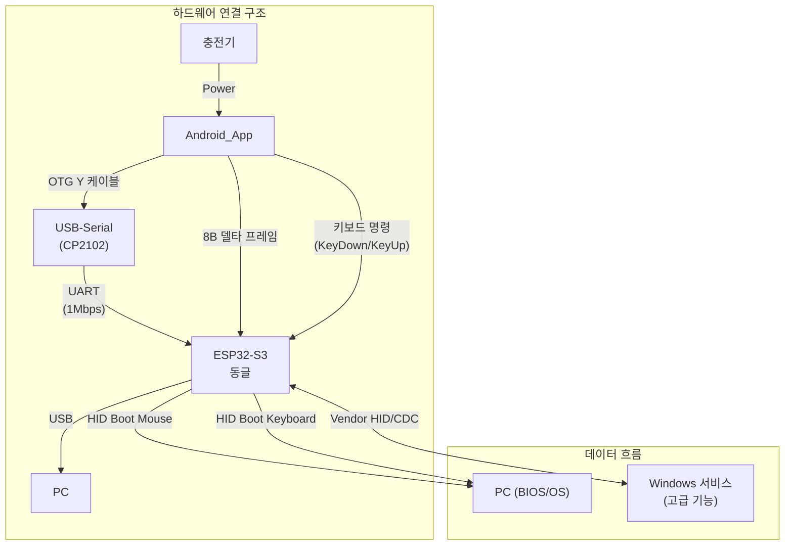

# BridgeOne Windows 서버 디자인 가이드

## 시스템 아키텍처 개요



> **핵심**: 본 서버는 Android 앱에서 전송되는 고급 입력 명령을 Windows 환경에서 처리하는 핵심 구성요소입니다.

**입력 처리 역할 구분**:
- **기본 키보드 입력**: HID Boot Keyboard를 통해 직접 PC OS로 전송되므로 Windows 서버가 중계하지 않음
- **고급 키보드 기능**: 매크로 실행, 복잡한 키 시퀀스 등은 Vendor/CDC 인터페이스를 통해 Windows 서버가 처리
- **멀티 커서 기능**: 가상 커서 이미지 관리 및 커서 상태 동기화를 Windows 서버가 담당

## 용어집/정의

- **Selected/Unselected**: 선택 상태. UI의 선택/강조 여부 표현 [[memory:5809234]]
- **Enabled/Disabled**: 입력 가능 상태. 상호작용 가능 여부 [[memory:5809234]]
- **Essential/Standard**: 시스템 운용 상태. Essential는 Windows 서버와 연결되지 않은 상태, Standard은 서버와 연결되어 모든 확장 기능이 활성화된 상태입니다.
- **핸드셰이크**: Android 앱과 Windows 서버 간 연결 확립 및 상태 동기화 과정
- **매크로 편집기**: 사용자 정의 작업 시퀀스를 생성하고 편집하는 GUI 도구

## 1. 디자인 철학 및 원칙

### 1.1 핵심 디자인 원칙

**직관성 우선 (Intuitiveness First)**:
- 비개발자도 쉽게 사용할 수 있는 인터페이스
- 복잡한 기능을 단순한 인터페이스로 표현
- 일관된 패턴과 예측 가능한 동작

**투명성과 신뢰성 (Transparency & Trust)**:
- 시스템 상태와 동작을 명확하게 표시
- 연결 상태, 성능 지표, 오류 상황을 실시간으로 시각화
- 사용자가 언제든지 현재 상황을 파악할 수 있도록 지원

**안정성과 복구 (Stability & Recovery)**:
- 오류 상황에서도 명확한 가이드 제공
- 자동 복구 기능과 수동 해결 방법 병행 제공
- 작업 중단 없는 연결 및 입력 신뢰성

### 1.2 사용자 대상 및 사용 시나리오

**주요 사용자**:
- **일반 사용자**: PC 원격 제어를 위한 기본 설정 및 연결 관리
- **파워 유저**: 고급 설정 조정 및 시스템 최적화
- **시스템 관리자**: 기업 환경에서의 배포 및 관리

**핵심 사용 시나리오**:
1. **최초 설치**: 설치 마법사를 통한 초기 설정 및 Android 앱 페어링
2. **일상 사용**: 백그라운드 실행 중 연결 상태 확인 및 간단한 설정 변경
4. **문제 해결**: 연결 문제 진단 및 해결을 위한 디버깅 도구 사용

### 1.3 Windows 11 Fluent Design 적용

**Material and Light**:
- Mica 배경 효과로 모던한 Windows 11 느낌 구현
- Acrylic 표면으로 계층감과 깊이 표현
- 적절한 그림자와 레이어를 통한 정보 구조 명확화

**Motion**:
- 부드러운 300ms 이하의 전환 효과
- 의미 있는 애니메이션으로 사용자 피드백 제공
- Connected Animation으로 화면 간 연결성 강조

## 2. 색상 시스템

**기본 테마 설정**:
- 시스템 테마 사전 적용
- 다크 테마 및 컨트롤 사전 구성 (권장)

### 2.1 다크 테마

#### 배경 색상
- **#1E1E1E** (Primary Background): 메인 윈도우 배경, Mica 배경 효과, 네비게이션 패널 배경, 전체 애플리케이션 기본 배경
- **#2D2D30** (Secondary Background): 카드 컴포넌트 배경, 사이드 패널 배경, 설정 패널 배경, 드롭다운 메뉴 배경
- **#3C3C3C** (Card Background): 정보 카드 배경, 성능 지표 카드 배경, 연결 상태 카드 배경, 진단 도구 카드 배경

#### 텍스트 색상
- **#FFFFFF** (Primary Text): 기본 텍스트, 제목 텍스트, 메뉴 항목 텍스트, 버튼 텍스트
- **#CCCCCC** (Secondary Text): 보조 텍스트, 설명 텍스트, 카드 내 세부 정보 텍스트, 상태 표시 텍스트
- **#999999** (Disabled Text): Disabled 상태 텍스트, 비활성화된 메뉴 항목 텍스트, 사용 불가능한 설정 항목 텍스트 (권장 투명도: 60%)

### 2.2 라이트 테마

#### 배경 색상
- **#FAFAFA** (Primary Background): 메인 윈도우 배경, Mica 배경 효과, 네비게이션 패널 배경
- **#FFFFFF** (Secondary Background): 카드 컴포넌트 배경, 사이드 패널 배경, 설정 패널 배경
- **#F5F5F5** (Card Background): 정보 카드 배경, 성능 지표 카드 배경, 연결 상태 카드 배경

#### 텍스트 색상
- **#1E1E1E** (Primary Text): 기본 텍스트, 제목 텍스트, 메뉴 항목 텍스트, 버튼 텍스트
- **#616161** (Secondary Text): 보조 텍스트, 설명 텍스트, 카드 내 세부 정보 텍스트
- **#9E9E9E** (Disabled Text): Disabled 상태 텍스트, 비활성화된 메뉴 항목 텍스트 (권장 투명도: 60%)

### 2.3 공통 액센트 색상

#### 상태 색상
- **#2196F3** (Info/Blue-500): 주요 액션 버튼 배경, Selected 상태 표시, 연결 설정 버튼, 정보 알림 배경, 가상 커서 기본 색상, 커서 팩 감지 진행 상태
- **#10B981** (Success/Green-500): 연결 성공 상태 표시, 성공 알림 배경, 가상 커서 활성 상태, 커서 팩 감지 성공, 품질 배지 (Excellent/Good), 경로 일관성 양호 상태, 성능 모니터링 정상 상태
- **#F59E0B** (Warning/Amber-500): 연결 중 상태 표시, 경고 알림 배경, 커서 팩 감지 진행 상태, 품질 배지 (Basic), 경로 일관성 주의 상태, 성능 모니터링 주의 상태
- **#EF4444** (Error/Red-500): 연결 오류 상태 표시, 오류 알림 배경, 커서 팩 감지 실패, 품질 배지 (Incomplete), 심각한 오류 표시, 성능 모니터링 위험 상태
- **#6B7280** (Gray-500): 연결 끊김 상태 표시, 가상 커서 비활성 상태, Unselected 상태 표시, Disabled 상태 표시 (권장 투명도: 60%)

#### 특수 효과 색상
- **#8B5CF6** (Purple-500): 텔레포트 하이라이트 효과, 가상 커서 색상 틴트 옵션, 특수 상태 표시
- **#60A5FA** (Blue-400): 글로우 효과 기본 색상, 가상 커서 글로우 효과, 부드러운 강조 효과
- **#FFFFFF** (Outline): 가상 커서 외곽선, 강조 표시 외곽선

#### 가상 커서 표시 색상
- **외곽선 색상**: 사용자 선택 가능 (기본값: #FFFFFF)
- **색상 틴트 프리셋**:
  - 파랑: #2196F3 (Info/Blue-500)
  - 초록: #10B981 (Success/Green-500)
  - 보라: #8B5CF6 (Purple-500)
  - 주황: #F59E0B (Warning/Amber-500)
  - 빨강: #EF4444 (Error/Red-500)
- **글로우 색상**: 자동 감지 또는 사용자 선택 (기본값: #60A5FA)

#### 텔레포트 리플 효과 색상
- **리플 색상**: 자동(커서 색상 기반) 또는 사용자 선택
- **리플 투명도**: 30%-90% (10% 간격)

### 2.4 시스템 설정

**시스템 액센트 색상**:
- 동적 시스템 액센트 색상 리소스 활용 (Windows 11 자동 감지)
- Mica 배경 효과와 연동
- Acrylic 표면 효과와 조화

**투명도 사용법**:
- 30% 투명도: 그림자 효과, 오버레이
- 60% 투명도: Disabled 상태, Unselected 상태
- 80% 투명도: 호버 효과, 부드러운 전환

**접근성 고려사항**:
- 최소 4.5:1 색상 대비율 유지
- 색상에만 의존하지 않는 정보 전달 (아이콘, 텍스트 병행)

### 2.5 시스템 트레이 아이콘 색상

**연결 상태에 따른 아이콘 색상 변경**:
- **연결됨**: 기본 브랜드 아이콘 (정상 상태) - 브랜드 기본 색상 사용
- **연결 안됨**: #6B7280 (Gray-500) - 연결 대기 상태
- **연결 중**: #F59E0B (Warning/Amber-500) - 연결 시도 중 (회전 애니메이션 또는 펄스 효과)
- **오류 상태**: #EF4444 (Error/Red-500) - 오류 발생

**시각적 효과**:
- **애니메이션**: 연결 중 상태에서 회전 애니메이션 또는 펄스 효과 적용
- **투명도**: 비활성 상태에서 60% 투명도 적용 (권장)
- **크기**: 시스템 트레이 표준 크기 (16x16px) 유지

## 3. 타이포그래피

### 3.1 폰트 패밀리

**주 폰트**: Segoe UI Variable
- Windows 11 시스템 기본 가변 폰트 사용

**아이콘 폰트**: Segoe Fluent Icons
- Fluent 아이콘 팩 폰트 사용

### 3.2 타이포그래피 계층

**계층 정의 및 사용법**:
```
Display: 28pt, SemiBold - 주요 제목용
TitleLarge: 24pt, SemiBold - 페이지 제목용
Title: 20pt, SemiBold - 섹션 제목용
Subtitle: 16pt, Medium - 하위 제목용
BodyStrong: 14pt, SemiBold - 강조 본문용
Body: 14pt, Regular - 일반 본문용
Caption: 12pt, Regular - 보조 텍스트용
```

### 3.3 사용 규칙

**계층 구조**:
- 한 화면에서 Display는 최대 1개 사용
- Title과 Subtitle로 명확한 정보 계층 형성
- Body와 Caption으로 세부 정보 표현

**가독성 보장**:
- 최소 4.5:1 색상 대비율 유지
- 한 줄 최대 75자 제한
- 적절한 줄 간격 (1.4배) 유지

## 4. 아이콘 시스템

### 4.1 아이콘 라이브러리 및 표준

**Fluent System Icons 사용**:
- Windows 11 표준 아이콘 라이브러리 활용
- 심볼 아이콘 표시 방식으로 일관된 시각적 언어 제공
- Microsoft Fluent Design System과 완벽한 호환성

**아이콘 표준 준수**:
- Windows 11 디자인 가이드라인 완전 준수
- 시스템 테마와 자동 동기화 (다크/라이트 모드)
- 고해상도 디스플레이 지원 (DPI 스케일링)

### 4.2 크기 및 스케일링 시스템

**크기 규격 정의**:
```
Small: 16px - 시스템 트레이 아이콘, 작은 버튼, 상태 표시기
Medium: 20px - 일반 버튼, 메뉴 아이콘, 네비게이션 요소
Large: 24px - 주요 액션 버튼, 카드 헤더, 중요 기능 표시
XLarge: 32px - 대형 표시, 메인 기능 아이콘, 대시보드 요소
```

**스케일링 원칙**:
- DPI 인식 스케일링으로 모든 해상도에서 선명한 표시
- 터치 인터페이스 고려 (최소 44px 터치 영역)
- 접근성 기준 준수 (최소 16px 크기 보장)

### 4.3 카테고리별 아이콘 세트

**연결 및 USB 통신**:
- **Connected**: 연결됨 상태 표시 (녹색 체크마크)
- **Disconnected**: 연결 끊김 상태 표시 (회색 X)
- **USB Connection**: USB 포트 및 연결 표시
- **HID Interface**: HID 장치 및 입력 인터페이스 표시
- **Pairing**: 페어링 및 연결 설정 표시

**시스템 상태**:
- **Success**: 성공 상태 (녹색 체크마크)
- **Warning**: 경고 상태 (주황색 삼각형)
- **Error**: 오류 상태 (빨간색 X)
- **Info**: 정보 표시 (파란색 원)
- **Loading**: 로딩 및 진행 상태 (회전 애니메이션)

**액션 및 네비게이션**:
- **Settings**: 설정 및 구성 옵션
- **Home**: 홈 화면 및 메인 대시보드
- **Refresh**: 새로고침 및 재시도
- **Close**: 닫기 및 종료
- **Minimize**: 최소화 및 숨기기

**멀티 커서 관련**:
- **Cursor**: 기본 커서 표시
- **MultiCursor**: 멀티 커서 모드
- **Teleport**: 텔레포트 및 커서 전환
- **CursorPack**: 커서 팩 관리
- **Glow**: 글로우 효과 설정

### 4.4 색상 및 상태 표시

**기본 색상 적용**:
- **Primary Text 색상**: 기본 아이콘 색상 (#FFFFFF 다크 모드, #1E1E1E 라이트 모드)
- **Secondary Text 색상**: 보조 아이콘 색상 (#CCCCCC 다크 모드, #616161 라이트 모드)
- **Disabled Text 색상**: 비활성 아이콘 색상 (60% 투명도 적용)

**상태별 색상 코딩**:
- **Success**: #10B981 (Green-500) - 성공, 연결됨, 정상 상태
- **Warning**: #F59E0B (Amber-500) - 경고, 연결 중, 주의 상태
- **Error**: #EF4444 (Red-500) - 오류, 연결 실패, 위험 상태
- **Info**: #2196F3 (Blue-500) - 정보, 설정, 일반 상태
- **Gray**: #6B7280 (Gray-500) - 비활성, 연결 끊김, 중립 상태

**상태 전환 애니메이션**:
- 300ms 부드러운 색상 전환 효과
- 상태 변경 시 페이드 인/아웃 애니메이션
- 호버 상태에서의 미묘한 색상 변화

### 4.5 사용법 및 가이드라인

**버튼 내 아이콘 사용법**:
- 아이콘과 텍스트를 함께 표시하여 명확한 의미 전달
- 아이콘 크기는 버튼 크기에 비례하여 조정 (Medium 20px 권장)
- 아이콘과 텍스트 간 적절한 간격 유지 (8px 권장)
- 버튼 상태에 따른 아이콘 색상 자동 변경

**독립 아이콘 사용법**:
- 심볼 아이콘을 독립적으로 사용하여 공간 효율성 극대화
- 크기 및 색상을 컨텍스트에 맞게 자유롭게 지정
- 상태 표시기로 사용 시 명확한 색상 코딩 적용
- 툴팁을 통한 추가 정보 제공

**일관성 유지 원칙**:
- 동일한 기능은 전체 애플리케이션에서 동일한 아이콘 사용
- 아이콘 스타일과 크기의 일관된 적용
- 색상 코딩 규칙의 엄격한 준수
- Windows 11 표준과의 완벽한 호환성 유지

### 4.6 접근성 고려사항

**시각적 접근성**:
- 최소 16px 크기 보장으로 시각적 인식성 확보
- 4.5:1 이상의 색상 대비율 유지
- 색상에만 의존하지 않는 정보 전달 (아이콘 + 텍스트 조합)

**인터랙션 접근성**:
- 터치 영역 최소 44px 보장
- 키보드 네비게이션 지원
- 포커스 표시기 명확한 시각적 피드백

**고해상도 디스플레이 지원**:
- 벡터 기반 아이콘으로 모든 DPI에서 선명한 표시
- 자동 스케일링으로 다양한 해상도 대응
- 픽셀 퍼펙트 렌더링 보장

## 5. 사용자 경험 설계

### 5.1 전체 사용자 여정

**발견 단계**: 서버 실행부터 Android 앱과의 자동 연결까지의 초기 경험
**온보딩 단계**: 브랜드 인지도 강화와 초기 설정을 통한 사용자 적응 과정
**일상 사용 단계**: 백그라운드 실행과 온디맨드 인터페이스를 통한 일상적 사용 경험
**고급 활용 단계**: 개인화된 설정과 고급 기능을 통한 전문가 수준 활용

### 5.2 직관성과 학습 곡선

**즉시 이해 가능한 시각 언어**: 색상, 아이콘, 텍스트를 조합한 직관적 정보 전달
**학습 없이 사용 가능한 기본 기능**: 원클릭 자동화와 자동 해결책을 통한 사용자 개입 최소화

### 5.3 접근성 고려사항

**시각적 접근성**:
- 최소 4.5:1 색상 대비율 준수
- 색상에만 의존하지 않는 정보 전달 (아이콘, 텍스트 병행)

**마우스 접근성**:
- 모든 기능을 마우스만으로 접근 가능
- 명확한 포인터 피드백 및 호버 효과 제공

**인지적 접근성**:
- 복잡한 작업을 작은 단계로 분해
- 각 단계마다 명확한 피드백 제공
- 실행 취소 및 되돌리기 기능 항상 제공

## 6. 핵심 기능 설계

### 6.1 연결 관리

**개요**: Android 기기와의 안정적인 연결을 유지하고, 연결 상태를 실시간으로 모니터링하며, 문제 발생 시 자동으로 복구

**시스템 목표**:
- **투명성**: 연결 상태의 실시간 시각화로 사용자에게 명확한 피드백 제공
- **자동화**: 연결 품질 모니터링 및 자동 복구로 사용자 개입 최소화
- **신뢰성**: 연결 과정의 시각적 표현으로 안정성 확보
- **사용성**: 오류 상황에서의 구체적 해결 방안 제시

**전체 아키텍처**:
- **모니터링 계층**: 실시간 연결 상태 및 성능 지표 추적
- **프로세스 계층**: 체계적인 연결/재연결 프로세스 관리
- **복구 계층**: 자동 및 수동 연결 복구
- **사용자 계층**: 직관적인 오류 처리 및 가이드 제공

#### 6.1.1 연결 상태 모니터링

**목적**: Android 기기와의 연결 상태를 실시간으로 추적하고, 사용자에게 명확한 시각적 피드백을 제공하여 연결 품질을 투명하게 관리

**핵심 기능**:

**실시간 연결 상태 표시**:
- **연결 상태 아이콘**: 연결됨(녹색), 연결 중(주황색), 연결 끊김(빨간색), 오류(회색)
- **상태 텍스트**: "연결됨", "연결 중...", "연결 끊김", "오류 발생" 등 명확한 상태 메시지
- **애니메이션 효과**: 연결 중일 때 펄스 애니메이션으로 활성 상태 표현

**기기 정보 표시**:
- **기기 식별**: Android 기기명, 모델명, OS 버전 표시
- **연결 정보**: USB 포트, 연결 시간, 마지막 연결 시간
- **보안 상태**: 인증 상태, 암호화 레벨, 신뢰할 수 있는 기기 여부

**성능 지표 모니터링**:
- **지연시간**: 실시간 지연시간 측정 및 표시
- **입력 데이터 전송률**: 마우스/키보드 입력 데이터의 실시간 전송 속도 표시
- **연결 안정성**: Keep-alive 패킷 응답률, 연결 끊김 빈도
- **리소스 사용량**: CPU, 메모리 사용률 (백그라운드 모니터링)

**시각적 피드백 요소**:
- **연결 상태 표시기**: 3단계 상태 표시 (정상/주의/오류)
- **성능 차트**: 지연시간, 전송률의 시간별 변화 그래프
- **상태 배지**: 연결 상태, 보안 상태, 기기 신뢰도 등의 상태 배지

**기술적 구현**:
- **폴링 주기**: 연결 상태 1초, 성능 지표 5초, 상세 정보 30초
- **이벤트 기반 업데이트**: 연결 상태 변경 시 즉시 UI 업데이트
- **백그라운드 모니터링**: 시스템 리소스 최소화를 위한 효율적인 모니터링

#### 6.1.2 연결 프로세스 관리

**목적**: Android 기기와의 연결을 체계적이고 안정적으로 수립하며, 명확한 시각적 피드백을 제공하여 사용자 신뢰도 확보

**3단계 연결 프로세스**:

**1단계 - 연결 신호 전송** (예상 시간: 0.5-2초):
- **기능**: Android 기기를 능동적으로 탐지하고 연결 신호 전송
- **시각적 표현**: 
  - "Android 기기를 찾는 중..." 메시지로 현재 작업 명확화
- **사용자 가이드**: USB 케이블 연결 상태 확인, Android 앱 실행 확인
- **기술적 세부사항**: 
  - 0.5초 주기로 연결 신호 전송
  - 최대 10초 타임아웃 설정
  - 연결 실패 시 자동 재시도 (최대 3회)

**2단계 - 인증 과정** (예상 시간: 1-3초):
- **기능**: 기기 인증, 보안 설정, 연결 파라미터 협상
- **시각적 표현**:
  - 보안 아이콘 표시
  - 기기 정보(기종, ID, OS 버전 등) 표시로 연결 대상 확인
- **보안 요소**:
  - 디지털 인증서 검증
  - 암호화 키 교환
  - 기기 신뢰도 확인
- **기술적 세부사항**:
  - TLS 1.3 기반 보안 연결
  - RSA 2048비트 키 교환
  - 인증서 유효성 검증

**3단계 - 연결 완료** (즉시):
- **기능**: 연결 설정 완료, 서비스 활성화, 상태 모니터링 시작
- **시각적 표현**:
  - 성공 상태를 녹색 체크마크와 "연결됨" 메시지로 명확히 표시
  - 연결 품질 정보(지연시간, Keep-alive 상태) 실시간 표시
  - 고급 기능 활성화 상태 시각적 확인
- **활성화 기능**:
  - 멀티 커서 기능 준비 완료
  - 커스텀 커서 팩 로드
  - 성능 모니터링 시작

**오류 처리**:
- **실패 지점 표시**: 어느 부분에서 실패했는지 명확히 표시
- **구체적인 오류 메시지**: "USB 연결 확인 필요", "Android 앱이 실행되지 않음" 등
- **해결 방법 안내**: 문제 해결 가이드 제공
- **재시도 옵션**: "다시 시도" 버튼으로 간편한 재연결 지원

#### 6.1.3 연결 복구

**목적**: 연결 문제 발생 시 자동 및 수동 복구

##### 6.1.3.1 자동 연결 관리

**연결 품질 모니터링**:
- 지연시간 임계값 모니터링 (50ms 초과 시 경고)
- Keep-alive 패킷 응답률 추적 (95% 미만 시 경고)
- 연결 끊김 빈도 분석 (5분 내 3회 이상 시 경고)

**자동 복구 트리거**:
- 연결 품질 저하 감지 시 자동 재연결 시도
- 연결 끊김 감지 시 즉시 재연결 시도
- 주기적 연결 상태 검증 (5분마다)

**복구 전략**:
- 재시도 (1초, 3초, 5초 간격)
- 최대 재시도 횟수 제한 (5회)
- 복구 실패 시 사용자 알림

**연결 품질 기반 자동 복구**:
- **품질 임계값 설정**:
  - 정상: 지연시간 <50ms, 응답률 >95%
  - 주의: 지연시간 50-100ms, 응답률 90-95%
  - 오류: 지연시간 >100ms, 응답률 <90%
- **자동 복구 정책**:
  - "주의" 등급 시 경고 표시 및 모니터링 강화
  - "오류" 등급 시 자동 재연결 시도
  - 지속적인 품질 저하 시 사용자 알림

##### 6.1.3.2 수동 재연결

**강제 재연결**:
- **트리거**: 사용자가 명시적으로 재연결 요청

**3단계 재연결 프로세스**:
- **1단계 - 연결 종료** (예상 시간: 0.5-1초):
  - **기능**: 현재 연결을 안전하게 종료하고 리소스 정리
  - **시각적 표현**:
    - "연결을 종료하는 중..." 메시지와 함께 진행률 표시
  - **기술적 세부사항**:
    - Android 앱에 연결 해제 신호 전송
    - 활성 세션 정리
    - 리소스 해제 및 메모리 정리
- **2단계 - 재연결 시도** (예상 시간: 1-5초):
  - **기능**: 새로운 연결을 시도하는 과정
  - **시각적 표현**:
    - "새로운 연결을 시도하는 중..." 메시지 표시
    - 연결 시각적 피드백과 동일한 과정 반복
  - **기술적 세부사항**:
    - 새로운 연결 프로세스 시작
    - 기존 연결 프로세스와 동일한 3단계 과정
    - 연결 품질 검증
- **3단계 - 재연결 완료**:
  - **성공 시**:
    - 녹색 체크마크와 "재연결 완료" 메시지 표시
    - 연결 품질 정보 업데이트
    - 모든 기능 정상 동작 확인
  - **실패 시**:
    - 빨간색 경고 아이콘과 구체적인 오류 원인 표시
    - 해결 방법 제시 (USB 재연결, 앱 재시작 등)
    - "수동 연결" 버튼으로 대안 제공

#### 6.1.4 오류 처리 및 사용자 가이드

**목적**: 연결 문제 발생 시 사용자가 쉽게 문제를 진단하고 해결할 수 있도록 체계적인 오류 처리 및 가이드 제공

**오류 분류 및 진단**:
- **연결 오류 처리**:
  - **1단계 오류 (신호 전송 실패)**:
    - USB 연결 문제: "USB 케이블을 확인해주세요"
    - Android 앱 미실행: "Android 앱을 실행해주세요"
    - 기기 인식 실패: "기기를 다시 연결해주세요"
  - **2단계 오류 (인증 실패)**:
    - 보안 인증 실패: "기기 인증을 다시 시도해주세요"
    - 암호화 오류: "보안 설정을 확인해주세요"
    - 권한 부족: "관리자 권한이 필요합니다"
  - **3단계 오류 (연결 완료 실패)**:
    - 서비스 초기화 실패: "서비스를 다시 시작해주세요"
    - 리소스 부족: "시스템 리소스를 확인해주세요"
- **오류 시각화**:
  - **오류 아이콘**: 실패 지점을 명확히 표시하는 아이콘
  - **오류 메시지**: 구체적이고 이해하기 쉬운 오류 설명
  - **해결 방법 안내**: 단계별 문제 해결 가이드
  - **진행률 표시**: 문제 해결 진행 상황 시각화

**사용자 가이드**:
- **문제 해결 체크리스트**:
  - **USB 연결 확인**:
    - USB 케이블 연결 상태 확인
    - USB 포트 변경 시도
    - 다른 USB 케이블 사용
  - **Android 앱 확인**:
    - 앱이 실행 중인지 확인
    - 앱 재시작
    - 앱 권한 설정 확인
  - **시스템 확인**:
    - Windows 업데이트 확인
    - USB 드라이버 업데이트
    - 방화벽 설정 확인
- **대화형 문제 해결**:
  - **가이드**: 문제 유형에 따른 맞춤형 해결 방법
  - **자동 진단**: 시스템 상태 자동 검사 및 문제점 식별
  - **원클릭 해결**: 간단한 문제의 경우 원클릭으로 해결
  - **고급 옵션**: 전문 사용자를 위한 고급 진단 도구
- **사용자 액션 가이드**:
  - **즉시 액션**: "다시 시도", "연결 해제", "설정 열기" 등
  - **액션 가이드**: 문제 해결을 위한 액션 가이드
  - **대안 제공**: 주요 해결 방법이 실패할 경우 대안 제시
  - **도움말 링크**: 상세한 도움말 문서 및 지원 채널 안내

**접근성 고려사항**:
- **시각적 접근성**: 색상 외에도 아이콘과 텍스트로 상태 표시
- **청각적 피드백**: 연결 성공/실패 시 사운드 알림
- **키보드 네비게이션**: 모든 기능을 키보드로 접근 가능
- **화면 읽기 지원**: 스크린 리더 호환성

> **UI 구현 참조**: 이 기능의 구체적인 UI 레이아웃, 컴포넌트 배치, 시각적 디자인은 `styleframe-server.md`의 §6.1(홈 화면)을 참조하세요.

### 6.2 멀티 커서 기능

**설계 목적**: 윈도우의 단일 커서 제약을 극복하여 두 개의 독립적인 커서를 시뮬레이션하고, 다양한 커서 팩과의 호환성을 자동으로 처리하는 혁신적인 멀티태스킹 기능

**기능 개요**:
- 멀티 커서는 윈도우의 단일 커서 제약을 극복하기 위해 실제 커서와 가상 커서 이미지를 조합하여 사용하는 혁신적인 기능입니다.
- 터치패드 A와 터치패드 B 간 전환 시 텔레포트를 통해 실제 커서와 가상 커서 이미지의 위치를 바꿔 두 개의 독립적인 커서를 시뮬레이션하여 멀티태스킹 효율성을 극대화합니다.
- 가상 커서 이미지는 텔레포트 장치 역할을 하여 실제 커서가 원하는 위치로 즉시 이동할 수 있게 해주는 워프 포인트입니다.

**동적 커서 상태 반영**

**목적**: 멀티 커서 모드에서 가상 커서 이미지가 실제 커서의 현재 상태를 실시간으로 반영하여, 두 커서 간의 완벽한 시각적 일관성을 제공

**동작 방식**:
- 커서 상태 실시간 모니터링을 통한 현재 커서 상태 감지
- 커서 변경 이벤트 기반 감지를 통한 즉시 상태 변경 감지  
- 감지된 커서 상태에 따른 가상 커서 이미지 동적 업데이트
- 기존의 시각적 효과(외곽선, 글로우, 반투명 등)를 동적으로 적용

**지원하는 커서 상태**:
- **기본 상태**: 화살표, 텍스트 입력, 링크/버튼 커서
- **크기 조절 상태**: 좌우, 상하, 대각선 크기 조절 커서
- **기타 상태**: 대기, 십자선, 금지, 위쪽 화살표 커서
- **애플리케이션별 커스텀 커서**: 각 애플리케이션에서 정의한 특수 커서 상태

**사용자 경험 혁신 효과**:
- **직관적 상태 인식**: 텍스트 편집 중 I-beam 커서 → 가상 커서도 I-beam 표시, 링크 호버 시 hand 커서 → 가상 커서도 hand 표시
- **완벽한 시각적 일관성**: 실제 커서와 가상 커서가 100% 동일한 상태를 실시간으로 반영하여 진정한 "듀얼 커서" 경험 제공
- **작업 효율성 향상**: 멀티 커서 환경에서 각 커서의 현재 상태를 한눈에 파악하여 작업 전환이 더 매끄러워짐

**호환성 및 성능 고려사항**:
- **커서 팩 호환성**: 모든 커서 팩이 전체 커서 상태 세트를 포함하지 않을 수 있으므로, 누락된 상태에 대한 폴백 이미지 자동 생성
- **성능 최적화**: 커서 상태 변경이 빈번하게 발생할 수 있어 이벤트 기반 업데이트와 스마트 캐싱을 통한 효율적인 리소스 관리
- **동기화 지연 최소화**: 실제 커서 상태 변경과 가상 커서 이미지 업데이트 간의 미세한 지연을 최소화하기 위한 비동기 처리
- **메모리 관리**: 다양한 커서 상태 이미지들을 효율적으로 캐싱하고 관리하여 메모리 사용량 최적화

**사용자 플로우 참조**:
- 싱글 커서 / 멀티 커서 모드 관련 유저 플로우는 `component-touchpad.md`의 §3.2.4를 참조하세요.
- 해당 섹션에서는 앱에서 발생하는 모드 전환 애니메이션, 터치패드 기반 커서 제어, 시각적 피드백 등 상세한 사용자 경험 설계를 확인할 수 있습니다.

**실제 사용 시나리오**:
- **개발자 워크플로우**: 터치패드 A로 실제 커서를 움직여 코드 편집, 터치패드 B로 전환하여(텔레포트를 통해) 브라우저에서 API 문서 참조
- **디자인 작업**: 터치패드 A로 실제 커서를 움직여 디자인 툴 조작, 터치패드 B로 전환하여(텔레포트를 통해) 참조 이미지 탐색
- **문서 작업**: 터치패드 A로 실제 커서를 움직여 메인 문서 편집, 터치패드 B로 전환하여(텔레포트를 통해) 참조 자료 검색 및 인용
- **데이터 분석**: 터치패드 A로 실제 커서를 움직여 데이터 시각화, 터치패드 B로 전환하여(텔레포트를 통해) 원본 데이터 확인

**생산성 이점**:
- **컨텍스트 전환 시간 단축**: 실제 커서의 텔레포트를 통해 작업 전환 시간 대폭 절약
- **멀티모니터 환경 최적화**: 실제 커서와 가상 커서 이미지를 활용한 자연스러운 작업 흐름
- **전문가 워크플로우 지원**: 복잡한 작업을 실제 커서와 가상 커서 이미지로 동시에 처리할 수 있는 환경 제공
- **학습 곡선 최소화**: 직관적인 설정으로 빠른 적응 가능

#### 6.2.1 커서 팩 등록 기능

**기능 목적**: 실제 커서와 가상 커서가 동일한 디자인 룩을 공유하도록 커서 팩을 시스템에 등록하고 관리하는 기능

**등록 과정 UX 흐름**:
- **커서 팩 선택**: 사용자가 원하는 커서 팩을 선택하는 과정
- **등록 완료**: 호환성 검사 통과 시 시스템에 등록 및 활성화

**호환성 검사**:
- **파일 형식 호환성**: 커서 팩 파일이 시스템에서 지원하는 형식인지 확인 (`.cur`, `.ani` 파일 등)
- **시스템 호환성**: Windows 버전과의 호환성 (Windows 10/11 지원 여부) 및 시스템 아키텍처 호환성
- **리소스 호환성**: 커서 이미지의 크기, 해상도, 색상 깊이 및 메모리 사용량이 시스템 제한 내에 있는지 검증
- **가상 커서 표시 호환성**: 사용자가 현재 사용 중인 커서 팩을 기반으로 가상 커서가 실제 커서와 동일하게 표시될 수 있는지 및 커서 상태별 이미지 완성도 확인
- **보안 호환성**: 파일이 악성 코드를 포함하지 않는지 및 시스템 리소스에 안전하게 접근할 수 있는지 검증

#### 6.2.2 가상 커서 이미지 표시 설정 기능

**기능 목적**: 멀티 커서 모드에서 가상 커서 이미지의 시각적 표시 방식을 사용자가 원하는 대로 설정하는 기능

**표시 옵션**:
- **표시 스타일 조합**: 다음 5가지 커서 표시 스타일을 조합하여 사용
  - **외곽선**
    - 선 스타일: 실선 / 점선 선택
    - 점선 간격 설정 (1-10px, 점선 선택 시)
    - 점선 길이 설정 (2-20px, 점선 선택 시)
    - 외곽선 두께 설정 (1-5px)
    - 외곽선 색상 선택
  - **반투명 표시**
    - 투명도 슬라이더 (30-70%, 5% 간격)
    - 프리셋: 연함(30%), 보통(50%), 진함(70%)
  - **색상 틴트**: 커스텀 색상 틴트 적용
    - 프리셋 색상 (파랑, 초록, 보라, 주황, 빨강)
    - 강도 조절 (0.3-1.0 범위)
  - **글로우 효과**
    - 글로우 반경 (4-20px)
    - 자동 색상 감지 옵션
    - 수동 글로우 색상 선택
  - **크기 조절**:
    - 크기 비율 (80%, 100%, 120%)

**조합 예시**:
- **개발자용 조합**: 외곽선(점선, 파란색) + 반투명 표시(보통 50%) + 크기 조절(120%)
  - 코드 작업 시 가상 커서 이미지가 명확하게 보이면서도 실제 커서와 구분되도록 설계
- **디자이너용 조합**: 글로우 효과(자동 색상 감지) + 색상 틴트(보라색, 강도 0.7) + 크기 조절(100%)
  - 디자인 작업 시 시각적으로 아름답고 부드러운 효과로 창의적 작업 환경 조성
- **밝은 환경용 조합**: 외곽선(실선, 빨간색, 두께 3px) + 크기 조절(120%)
  - 밝은 환경이나 시각적 접근성이 필요한 경우 명확한 가시성 제공
- **미니멀 조합**: 반투명 표시(연함 30%) + 크기 조절(80%)
  - 최소한의 시각적 방해로 작업에 집중할 수 있는 환경 제공
- **프리미엄 조합**: 모든 스타일 조합 (외곽선 + 반투명 + 색상 틴트 + 글로우 + 크기 조절)
  - 최대한의 시각적 효과와 개인화된 커서 표시 경험 제공

**실시간 미리보기**:
- **설정 변경 즉시 반영**: 사용자가 설정을 변경하면 즉시 미리보기에 반영
- **다양한 시나리오 테스트**: 여러 작업 환경에서의 표시 효과 확인 가능
- **설정 저장 및 복원**: 원하는 설정을 저장하고 필요시 복원 가능

#### 6.2.3 멀티 커서 간 전환 애니메이션 설정

**기능 목적**: 멀티 커서 모드 내에서 두 커서 간의 전환 시 발생하는 애니메이션 효과를 관리하는 기능

**전환 시나리오**: 두 터치패드 간 전환 시 실제 커서가 가상 커서 위치로 이동하고, 가상 커서 이미지가 기존 실제 커서 위치로 이동하는 과정의 시각적 효과

**애니메이션 종류 및 설정 옵션**:

**실제 커서 이동**
- **이동 속도**: 즉시/매우 빠름(0.05초)/빠름(0.1초)/보통(0.2초)/느림(0.4초)

**전환 이동 이후 실제 커서 주변 리플 효과**
- **리플 크기**: 사용자 정의(10-100px)
- **리플 속도**: 빠름(0.3초)/보통(0.6초)/느림(1.0초)
- **리플 색상**: 자동(커서 색상 기반)
- **리플 개수**: 단일/이중/삼중
- **리플 투명도**: 30%-90% (10% 간격)

**사용자 경험 관련 설정**:

**미리보기 및 테스트 설정**
- **실시간 미리보기**: 설정 변경 시 즉시 미리보기 표시

#### 6.2.4 멀티 커서 모드 On/Off 애니메이션

**기능 목적**: 멀티 커서 모드 활성화/비활성화 시 가상 커서 이미지의 생성 및 삭제 애니메이션을 처리

**On 시나리오**: 
- 멀티 커서 모드 활성화 시
- 실제 커서 위치에 가상 커서 이미지가 fade-in 200ms로 생성
- 부드러운 등장 효과로 사용자에게 멀티 커서 모드 진입을 알림

**Off 시나리오**:
- 멀티 커서 모드 비활성화 시  
- 가상 커서 이미지가 fade-out 200ms로 사라짐
- 자연스러운 사라짐 효과로 싱글 커서 모드로의 전환을 표시

**애니메이션 상세**:
- **지속 시간**: 200ms (고정)
- **전환 방식**: fade-in/fade-out (고정)
- **커스터마이징**: 불가 (시스템 기본값 사용)
- **시각적 효과**: 부드러운 투명도 변화로 자연스러운 전환

**사용자 경험**:
- **즉시성**: 모드 전환과 동시에 애니메이션 시작
- **일관성**: 모든 사용자에게 동일한 애니메이션 경험 제공
- **직관성**: fade-in/fade-out으로 모드 상태를 명확하게 표시

> **UI 구현 참조**: 이 기능의 구체적인 UI 레이아웃, 컴포넌트 배치, 시각적 디자인은 `styleframe-server.md`의 §6.2(멀티 커서 화면)을 참조하세요.

### 6.3 매크로 실행 기능

> (추후 작성 예정)

### 6.4 성능 모니터링

**설계 목적**: 시스템의 성능 지표를 실시간으로 모니터링하고, 연결 품질과 시스템 리소스 사용량을 투명하게 표시하여 사용자가 시스템 상태를 정확히 파악할 수 있도록 지원

**모니터링 기능 요소**:
- **지연시간 모니터링**: Android 기기와의 통신 지연시간 실시간 측정 및 표시
- **CPU 사용률 모니터링**: 서버 프로그램의 CPU 사용량 추적
- **메모리 사용량 모니터링**: 메모리 사용량 및 메모리 누수 감지
- **연결 품질 모니터링**: Keep-alive 상태, 패킷 손실률 등 연결 안정성 지표

**시각적 표시 방식**:
- **실시간 그래프**: 성능 지표의 시간별 변화를 시각적으로 표현
- **상태 색상 코딩**: 정상(녹색), 주의(노란색), 위험(빨간색) 상태 구분
- **알림**: 임계값 초과 시 사용자에게 알림 제공

> **UI 구현 참조**: 이 기능의 구체적인 UI 레이아웃, 컴포넌트 배치, 시각적 디자인은 `styleframe-server.md`의 §6.1(홈 화면)을 참조하세요.

### 6.5 설정 관리

**목적**: 시스템의 다양한 설정을 논리적으로 그룹화하여 사용자가 원하는 설정을 쉽게 찾고 변경할 수 있도록 지원

**설정 카테고리 구조**:
- **연결 설정**: 포트, Keep-alive 간격, 자동 재연결 등
- **보안 설정**: 인증 요구, 통신 암호화, 방화벽 예외 등
- **성능 설정**: 저지연 모드, 로그 레벨, CPU 사용량 제한 등
- **시작 설정**: Windows 시작 시 자동 실행, 최소화 시작 등

**설정 UI 패턴**:
- **토글 스위치**: 단순 on/off 설정
- **슬라이더**: 연속값 설정 (CPU 사용량, 지연시간 등)
- **드롭다운**: 선택지가 제한된 옵션 설정
- **입력 필드**: 포트 번호, 경로 등 자유 입력값

> **UI 구현 참조**: 이 기능의 구체적인 UI 레이아웃, 컴포넌트 배치, 시각적 디자인은 `styleframe-server.md`의 §6.3(시스템 설정 화면)을 참조하세요.

### 6.6 애플리케이션 로딩 스플래시

**실행 모드별 동작**:
- **백그라운드 서비스**: OS 부팅과 함께 자동 실행되는 경우 조용히 백그라운드에서 실행
- **사용자 인터페이스 접근**: 사용자가 메인 창을 열 때는 실행 방식에 관계없이 아래의 스플래시 스크린이 표시됨

**시작 경험 기능 요소**:
- **브랜드 아이덴티티 강화**: 로고와 브랜드 메시지를 통한 시각적 인상 강화
- **로딩 시간 활용**: 시스템 초기화 시간을 브랜드 경험으로 전환
- **사용자 상호작용 지원**: 필요시 즉시 건너뛰기 가능한 유연한 인터페이스

**애니메이션 시퀀스 (총 2.5초)**:
1. **검은 배경** (0.3초): 집중도 높이는 순수한 시작
2. **브릿지 등장** (0.7초): 연결의 개념을 시각적으로 표현
3. **별 회전** (0.5초): 역동성과 변화를 상징
4. **회전 정지** (0.3초): 안정성 도달을 의미
5. **별 확장** (0.1초): 기능 확장을 빠른 임팩트로 표현
6. **텍스트 등장** (0.6초): 브랜드명으로 마무리

### 6.7 시스템 트레이 관리 기능

#### 6.7.1 설계 목적 및 원칙

**설계 목적**: 백그라운드에서 실행되는 서버 애플리케이션의 상태를 시스템 트레이를 통해 직관적으로 표시하고, 사용자가 메인 창을 열지 않고도 주요 기능에 빠르게 접근할 수 있는 인터페이스 제공

**기능 구성 원칙**:
- 시스템 트레이 아이콘을 통한 애플리케이션 상태의 직관적 시각화
- 컨텍스트 메뉴를 통한 핵심 기능의 빠른 접근성 제공
- 알림 시스템을 통한 중요한 상태 변경의 즉시 통지
- 최소한의 화면 공간 사용으로 작업 환경 방해 최소화

**핵심 기능 요소**:
- **상태 아이콘 표시**: 연결 상태에 따른 아이콘 색상 변경
- **컨텍스트 메뉴**: 우클릭 메뉴를 통한 빠른 기능 접근 및 설정 변경
- **알림**: 중요한 상태 변경 시 트레이 알림 표시
- **빠른 창 접근**: 더블클릭으로 메인 창 열기/닫기

#### 6.7.2 상태 아이콘 표시

**연결 상태에 따른 아이콘 색상 변경**:
- **연결됨**: 기본 브랜드 아이콘 (정상 상태)
- **연결 안됨**: 회색 아이콘 (연결 대기 상태)
- **연결 중**: 회전 애니메이션 또는 펄스 효과 (연결 시도 중)
- **오류 상태**: 빨간색 아이콘 (오류 발생)

#### 6.7.3 컨텍스트 메뉴

**컨텍스트 메뉴 구성**:
- **연결 관리**
  - 연결 상태 보기
  - 강제 재연결
  - 연결 해제
- **설정**
  - 설정 창 열기
- **알림 설정**
  - 알림 on/off
  - 알림 유형 설정
- **시작 설정**
  - Windows 시작 시 자동 실행 토글
- **종료**
  - 애플리케이션 종료

#### 6.7.4 알림 시스템

**알림 유형**:
- **연결 상태 변경**: 연결 성공/실패 시 알림 표시
- **성능 경고**: CPU/메모리 사용량 임계값 초과 시 알림
- **오류 발생**: 심각한 오류 발생 시 상세 알림

#### 6.7.5 사용자 경험

**사용자 경험 원칙**:
- **직관적 상태 인식**: 아이콘만 보고도 현재 상태를 즉시 파악 가능
- **빠른 기능 접근**: 메인 창을 열지 않고도 주요 기능에 접근
- **방해 없는 백그라운드 실행**: 최소한의 화면 공간 사용으로 작업 환경 보존
- **일관된 인터페이스**: Windows 표준 트레이 아이콘 동작 방식 준수

**메인 창 접근 방식**:
- **더블클릭으로 메인 창 열기/닫기**: 시스템 트레이 아이콘 더블클릭으로 메인 창 토글
- **처음 열 때**: 애플리케이션 로딩 스플래시(§6.6) 표시 후 메인 창 열기
- **이후 열 때**: 스플래시 없이 바로 메인 창 표시
- **다른 방법으로 창 열 때**: 스플래시 표시 안 함 (컨텍스트 메뉴, 단축키 등)

> **UI 구현 참조**: 이 기능의 구체적인 UI 레이아웃, 아이콘 디자인, 컨텍스트 메뉴 구성은 `styleframe-server.md`의 §6.4(시스템 트레이 관리)를 참조하세요.

## 7. 주요 사용자 플로우

### 7.1 초기 설치 및 설정 플로우

**설계 원칙** (4.2 UX 원칙 적용):
- **원클릭 설치**: "학습 없이 사용 가능한 기본 기능" 원칙에 따른 복잡한 설정 자동화
- **실시간 피드백**: "즉시 이해 가능한 시각 언어" 원칙에 따른 진행 상황 명확 표시
- **오류 방지**: 잠재적 문제 사전 감지 및 자동 해결

**플로우 단계**:
1. **MSI 설치 패키지 실행** → 자동 권한 요청 및 방화벽 설정
2. **초기 구성 마법사** → 기본 설정값으로 자동 구성
3. **Android 앱 페어링** → QR 코드 또는 PIN 기반 간편 연결
4. **연결 테스트** → 실제 입력 테스트로 정상 작동 확인

### 7.2 연결 관리 플로우

**목적**: 연결 문제를 사용자가 직접 해결할 필요 없이 시스템이 자동으로 감지하고 복구

**설계 원칙** (4.2 UX 원칙 적용):
- **자동화된 연결 관리**: "학습 없이 사용 가능한 기본 기능" 원칙에 따른 사용자 개입 최소화
- **투명한 상태 표시**: "즉시 이해 가능한 시각 언어" 원칙에 따른 문제 상황 이해하기 쉬운 시각화
- **해결 가이드**: 자동 해결 및 수동 개입 가이드 제공

**구현 방식**:
- **실시간 상태 모니터링**: Keep-alive 신호로 연결 품질 지속 감시
- **자동 복구 시도**: 백오프 알고리즘으로 재연결
- **자동 해결책 적용**: 대부분의 일반적 문제를 자동으로 해결
- **수동 개입 가이드**: 자동 해결이 불가능한 경우 가이드 제공

### 7.3 오류 처리 및 복구 플로우

**목적**: 오류 상황에서도 사용자가 당황하지 않고 문제를 해결할 수 있도록 지원

**설계 원칙** (4.2 UX 원칙 적용):
- **오류 처리**: 자동 복구, 가이드 복구, 전문가 지원 제공
- **사용자 중심적 메시지**: "즉시 이해 가능한 시각 언어" 원칙에 따른 일상 언어 사용 및 구체적 액션 제시

**구현 방식**:
- **자동 복구** (1차): 시스템이 감지하고 자동으로 해결
- **가이드 복구** (2차): 해결 방법을 시각적으로 안내
- **전문가 지원** (3차): 로그 수집 및 고급 진단 도구 제공
- **원인 설명**: 기술적 용어 대신 일상 언어로 문제 상황 설명
- **해결 방법**: "무엇을 해야 하는지" 구체적 액션 아이템 제시
- **예방 가이드**: 동일 문제 재발 방지를 위한 설정 제안

### 7.4 멀티 커서 관리 플로우

**목적**: 복잡한 멀티 커서 기능을 일반 사용자도 쉽게 설정하고 사용할 수 있도록 지원

**설계 원칙** (4.2 UX 원칙 적용):
- **기능 활성화**: 기본 활성화, 자동 최적화, 개인화 설정 제공
- **실시간 피드백**: "즉시 이해 가능한 시각 언어" 원칙에 따른 설정 변경 즉시 미리보기

**구현 방식**:
- **기능 활성화**: 체크박스 하나로 멀티 커서 모드 즉시 시작
- **자동 최적화**: 현재 시스템의 커서 팩을 자동 감지하고 최적 설정 적용
- **개인화 설정**: 사용자 취향에 맞는 표시 타입 및 효과 조정
- **실시간 테스트**: 설정 변경 즉시 미리보기로 효과 확인
- **커서 팩 자동 감지**: 레지스트리 기반으로 현재 커서 스킴 실시간 감지
- **호환성 자동 검사**: 선택한 표시 타입과 커서 팩의 호환성 자동 확인
- **성능 자동 조정**: 시스템 성능에 따라 렌더링 품질 자동 조절

### 7.5 트레이에서 GUI 표시 플로우

**목적**: 백그라운드에서 실행 중인 서버를 필요시에만 GUI로 불러올 수 있는 최소 침해적 인터페이스 제공

**설계 원칙** (4.2 UX 원칙 적용):
- **비침해적 백그라운드 실행**: "학습 없이 사용 가능한 기본 기능" 원칙에 따른 최소한의 사용자 개입
- **직관적 상태 표시**: "즉시 이해 가능한 시각 언어" 원칙에 따른 색상 변화와 아이콘을 통한 상태 파악
- **온디맨드 접근**: 필요시에만 GUI 활성화

**구현 방식**:
- **트레이 아이콘**: 연결 상태에 따른 색상 변화로 상태 즉시 파악
- **컨텍스트 메뉴**: 우클릭으로 핵심 기능에 빠른 접근
- **알림**: 중요한 상태 변화만 선별적으로 알림
- **더블클릭 감지**: 트레이 아이콘 더블클릭으로 GUI 활성화 요청
- **스플래시 표시**: 브랜드 일관성을 유지하며 로딩 시간을 의미있는 경험으로 전환
- **메인 GUI 활성화**: 완전한 기능을 제공하는 메인 윈도우 표시

## 8. 접근성 및 사용성

### 8.1 마우스 내비게이션

**완전한 마우스 접근성**:
- 모든 기능을 키보드 없이 마우스만으로 접근 가능
- 마우스 포인터가 시각적 레이아웃과 논리적으로 일치하는 경로로 이동
- 명확한 포인터 피드백으로 현재 위치 및 상호작용 가능 상태 즉시 파악

**마우스 제스처 체계**:
- **표준 제스처 지원**: 클릭, 더블클릭, 우클릭, 드래그 앤 드롭 등 Windows 표준 활용
- **기능별 제스처**: 마우스 휠 스크롤, 호버 메뉴, 컨텍스트 메뉴 등 직관적 조작
- **제스처 가이드**: UI 요소에 마우스 상호작용 방법을 시각적으로 표시하여 학습 촉진

### 8.2 시각적 접근성

**색상 및 대비**:
- **최소 4.5:1 대비율**: WCAG 2.1 AA 기준 준수
- **색상 독립적 정보 전달**: 색상과 함께 아이콘, 텍스트 패턴 활용

**시각적 계층 구조**:
- **명확한 정보 구조**: 제목, 부제목, 본문의 시각적 차별화
- **적절한 여백**: 정보 그룹 간 충분한 시각적 구분
- **일관된 패턴**: 동일한 기능은 전체 애플리케이션에서 동일한 시각적 표현
- **마우스 상호작용 최적화**: 클릭 영역의 충분한 크기와 명확한 경계 표시

### 8.3 인지적 접근성

**단순하고 예측 가능한 상호작용**:
- **일관된 동작 패턴**: 동일한 액션은 항상 동일한 결과 생성
- **즉시 피드백**: 사용자 행동에 대한 명확하고 즉각적인 반응
- **실행 취소 지원**: 중요한 변경사항에 대한 되돌리기 기능
- **직관적인 마우스 조작**: 클릭, 드래그, 스크롤 등 자연스러운 마우스 동작 지원

**오류 방지 및 복구**:
- **입력 유효성 검사**: 잘못된 입력을 사전에 방지
- **확인 다이얼로그**: 중요한 작업 전 사용자 확인 요청
- **자동 저장**: 작업 내용 손실 방지를 위한 주기적 자동 저장

## 참조 및 연관 문서

### 설계 참조 문서
- **`Docs/design-guide-app.md`**: Android 앱 디자인 원칙과의 일관성 유지
- **`Docs/styleframe-server.md`**: 본 가이드의 시각적 구현 세부사항
- **`Docs/technical-guide-server.md`**: 설계 의도의 기술적 구현 방법

### 기능 명세 참조
- **`Docs/PRD.md`**: 전체 프로젝트 요구사항 및 목표
- **`Docs/technical-specification.md`**: 시스템 전반의 기술적 명세
- **`Docs/component-design-guide-app.md`**: 컴포넌트 수준 상호작용 설계

### Microsoft 공식 가이드
- **Windows 11 Design Guidelines**: UI 패턴 및 상호작용 원칙
- **Fluent Design System**: Microsoft 디자인 언어 체계
- **Accessibility Guidelines**: Windows 애플리케이션 접근성 요구사항

> **중요**: 모든 용어는 프로젝트 전체 용어집과 일관성을 유지하며, 특히 "활성/비활성" 대신 "Selected/Unselected", "Enabled/Disabled" 표현을 사용합니다 [[memory:5809234]]. 또한 마우스 중심의 접근성을 우선시하여 직관적인 GUI 상호작용을 제공합니다.
