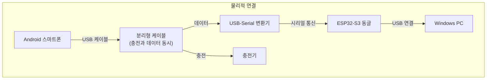
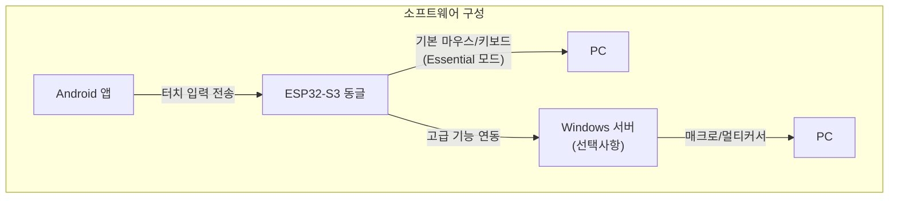
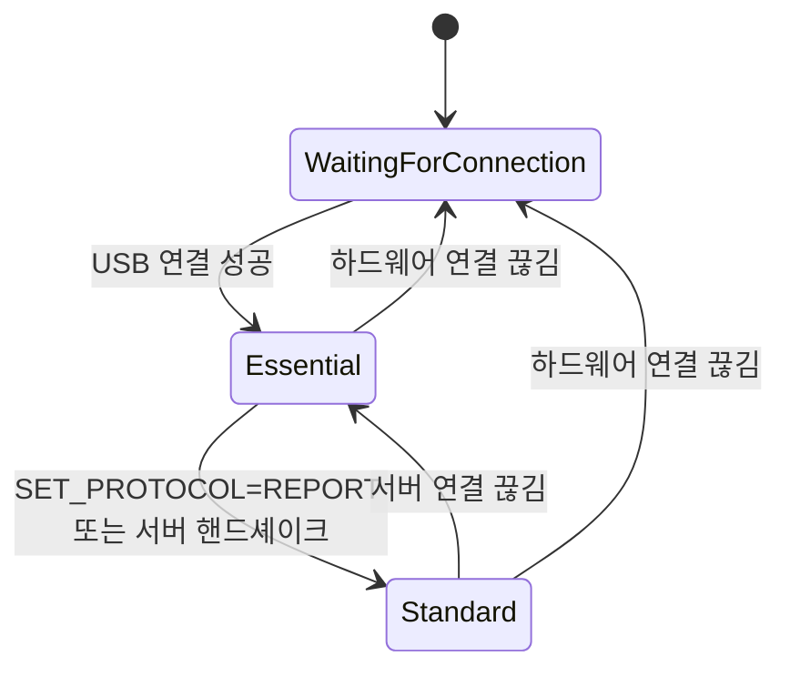

# BridgeOne 통합 유저 플로우 가이드

> **📝 출처 문서 매핑**: 본 문서는 Docs/ 폴더의 여러 문서들에서 정보를 통합하여 작성되었습니다. 각 섹션별 상세 출처는 해당 섹션에 명시되어 있습니다.

## 용어집/정의

### 기본 상태 용어
- **Selected/Unselected**: 선택 상태. UI의 시각적 강조 여부를 나타냅니다.
- **Enabled/Disabled**: 입력 가능 상태. 터치/클릭 상호작용 허용 여부를 의미합니다.
- **Essential/Standard**: 시스템 운용 상태. Essential은 Windows 서버와 연결되지 않은 상태의 필수 기능 모드이며, Standard는 서버와 연결되어 모든 확장 기능을 사용하는 모드입니다.
- **TransportState**: 연결 상태 - NoTransport | UsbOpening | UsbReady
- **AppState**: 앱 상태 - WaitingForConnection | Essential | Standard

### 터치패드 전용 용어
- **TouchpadWrapper**: 터치패드 컴포넌트 전체를 감싸는 최상위 래퍼 (1:2 비율 고정)
- **TouchpadAreaWrapper**: 실제 터치 감지가 이루어지는 터치패드 영역 래퍼
- **Touchpad1Area/Touchpad2Area**: 싱글/멀티 커서 모드에 따른 터치패드 영역 분할
- **ControlButtonContainer**: 터치패드 상단에 오버레이되는 제어 버튼 영역
- **PrimaryMode**: 터치패드의 주요 동작 모드 (MOVE | SCROLL)
- **ClickMode**: 클릭 동작 모드 (LEFT | RIGHT)
- **MoveMode**: 커서 이동 모드 (FREE | RIGHT_ANGLE)
- **CursorMode**: 커서 개수 모드 (SINGLE | MULTI)
- **스크롤 비활성 상태**: 스크롤 모드가 아닌 커서 이동 모드가 주요 동작으로 활성인 상태
- **데드존 보상**: 미세한 터치 떨림을 억제하면서 의도적 이동 시 반응 지연을 방지하는 알고리즘

### 통신 프로토콜 용어
- **8바이트 프레임**: BridgeOne 프로토콜의 표준 데이터 단위 (seq, buttons, dx, dy, wheel, flags)
- **HID Boot Mouse**: BIOS/OS에서 지원하는 표준 마우스 프로토콜
- **Keep-alive**: 연결 상태 유지를 위한 주기적 ping 신호 (0.5초 주기)

### 원칙 및 규칙
- **상태 용어 사용 원칙**: "활성/비활성" 금지. Selected/Unselected, Enabled/Disabled로 표기 [[memory:5809234]]
- **터치 추적 연속성**: 터치 시작점이 터치패드 내부라면 손가락이 영역 밖으로 이동해도 제스처 지속
- **색상 우선순위**: 무한 스크롤 > 일반 스크롤 > 우클릭 > 기본(좌클릭/커서 이동)

---

## 1. 개요
> **📋 출처**: `Docs/PRD.md` § 1.1-1.2 (프로젝트 개요, 핵심 가치), § 2.1 (타겟 사용자), § 3.1-3.3 (기능 요구사항)

### 1.1 BridgeOne 프로젝트 개요

**BridgeOne**은 "손가락 하나로도 컴퓨터 속 세상으로 들어갈 수 있는 다리"를 의미하는 근육장애 사용자를 위한 Android-PC 입력 브리지 시스템입니다.

**핵심 가치**:
- **연결성**: 물리적 세계와 디지털 세계를 연결하는 다리 역할
- **희망성**: 불가능해 보이는 것을 가능하게 만드는 기술
- **단순함**: 복잡한 설정 없이 즉시 연결되는 직관적 경험
- **접근성**: 단일 터치로 모든 기능 접근 가능

### 1.2 프로젝트 구성 요소

1. **Android 앱**: 터치 입력을 받아 8바이트 프레임으로 변환
2. **ESP32-S3 동글**: UART ↔ USB HID 변환 브리지
3. **Windows 서버** (선택): 고급 기능(매크로, 멀티 커서) 제공
4. **연결 인프라**: OTG Y 케이블, USB-Serial, 충전기

---

## 2. 시스템 아키텍처 및 구성요소
> **📋 출처**: `Docs/Board/usb-hid-bridge-architecture.md` § 2.1-2.2 (시스템 아키텍처), § 3.1-3.2 (하드웨어 연결), `Docs/technical-specification.md` § 3.1-3.2 (시스템 개요)

### 2.1 하드웨어 연결 구조



### 2.2 소프트웨어 아키텍처



### 2.3 상태 모델 및 전환



---

## 3. 시나리오 1: 장치 연결 없이 앱 실행 (초기 감지 → 대기 화면)
> **📋 출처**: `Docs/Android/design-guide-app.md` § 10.1.3 (장치 연결 대기 화면), `Docs/Android/styleframe-connection-waiting.md` § 1-4 (개요, 레이아웃, 상호작용, 진입/해제 트리거)

> **상황**: ESP32-S3 동글이 연결되지 않은 상태에서 Android 앱 실행
> **목적**: Splash 중 초기 감지 실패 → 장치 연결 대기 화면 진입

### 3.1 앱 시작 및 초기 상태 감지 (소요시간: 2.5-5초)

**앱 실행 플로우**

앱을 실행하면 스플래시 화면이 2.5초 동안 표시되며, 동시에 다음을 자동으로 확인합니다:
- USB 동글 연결 여부
- Windows 서버 실행 여부

스플래시 종료 시점에서 상황에 따라 분기됩니다:
**A) 모든 구성요소 준비됨 (약 3초):**
- **AppState: Standard** 모드로 직접 진입
- 바로 일반 홈 페이지 (Page 1) 표시
- "모든 기능이 활성화되었습니다" 알림 (녹색)

**B) USB 동글만 연결됨:**
- 즉시 Essential 모드로 진입
- Windows 서버 연결 신호 대기 중 Standard 모드로 자동 전환 가능

**C) USB 동글 미연결 (2.5초 + 대기):**
- **AppState: WaitingForConnection**
- 장치 연결 대기 화면 표시
- 회전하는 USB 아이콘과 "USB 동글을 연결해주세요" 메시지

### 3.2 장치 연결 대기 상태의 상호작용

**자동 연결 처리**
- USB 동글 연결 시 즉시 감지되어 자동 연결 시도
- 권한이 필요한 경우 자동으로 요청
- 연결 성공하면 **AppState: WaitingForConnection → Essential**로 즉시 전환

**사용자 피드백**
- **시각적 표시**: USB 아이콘이 2초 주기로 계속 회전
- **화면 상태**: 페이지 전환과 스와이프 제스처는 비활성화
- **연결 성공**: "장치가 연결되었습니다" 알림 (파란색, 2초)

### 3.3 화면 전환 및 종료 처리

**장치 연결 성공 시**
- USB 동글 연결이 확인되면 **AppState: WaitingForConnection → Essential**로 전환
- 화면이 부드럽게 전환됩니다 (페이드 아웃 → 페이드 인, 총 500ms)
- 성공 알림 표시 후 USB 탐지 기능 중단

**앱 종료 처리**
- 뒤로가기 버튼 첫 터치: "앱을 종료하시겠습니까?" 알림 (파란색, 3초)
- 3초 내 두 번째 뒤로가기: 앱 완전 종료
- 3초 초과 시: 알림 사라지고 대기 화면 유지

**지속적 대기 상태**
- 장치가 연결되지 않으면 화면이 계속 표시됩니다
- 백그라운드에서 배터리 효율적으로 대기 (이벤트 발생 시에만 동작)
- 앱을 나가면 자동 탐지 기능도 해제됩니다

---

## 4. 시나리오 2: 서버 없이 앱 실행 (Essential 모드)
> **📋 출처**: `Docs/Android/styleframe-essential.md` § 1-2 (개요, 레이아웃), § 5 (진입/해제 트리거), `Docs/Android/styleframe-connection-waiting.md` § 2-3 (연결 상태, 상호작용)

> **상황**: ESP32-S3 동글과만 연결되고 Windows 서버는 실행하지 않은 경우
> **목적**: 기본 HID 마우스/키보드 기능으로 PC 제어

### 4.1 USB 연결 및 Essential 모드 진입 (소요시간: 3-5초)

**자동 USB 연결 및 Essential 진입**

USB 동글이 연결되면 다음 과정이 자동으로 진행됩니다:
1. **USB 연결 확인**
   - USB 동글을 자동으로 탐지하고 연결
   - "USB 연결됨" 알림 (파란색, 2초)
   - **TransportState: NoTransport → UsbReady**
2. **즉시 Essential 모드 진입**
   - 연결 완료 즉시 BIOS/Boot-safe 페이지 표시
   - Windows 서버 연결 신호 대기 시작

**스마트 서버 감지 시스템**
- **즉시 BIOS 모드 진입**: USB 연결 완료 즉시 BIOS 페이지 표시
- **서버 연결 신호 대기**: Windows 서버가 0.5초마다 "연결 요청" 신호 전송
- **신호 수신 시**: **AppState: WaitingForConnection → Standard** 직접 전환
- **신호 미수신 시**: **AppState: WaitingForConnection → Essential** 유지
- 화면은 BIOS/Boot-safe 페이지 유지하며 연결 신호에 따라 자동 전환

### 4.2 Essential 모드 기능 범위

> **📋 참조**: `Docs/Android/styleframe-essential.md` (BIOS 전용 페이지 설계)

**UI/화면 제한**
- **단일 페이지만 표시**: BIOS/Boot-safe 전용 페이지만 표시
- **페이지 네비게이션 비활성**: 페이지 전환, 슬라이드 제스처, 페이지 인디케이터 모두 비활성화
- **최소 UI 구성**: 좌측 터치패드 + 우측 Boot Keyboard 클러스터만 제공

**허용되는 기본 기능**
- **터치패드 최소 제어**: 탭(좌클릭), 드래그(커서 이동) - 우클릭 모드 전환 비활성
- **Boot Keyboard**: Del, Esc, Enter, F1-F12, 방향키(DPad)만 지원
- **기본 입력만**: X/Y 마우스 이동, 좌클릭 단발, Boot 키보드 입력

**완전 비활성화되는 기능**
- **모든 고급 기능**: 무한 스크롤, 멀티 커서, 매크로, 서버 연동 기능 등
- **확장 UI 요소**: DPI 조절, 이동 모드 전환, Sticky Hold, 우클릭 등
- **페이지 접근**: 키보드 페이지, 게임 페이지 등 다른 모든 페이지 접근 불가

### 4.3 Windows 서버 연결 및 Standard 모드 복귀

**Windows 서버 연결을 통한 Standard 모드 복귀**

Standard 모드로의 전환은 **오직 Windows 서버와의 연결이 확인될 때만** 발생합니다:

1. **Windows 서버 연결 확인**:
   - Windows 서버 실행 및 연결 신호 수신
   - 서버-앱 간 핸드셰이크 완료 확인

2. **Standard 모드 전환**:
   - **AppState: Essential → Standard**
   - 이전 설정값(DPI, 모드 등) 즉시 복원
   - "노멀 모드로 복귀했습니다" 알림 (파란색, 2초)

> **중요**: Windows 서버가 실행되고 연결이 확인되어야만 Standard 모드로 전환됩니다. 서버 연결이 확인되지 않으면 앱은 Essential 모드를 유지합니다.

---

## 5. 시나리오 3: 모두 정상 연결 (Splash → 직접 Standard 모드)

> **📋 출처**: `Docs/Android/styleframe-page1.md` § 1-2 (Page 1 개요, 레이아웃), `Docs/Android/styleframe-page2.md` § 1-2 (Page 2 개요, 레이아웃), `Docs/Android/styleframe-page3.md` § 1-2 (Page 3 개요, 레이아웃), `Docs/Windows/technical-guide-server.md` § 5.1 (서버-앱 연결 플로우), `Docs/Android/component-design-guide-app.md` § 2-4 (컴포넌트 상세 명세), `Docs/Android/component-touchpad.md` § 3 (터치패드 상세 플로우)

> **상황**: 앱 실행 시점에 ESP32-S3 동글 + Windows 서버 모두 준비된 경우

### 5.1 앱 시작 및 연결 최적화

> **📋 기술적 구현 세부사항**: `Docs/Android/usb-serial-integration-guide.md` 참조

#### 5.1.1 BridgeOne 스플래시 화면과 백그라운드 연결의 동시 진행

**사용자 경험**: 2.5초간의 브랜드 애니메이션과 완벽하게 동기화된 연결 프로세스

**Phase 1-6: 스플래시 애니메이션 시퀀스 (2.5초)**
> **📋 출처**: `Docs/animated-splash-screen-plan.md` § 애니메이션 시퀀스 설계

**동시 진행되는 백그라운드 연결 작업**:
- **USB 동글 연결**: CP2102 자동 탐지 및 1Mbps 통신 설정 (100ms 내 완료)
- **Windows 서버 핸드셰이크**: ESP32-S3를 통한 상호 인증 및 상태 동기화 (2초 내 완료)
- **고급 기능 준비**: 멀티 커서, 매크로 엔진, 녹화 기능 활성화 준비

**완벽한 타이밍 동기화**:
- 스플래시 애니메이션 종료와 연결 완료가 정확히 2.5초에 맞춰짐
- 사용자는 중간 대기 없이 바로 Standard 모드로 진입
- "모든 기능이 활성화되었습니다" 성공 피드백 (녹색 토스트, 3초) + 햅틱 Strong

#### 5.1.2 Standard 모드 즉시 전환 및 전체 기능 활성화

**앱 상태 전환**:
- `AppState: WaitingForConnection → Standard` 즉시 적용
- 모든 UI 컴포넌트 300ms 페이드 인으로 활성화
- Standard 모드 3개 페이지 접근 가능 + 고급 기능 잠금 해제

**Page 1 초기 표시 상태**:
- 터치패드 기본 모드: `PrimaryMode=MOVE`, `ClickMode=LEFT`, `MoveMode=FREE`, `CursorMode=SINGLE`
- DPI 설정: Medium (1.0x) 기본 상태
- 테두리 색상: `#2196F3` (좌클릭 + 자유 이동)
- Actions 패널: Special Keys, Shortcuts, Macros 전체 영역 즉시 활성화

**Windows 서버 동기화 완료**:
- 커서 팩 자동 감지 및 매크로 라이브러리 준비
- 멀티 커서 시스템 대기 상태
- 고급 입력 처리 엔진 전체 가동

**사용자 피드백 완료**:
- 성공 토스트: "모든 기능이 활성화되었습니다" (녹색 배경, 3초 표시)
- 햅틱 피드백: Strong 카테고리 진동 (45-55ms, 최대 강도)
- 페이지 인디케이터: Page 1이 Selected 상태로 표시 (파란색, 12dp)

### 5.2 Page 1 (터치패드 + 액션) 완전 사용 시나리오
> **📋 출처**: `Docs/Android/styleframe-page1.md` § 2 (레이아웃 구조), `Docs/Android/component-touchpad.md` § 3 (상세 유저 플로우), `Docs/Android/component-design-guide-app.md` § 2 (버튼 컴포넌트)

#### 5.2.1 터치패드 컴포넌트 상세 사용법
> **📋 참조**: `Docs/Android/component-touchpad.md` § 1 (내부 컴포넌트 구성), § 3 (상세 유저 플로우)

**터치패드 컴포넌트 구조 개요**:
- **TouchpadWrapper**: 1:2 비율로 고정된 터치패드 전체 래퍼 (최소 160×320dp)
- **TouchpadAreaWrapper**: 실제 터치 감지 영역 (전체 크기, 둥근 모서리 3%)
- **ControlButtonContainer**: 상단에 오버레이되는 제어 버튼 영역 (높이 15%)
- **터치 추적 연속성**: 터치 시작점이 터치패드 내부라면 손가락이 영역 밖으로 이동해도 제스처 지속

##### 5.2.1.1 클릭 모드 변경 및 사용

**좌클릭 모드 (기본 상태)**:
1. **기본 설정**: 
   - 터치패드 테두리: `#2196F3` (파란색) - 좌클릭 + 자유 이동 조합
   - ClickModeButton 표시: "우클릭 모드" (다음 전환 모드 표시)
2. **좌클릭 실행**:
   - **터치패드 짧은 탭**: 200ms 이하, 데드존(8px) 이하 이동
   - **데드존 보상**: 미세 떨림 억제하면서 의도적 이동은 누적 후 보상
   - **ESP32-S3 전송**: 8바이트 프레임으로 좌클릭 신호 전송

**좌클릭 → 우클릭 모드 전환**:
1. **ClickModeButton 탭** (제어 버튼 컨테이너 좌측 첫 번째):
   - 버튼 스케일 애니메이션 (1.0 → 0.95 → 1.0, 200ms)
   - 햅틱 Light 피드백 (OS 사전 정의 효과)
2. **시각적 전환**:
   - 아이콘: `ic_lclick.xml` → `ic_rclick.xml`
   - 텍스트: "우클릭 모드" → "좌클릭 모드"
   - 버튼 배경: `#2196F3` → `#F3D021` (우클릭 대표 색상)
3. **터치패드 테두리 업데이트**:
   - 현재 이동 모드와 조합하여 색상 결정
   - 우클릭 + 자유 이동: `#F3D021` 단색
   - 우클릭 + 직각 이동: 좌=`#F3D021` → 우=`#FF8A00` 그라데이션

**우클릭 기능 사용**:
1. **우클릭 실행**: 터치패드 짧은 탭 → 우클릭 명령 전송 → PC 컨텍스트 메뉴
2. **상태 확인**: 터치패드 테두리 `#F3D021` 색상으로 현재 우클릭 모드 확인

##### 5.2.1.2 커서 이동 모드 변경 및 사용

**자유 이동 모드 (기본 상태)**:
1. **기본 동작**: 터치패드 드래그 → 모든 방향 자유 커서 이동
2. **DPI 반영**: 설정된 DPI 배율로 민감도 조절
3. **영역 외 추적**: 터치 시작이 내부라면 영역 밖 이동도 추적 지속

**자유 이동 → 직각 이동 전환**:
1. **MoveModeButton 탭** (제어 버튼 컨테이너 좌측 두 번째):
   - 현재 `PrimaryMode=MOVE` 상태에서만 표시
   - 햅틱 Medium 피드백 (모드 전환 강조)
2. **시각적 전환**:
   - 아이콘: `ic_free_move.xml` → `ic_right_angle_move.xml`
   - 텍스트: "커서 직각 이동 모드" → "커서 자유 이동 모드"
   - 배경색: `#2196F3` → `#FF8A00` (직각 이동 대표 색상)
3. **테두리 색상 업데이트**: 클릭 모드와 조합하여 결정

**직각 이동 모드 사용법**:
1. **축 결정 과정**:
   - 드래그 시작 → 최소 거리(18dp) 이동까지 축 미결정
   - 각도 계산: ±22.5° 범위로 수평/수직 축 분류
   - 축 결정 후 터치 종료까지 축 고정 유지
2. **축별 동작**:
   - **X축 고정**: Δy 성분 완전 무시, 수평 이동만
   - **Y축 고정**: Δx 성분 완전 무시, 수직 이동만
3. **정밀 제어**: 완벽한 직선 이동으로 정밀 작업 지원

##### 5.2.1.3 스크롤 모드 시스템

**스크롤 모드 진입** (PrimaryMode 전환):
1. **ScrollModeButton 탭** (제어 버튼 컨테이너 좌측 세 번째):
   - 현재 `PrimaryMode=MOVE` 상태에서 스크롤 모드로 전환
   - 직전 사용 스크롤 타입에 따라 일반/무한 스크롤 중 하나로 진입
2. **UI 전환 (300ms 애니메이션)**:
   - 클릭 모드/DPI 버튼 숨김 (상태는 보존)
   - 스크롤 감도 버튼 표시 (우측 첫 번째 위치)
3. **테두리 색상**: 일반 스크롤 `#84E268` 또는 무한 스크롤 `#F32121`

**일반 스크롤 상세 사용법**:
1. **스크롤 가이드라인 시스템**:
   - 드래그 시작 → 초록색(`#84E268`) 가이드라인 즉시 표시
   - 방향별 라인 패턴: 세로 스크롤 시 가로선, 가로 스크롤 시 세로선
   - 사용자 드래그 속도와 완벽 동기화된 라인 움직임
2. **스크롤 단위 및 햅틱**:
   - 20dp마다 1단위 스크롤 HID 신호 전송
   - 단위 달성 시마다 햅틱 Light 피드백 (최대 10Hz)
   - 감도 설정에 따라 단위당 거리 조절 가능
3. **방향 전환**: 드래그 중 방향 전환 시 즉시 가이드라인 방향 변경

**무한 스크롤 (관성 스크롤)**:
1. **일반 → 무한 전환**: 일반 스크롤 상태에서 ScrollModeButton 재탭
2. **관성 시스템**:
   - 드래그 속도 벡터 실시간 추적
   - 드래그 종료 후 지수 감속 (감속 상수 τ=350ms)
   - 빨간색(`#F32121`) 가이드라인으로 관성 방향 표시
3. **즉시 정지**: 관성 중 터치 시 즉시 정지
4. **자동 종료**: 임계속도(2px/s) 이하 시 가이드라인 자동 숨김

**스크롤 모드 종료**:
- **더블탭 제스처**: 터치패드 영역에서 300ms 이내 2회 탭
- **즉시 전환**: `PrimaryMode=SCROLL → MOVE`
- **UI 복구**: 클릭/DPI 버튼 즉시 표시, 스크롤 감도 숨김
- **테두리 복구**: 스크롤 비활성 조합색 (클릭+이동 모드 색상)

##### 5.2.1.4 스크롤 감도 조절

**ScrollSensitivityButton 사용** (스크롤 모드에서만 표시):
1. **위치**: 제어 버튼 컨테이너 우측 첫 번째
2. **감도 순환**: 보통(1.0x) → 빠름(1.25x) → 느림(0.8x) → 보통
3. **색상 변경**: 
   - 느림: `#20D8AD` (청록색)
   - 보통: `#2196F3` (파란색) 
   - 빠름: `#818BFF` (연보라색)
4. **즉시 적용**: 다음 스크롤부터 새로운 감도 반영

##### 5.2.1.5 DPI 조절 시스템

**DPIControlButton 사용** (커서 이동 모드에서만 표시):
1. **위치**: 제어 버튼 컨테이너 우측 세 번째
2. **DPI 순환**: 보통(1.0x) → 높음(1.4x) → 낮음(0.7x) → 보통
3. **아이콘 매핑**: Standard(`ic_normal.xml`) → Fast(`ic_fast.xml`) → Slow(`ic_slow.xml`)
4. **배경색 변경**: `#2196F3` → `#818BFF` → `#20D8AD` → `#2196F3`
5. **커서 이동 반영**: 다음 드래그부터 새로운 DPI 배율 적용

##### 5.2.1.6 터치패드 색상 피드백 시스템

**테두리 색상 결정 규칙** (우선순위 기준):
1. **무한 스크롤 활성**: `#F32121` (빨간색) 단색
2. **일반 스크롤 활성**: `#84E268` (초록색) 단색
3. **스크롤 비활성**: 클릭×이동 모드 조합
   - 파란색 중복 시: 파란색 단색
   - 한쪽만 파란색: 파란색 아닌 쪽 단색 사용
   - 둘 다 비파란색: 좌=클릭색, 우=이동색 그라데이션

**제어 버튼 색상 원칙**:
- 모든 버튼은 "다음 전환 모드"의 대표 색상을 배경으로 사용
- 텍스트/아이콘: `#1E1E1E` (진한 회색) 고정
- 상태 보존: UI에서 숨겨져도 내부 상태는 유지

#### 5.2.2 Actions 패널 상세 사용법
> **📋 참조**: `Docs/Android/styleframe-page1.md` § 2.2 (우측 Actions 패널)

##### 5.2.2.1 Special Keys 영역 사용

**권장 키 세트** (2열 그리드, 8개):
- `Esc`, `Tab`, `Enter`, `Backspace`, `Delete`, `Space`, `Home`, `End`

**KeyboardKeyButton 사용법**:
1. **단일 키 입력** (예: `Enter` 버튼):
   - 탭: 즉시 `KeyDown → KeyUp` 시퀀스 ESP32-S3로 전송
   - 햅틱 Light (12-16ms) + 버튼 스케일 애니메이션 (200ms)
   - PC에서 Enter 키 동작 즉시 실행

2. **Sticky Hold 지원 키** (예: `Ctrl` 버튼, `canStickyHoldOnLongPress=true`):
   - **짧은 탭**: 즉시 `CtrlDown → CtrlUp`
   - **롱프레스** (500ms 임계 초과):
     - `isStickyLatched=true` 상태로 전환
     - CtrlDown 유지, 버튼 배경 `#1976D2` (Sticky Hold 색상)
     - 다음 탭에서 CtrlUp 전송 후 라치 해제

##### 5.2.2.2 Shortcuts 영역 사용

**권장 조합** (2열 그리드, 8개):
- `Ctrl+C`, `Ctrl+V`, `Ctrl+S`, `Ctrl+Z`, `Ctrl+Shift+Z`, `Ctrl+X`, `Alt+Tab`, `Win+D`

**ShortcutButton 사용법**:
1. **단축키 실행** (예: `Ctrl+C` 버튼):
   - 탭: 정의된 순서로 키 시퀀스 실행
   - 시퀀스: `CtrlDown → CDown → CUp → CtrlUp`
   - 디바운스: 150ms 내 재탭 무시 (중복 주입 방지)
   - 햅틱 Light + 스케일 애니메이션

2. **Alt+Tab 특수 처리**:
   - 탭: Alt 누른 상태 유지
   - 버튼 Selected 상태 표시 (Alt 유지 중)
   - 일정 시간 후 또는 다른 입력 시 Alt 해제

##### 5.2.2.3 Macros 영역 사용

**사전 정의 매크로** (세로 리스트):
- `Macro 1`, `Macro 2`, `Macro 3` - 빌드 시 고정 매핑

**MacroButton 사용법**:
1. **매크로 실행 시작**:
   - 탭: `MACRO_START_REQUEST(macroId)` 즉시 전송
   - 버튼 상태: `isEnabled=false` (중복 입력 방지)
   - 배경색: `#2196F3` → `#C2C2C2` (Disabled 색상)
   - 진행 표시: 상단 토스트로만 "매크로 실행 중..." 표시

2. **Windows 서버 처리**:
   - 서버가 `macroId` 존재 여부 확인
   - **매크로 존재**: 실행 시작 → 완료 후 `TASK_COMPLETED` 응답
   - **매크로 없음**: 즉시 `MACRO_NOT_FOUND` 응답

3. **응답 처리** (라이브러리 기반):
   - **성공**: `onNewData()` 콜백에서 `TASK_COMPLETED(status=Success)` 수신
     - 버튼 즉시 Enabled 복구 (`#C2C2C2` → `#2196F3`)  
     - 성공 토스트: "매크로가 완료되었습니다" (녹색, 3초)
   - **오류**: `TASK_COMPLETED(status=Error)` 수신
     - 버튼 즉시 Enabled 복구
     - 오류 토스트: "매크로 실행 중 오류가 발생했습니다" (주황색, 4초)
   - **매크로 없음**: `MACRO_NOT_FOUND` 수신 (100ms 내)
     - 즉시 버튼 Enabled 복구
     - 오류 토스트: "해당 매크로를 찾을 수 없습니다" (1500ms)

4. **강제 해제 기능**:
   - **동일 버튼 재탭**: 실행 중 동일 MacroButton 재탭
   - **취소 신호 전송**: `MACRO_CANCEL_REQUEST(macroId)` 즉시 전송
   - **강제 활성화**: `UI_FORCE_ENABLE_ALL_TOUCHABLES_REQUEST` 병행 전송
   - **즉시 복구**: 모든 터치 가능 요소 Enabled 복구
   - **취소 토스트**: "작업이 취소되었습니다" (1000ms)

### 5.3 Page 2 (키보드 중심) 완전 사용 시나리오
> **📋 출처**: `Docs/Android/styleframe-page2.md` § 2 (레이아웃 구조), `Docs/Android/component-design-guide-app.md` § 2.2 (KeyboardKeyButton, ShortcutButton)

#### 5.3.1 페이지 전환 및 초기 상태

**Page 1 → Page 2 전환**:
1. **슬라이드 제스처**: 화면 폭의 20% 이상 좌측으로 슬라이드
2. **페이지 전환 애니메이션**: 
   - 스프링 효과 (400ms) 페이지 밀림 효과
   - 햅틱 Strong 피드백 (45-55ms)
   - 페이지 인디케이터 Selected 이동: Page 1 → Page 2
3. **이전 상태 저장**: Page 1의 모든 터치패드 설정값 자동 저장
4. **Page 2 로드**: 키보드 중심 레이아웃 활성화

**Page 2 초기 표시 상태**:
- **좌측 Key Cluster**: Modifiers Bar + Navigation/Editing Grid + Function Row
- **우측 Actions 패널**: Shortcuts + Media Controls + Lock Keys
- **터치패드 숨김**: Page 2에서는 기본적으로 터치패드 비표시
- **페이지 인디케이터**: Page 2가 Selected(파란색, 12dp) 상태

#### 5.3.2 Modifiers Bar 상세 사용법 (상단 고정)

##### 5.3.2.1 Sticky Modifiers 시스템
> **📋 참조**: `Docs/Android/component-design-guide-app.md` § 2.2.1 (KeyboardKeyButton), `Docs/Android/styleframe-page2.md` § 3 (상호작용 및 상태)

**Modifier 키들** (`Ctrl`, `Shift`, `Alt`, `Win`):

**탭 모드 (일시 고정)**:
1. **Ctrl 버튼 탭**:
   - 즉시 `CtrlDown` 전송, 버튼 Selected 상태 (`#2196F3` 강조색)
   - 햅틱 Light + 스케일 애니메이션
   - **자동 해제**: 다음 키 입력 후 또는 800ms 경과 시 `CtrlUp` 전송
   - UI 복귀: Selected → Unselected 상태로 버튼 색상 복구

**더블탭 모드 (토글 고정)**:
1. **Shift 버튼 더블탭** (300ms 이내 2회):
   - 첫 탭: 일시 고정 시작
   - 둘째 탭: 토글 모드 진입 → `isStickyLatched=true`
   - **지속 표시**: 버튼 배경에 토글 배지 노출
   - **해제**: 재탭 또는 페이지 전환 시 자동 해제

**길게 누르기 모드** (누르는 동안만):
1. **Alt 버튼 롱프레스** (400ms 이상):
   - 누르는 동안 `AltDown` 유지
   - 버튼 배경 `#1976D2` (Pressed 상태) 표시
   - **해제**: 손을 떼는 순간 `AltUp` 전송

##### 5.3.2.2 Modifier 조합 사용 예시

**복합 단축키 실행**:
1. **Ctrl 탭 → C 키 입력**:
   - Ctrl 버튼 탭 → `CtrlDown` 전송 + Selected 표시
   - 우측 Actions의 `Ctrl+C` ShortcutButton 탭
   - 자동 시퀀스: 이미 Ctrl이 Down 상태이므로 `CDown → CUp` 만 추가 전송
   - Ctrl 자동 해제: `CtrlUp` 전송 + 버튼 Unselected 복귀

#### 5.3.3 Navigation/Editing Grid 상세 사용법

##### 5.3.3.1 화살표 키 클러스터 (Inverted-T 배치)

**화살표 키 배치**:
- `↑` 중앙 상단, `←`/`→` 좌우, `↓` 중앙 하단
- 각 버튼 최소 48dp × 48dp 터치 영역 보장

**화살표 키 사용법**:
1. **단발 입력** (`↑` 버튼 탭):
   - 즉시 `UpArrowDown → UpArrowUp` 전송
   - 햅틱 Light + 버튼 스케일 애니메이션
   - PC에서 커서 또는 포커스 위로 이동

2. **Key Repeat** (길게 누르기):
   - **초기 지연**: 400ms 후 반복 시작
   - **반복 주기**: 60ms 간격 (OS 설정 준수, 앱 레벨 스로틀 25-30Hz)
   - **시각적 피드백**: 누르는 동안 버튼 Selected 상태 유지
   - **해제**: 손을 떼는 순간 키 반복 중단

##### 5.3.3.2 편집 키 그룹 (2-3열 그리드)

**편집 키들**: `Backspace`, `Delete`, `Enter`, `Tab`, `Home`, `End`, `PageUp`, `PageDown`

**특수 기능 키 사용법**:
1. **Home 키**:
   - 탭: 줄 시작으로 이동
   - Ctrl + Home 조합: 문서 시작으로 이동 (Modifier와 조합 시)

2. **PageUp/PageDown**:
   - 단발: 한 페이지 스크롤
   - 길게 누르기: 연속 페이지 스크롤 (Key Repeat 적용)

#### 5.3.4 Function Row 사용법 (하단)

**F1~F12 키 (수평 스크롤)**:
- **레이아웃**: Chips 또는 Compact 버튼 형태
- **스크롤**: 좌우 스와이프로 숨겨진 Function 키 접근
- **길게 누르기 지원**: 모든 F키에서 Key Repeat 기능 활성화

**F키 특수 기능**:
- **F5**: 새로고침 (브라우저/탐색기 등)
- **F11**: 전체화면 토글
- **F12**: 개발자 도구 (브라우저 등)

### 5.4 Page 3 (Minecraft 특화) 완전 사용 시나리오
> **📋 출처**: `Docs/Android/styleframe-page3.md` § 2-6 (레이아웃, DPad, Movement, Actions), `Docs/Android/component-design-guide-app.md` § 3 (4방향 D패드 컴포넌트)

#### 5.4.1 Page 3 진입 및 레이아웃 활성화

**Page 2 → Page 3 전환**:
1. **슬라이드 제스처**: 화면 폭의 20% 이상 좌측으로 슬라이드
2. **게임 특화 레이아웃 로드**:
   - 좌측: 터치패드 (시점 제어용, 1:2 비율 유지)
   - 우측: Movement (DPad) + Combat & Use + Inventory/Utility + Hotbar
3. **페이지 인디케이터**: Page 3 Selected 표시

#### 5.4.2 DPad 컴포넌트 상세 사용법
> **📋 참조**: `Docs/Android/component-design-guide-app.md` § 3 (4방향 D패드 컴포넌트)

##### 5.4.2.1 DPad 구조 및 초기 상태

**물리적 구조**:
- **컨테이너 크기**: 120dp × 120dp 정사각형
- **형태**: 둥근 사각형 (`RoundedCornerShape(12.dp)`)
- **배경**: VectorDrawable(`ic_dpad.xml`) 베이스 레이어
- **영역 분할**: 중심 원형(30% 반지름) + 8방향 섹터

**섹터 매핑** (45° 단위):
- **상하좌우**: Up(W), Down(S), Left(A), Right(D)  
- **대각선**: UpLeft(W+A), UpRight(W+D), DownLeft(S+A), DownRight(S+D)
- **중앙**: 입력 무시 (무효 영역)

##### 5.4.2.2 방향 입력 상세 플로우

**단방향 입력** (예: Up 영역 탭):
1. **섹터 판정**: 터치 위치의 중심 기준 벡터 각도 계산
2. **즉시 키 전송**: W키 `KeyDown → KeyUp` ESP32-S3로 전송
3. **시각적 피드백**: 
   - VectorDrawable의 Up 폴리곤에 선택 색(`#2196F3`) 오버레이
   - 컨테이너 테두리 하이라이트 표시
4. **햅틱 피드백**: Light 카테고리 (12-16ms)

**대각선 입력** (예: UpLeft 섹터):
1. **2키 동시 처리**: W키와 A키 동시 KeyDown 전송
2. **시각적 피드백**: Up + Left 폴리곤 동시 오버레이
3. **키 해제**: 터치 종료 시 W키, A키 순차 KeyUp

##### 5.4.2.3 드래그 방향 전환 (예외 규칙)
> **📋 참조**: `Docs/Android/design-guide-app.md` § 1.2.1 (터치 시작점 기준 동작)

**동일 포인터 유지 방향 전환**:
1. **드래그 전환**: Up 영역에서 시작 → 포인터 유지하며 Right 영역으로 이동
2. **이전 키 해제**: W키 즉시 KeyUp 전송
3. **새 키 활성화**: D키 즉시 KeyDown 전송 
4. **레이턴시 최소화**: 전환 처리 최대 1프레임(16.67ms) 내 완료
5. **시각적 업데이트**: Up 오버레이 제거 → Right 오버레이 표시

**디바운스 처리**:
- **동일 방향 재탭**: 50ms 이내 동일 방향 재입력 무시
- **미세 떨림 억제**: 6px 미만 미세 변동 무시

#### 5.4.3 게임 액션 그룹 사용법

##### 5.4.3.1 Movement 보조 버튼

**Jump (Space) 버튼**:
1. **단발 점프**: 탭 시 `SpaceDown → SpaceUp` 즉시 전송
2. **디바운스**: 300ms 내 재탭 무시

**Sneak (Shift) 버튼**:
1. **800ms 홀드**: 탭 시 Shift 800ms 유지 후 자동 해제
2. **토글 모드**: 더블탭 시 지속 Selected 상태, 재탭 또는 롱프레스로 해제
3. **상태 표시**: 토글 중 버튼 배경 `#1976D2` (선택 색상)

**Sprint (Ctrl) 버튼**:
1. **Sneak와 동일 패턴**: 800ms 홀드 또는 더블탭 토글
2. **충돌 처리**: Sneak/Sprint 동시 토글 시 마지막 입력 우선, 이전 상태 자동 해제

##### 5.4.3.2 Combat & Use 그룹

**Attack (LClick)**:
- **단발**: 탭 시 마우스 좌클릭 전송
- **지속 공격**: 길게 누르기 시 좌클릭 Down 유지, 해제 시 Up

**Use/Place (RClick)**:
- **단발**: 탭 시 마우스 우클릭 전송  
- **지속 사용**: 길게 누르기 시 우클릭 Down 유지

**Pick Block (MClick)** (선택적):
- **크리에이티브 모드 전용**: 탭 시 마우스 중간클릭 전송

##### 5.4.3.3 Inventory/Utility 그룹

**인벤토리 및 유틸리티 키들**:
- **Inventory (E)**: 인벤토리 창 열기/닫기
- **Drop (Q)**: 
  - 단발: 아이템 1개 드롭
  - 길게 누르기: 연속 드롭 (주의: 기본 Disabled 옵션)
- **Swap items (F)**: 손에 든 아이템 교환
- **Perspective (F5)**: 1인칭/3인칭 시점 토글
- **Pause/Menu (ESC)**: 게임 메뉴 열기
- **Chat (T)**: 채팅창 열기

#### 5.4.4 터치패드 시점 제어 (Minecraft 매핑)

##### 5.4.4.1 카메라 터치패드 사용법

**시점 이동 매핑**:
- **드래그**: 터치패드 드래그 → 마우스 X/Y 상대 이동 → 시점 회전
- **감도**: 기본 Standard DPI (1.0x) 적용
- **제스처**: 드래그만 유효, 더블탭/롱프레스 무시

**스크롤 → Hotbar 매핑**:
1. **스크롤 모드 활성화**: 터치패드 제어 버튼에서 스크롤 모드 선택
2. **Hotbar 스크롤**: 
   - 세로 드래그 → Wheel Up/Down 전송 → Hotbar 아이템 선택
   - 수평 드래그도 동일하게 Wheel 신호로 변환
3. **25-30Hz 스로틀**: 연속 휠 스크롤 상한 적용

##### 5.4.4.2 Hotbar 직접 선택

**숫자 버튼 (1~9)**:
- **직접 선택**: 각 숫자 버튼 탭 → 해당 Hotbar 슬롯 즉시 선택
- **시각적 피드백**: 탭한 버튼 잠시 Selected 표시

**Wheel Up/Down 버튼**:
- **작은 화살표 버튼**: ↑/↓ 버튼으로 Hotbar 순환
- **연속 스크롤**: 길게 누르기 시 25-30Hz로 스로틀된 연속 휠 전송

#### 5.2.3 멀티 커서 시스템 사용 시나리오
> **📋 출처**: `Docs/Android/component-touchpad.md` § 3.2.4 (커서 모드 플로우), `Docs/Windows/technical-guide-server.md` § 5.4, § 6.1 (멀티 커서 관리)

##### 5.2.3.1 멀티 커서 모드 활성화

###### 5.2.3.1.1 초기 활성화 과정

**CursorModeButton 사용** (제어 버튼 컨테이너 좌측 네 번째):
1. **버튼 탭**: `CursorModeButton` 탭으로 싱글 → 멀티 커서 전환
2. **즉시 피드백**:
   - 버튼 스케일 애니메이션 (1.0 → 0.95 → 1.0, 200ms)  
   - 햅틱 Medium 피드백 (24-32ms, 모드 전환 강조)
3. **모드 전환 신호**: `MULTI_CURSOR_MODE_ENABLE` Windows 서버로 전송

**터치패드 분할 애니메이션** (300ms ease-out):
1. **분할 시작**: 단일 TouchpadAreaWrapper에서 좌우 분할 시작
2. **분할 프로세스**:
   - 중앙 구분선 페이드 인 (1px 두께, `#C2C2C2` 색상)
   - 좌측: `Touchpad1Area` (50% 폭), 우측: `Touchpad2Area` (50% 폭)
   - 각 영역에 라벨 표시 (Touchpad1 | Touchpad2)
3. **버튼 UI 업데이트**:
   - 텍스트: "멀티 커서" → "싱글 커서" (다음 전환 모드 표시)
   - 아이콘: `ic_multi_cursor.xml` → `ic_single_cursor.xml`
   - 배경색: `#2196F3` → `#B552F6` (멀티 커서 대표 색상)

**터치패드 전환 기반 커서 제어**:
1. **전환 감지 시스템**:
   - `Touchpad1Area` 터치 → cursor1 활성화 신호
   - `Touchpad2Area` 터치 → cursor2 활성화 신호
   - `MULTI_CURSOR_SWITCH(targetCursorId)` 즉시 전송
2. **시각적 상태 표시**:
   - **Selected 터치패드**: 현재 모드 조합에 따른 테두리 색상 표시
   - **Unselected 터치패드**: 테두리 없음 (배경만 표시)
   - **전환 효과**: 파란색 펄스 애니메이션 (100ms, 80% 투명도)

###### 5.2.3.1.2 멀티 커서 테두리 색상 시스템

**테두리 표시 규칙** (Selected 터치패드에만 적용):
1. **스크롤 모드 활성**:
   - 무한 스크롤: `#F32121` (빨간색) 단색
   - 일반 스크롤: `#84E268` (초록색) 단색
2. **스크롤 비활성** (클릭×이동 조합):
   - 좌클릭 + 자유 이동: `#2196F3` (파란색) 단색
   - 우클릭 + 자유 이동: `#F3D021` (노란색) 단색
   - 좌클릭 + 직각 이동: `#FF8A00` (주황색) 단색
   - 우클릭 + 직각 이동: 좌=`#F3D021` → 우=`#FF8A00` 그라데이션
3. **Unselected 터치패드**: 항상 테두리 없음 (모드 무관)

###### 5.2.3.1.3 Windows 서버 연동 및 가상 커서 표시

**서버 측 초기화** (2-3초):
1. **레지스트리 자동 감지**:
   - `HKEY_CURRENT_USER\Control Panel\Cursors` 전체 조회
   - 현재 활성 커서 스킴 감지 (예: "Material x-V-x Light")
   - 14개 표준 커서 타입 파일 경로 추출 및 검증

2. **커서 팩 로딩**:
   - 감지된 `.cur/.ani` 파일들을 메모리에 로딩
   - 커서 이미지 캐시 생성 (Standard, Hand, IBeam 등)
   - 품질 평가: "Excellent quality (14 registry cursors)" 완료

3. **오버레이 윈도우 생성**:
   - 투명 배경의 전체 화면 오버레이 윈도우 생성
   - `WindowStyle.None`, `Topmost=true`, `ShowInTaskbar=false` 설정
   - GPU 가속 활성화 및 60fps 렌더링 준비

**가상 커서 초기 배치**:
1. **cursor1 활성화**: 현재 실제 커서 위치에서 초기화
2. **cursor2 대기**: 화면 중앙 (960, 540) 위치에 가상 커서 표시
3. **표시 타입 적용**: 기본 "Dashed Border" 타입으로 점선 테두리 표시
4. **실시간 동기화**: 실제 커서 상태 변화(Standard→Hand 등) 감지 시 가상 커서 이미지 자동 업데이트

###### 5.2.3.1.4 커서 팩 자동 감지 및 적용

**Material x-V-x Light 감지 예시**:
1. **자동 팩 분석**:
   - 공통 폴더: "D:\Cursors\Material-Light\" 추론
   - Install.inf 파일 파싱 → 팩 메타데이터 추출
   - 제작자: "alexgal", 생성일: 추출된 정보 표시

2. **호환성 검사**:
   - 6가지 표시 타입 모두 호환성 확인
   - 권장 설정: "Glow Effect with cyan tint" 자동 제안
   - 최적화: 해당 팩에 맞는 글로우 반지름 12px 권장

3. **가상 커서 적용**:
   - Material Light 스타일의 Standard 커서를 가상 커서에 즉시 적용
   - 점선 테두리 + 약간의 글로우 효과로 가시성 최적화

##### 5.2.3.2 텔레포트 기능 사용

###### 5.2.3.2.1 터치패드 영역 전환

**Touchpad1 → Touchpad2 전환**:
1. **터치 감지**: 사용자가 우측 터치패드 영역 (Touchpad2Area) 터치
2. **Android 앱 처리**:
   - 터치 영역 식별 → cursor2로 전환 결정
   - `MULTI_CURSOR_SWITCH(targetCursorId=2, animationType="fade")` 전송
3. **테두리 업데이트**: 
   - 좌측 터치패드: Selected → Unselected (테두리 제거)
   - 우측 터치패드: Unselected → Selected (테두리 표시)

###### 5.2.3.2.2 애니메이션 및 피드백

**Windows 서버 텔레포트 처리** (150ms 애니메이션):
1. **Phase 1 - 페이드 아웃** (50ms):
   - 현재 활성 가상 커서(cursor1) 투명도 1.0 → 0.3
   - 실제 커서 위치 저장: `GetCursorPos()` → cursor1 위치로 백업

2. **Phase 2 - 하이라이트** (50ms):
   - 목표 가상 커서(cursor2) 글로우 효과 증가
   - BlurRadius 8px → 20px로 확장
   - 글로우 색상: 텔레포트 하이라이트 `#8B5CF6` (Purple-500)

3. **Phase 3 - 페이드 인** (50ms):
   - 실제 커서 위치 변경: `SetCursorPos(cursor2.x, cursor2.y)` 즉시 실행
   - 새 활성 위치에서 가상 커서2 숨김
   - 이전 위치(cursor1)에 가상 커서 표시 (원래 표시 타입 적용)
   - 목표 커서 글로우 정상화

###### 5.2.3.2.3 위치 저장 및 복원

**커서 위치 관리**:
1. **위치 저장**: 각 텔레포트마다 이전 위치를 가상 커서 위치로 저장
2. **좌표 추적**: 실시간 좌표 표시 (Windows 서버 GUI에서 확인 가능)
3. **세션 지속성**: 앱 재시작 시에도 마지막 커서 위치들 복원

**작업 효율성 개선**:
- **이동 시간 단축**: 멀리 떨어진 영역 간 작업 시 80% 시간 절약
- **워크플로우 예시**: 
  - cursor1: 코드 편집기 영역
  - cursor2: 브라우저 영역  
  - 터치패드 전환만으로 두 영역 간 즉시 작업 전환

##### 5.2.3.3 고급 멀티 커서 기능

###### 5.2.3.3.1 가상 커서 표시 타입 변경

**Windows 서버 GUI에서 설정**:
1. **표시 타입 선택**: Dashed Border → Color Tint로 변경
2. **즉시 반영**: 실행 중인 가상 커서들에 새 타입 즉시 적용
3. **색상 커스터마이징**: 파란색 → 녹색 틴트로 변경
4. **강도 조절**: 70% → 90% 강도로 가시성 향상

###### 5.2.3.3.2 실시간 커서 상태 동기화

**시스템 커서 상태 변화 감지**:
1. **상태 감지**: 텍스트 입력 영역으로 이동 시 커서가 I-beam으로 변경
2. **자동 이미지 업데이트**: 
   - Windows 서버가 `WM_SETCURSOR` 메시지로 변화 감지
   - 커서 팩에서 `IBeam.cur` 파일 로딩
   - 두 가상 커서 모두 I-beam 이미지로 동시 업데이트
3. **표시 타입 유지**: 설정된 Color Tint 효과 그대로 적용

###### 5.2.3.3.3 성능 최적화 및 리소스 관리

**렌더링 최적화**:
- **화면 외 커서**: 보이지 않는 영역의 가상 커서 렌더링 생략
- **이미지 캐싱**: 동일 설정의 커서는 캐시에서 재사용
- **GPU 가속**: Direct2D 활용으로 60fps 유지
- **메모리 관리**: 사용되지 않는 커서 이미지 자동 해제

### 5.5 매크로 녹화/재생 완전 워크플로우
> **📋 출처**: `Docs/Android/component-design-guide-app.md` § 4 (녹화 매크로 컴포넌트), `Docs/Windows/technical-guide-server.md` § 5.3 (녹화 매크로 생성 및 재생)

#### 5.5.1 매크로 녹화 시작 과정

##### 5.5.1.1 녹화 버튼 활성화 및 범위 선택

**Record 버튼 탭** (Page 1 Macros 영역):
1. **팝아웃 표시**: 
   - `isScopeSelectorOpen=true` 상태로 전환
   - 범위 선택 팝아웃 오픈 (Mouse | Keyboard | Both)
   - 스크림 배경 `#121212` (40% 투명도) + 8dp 블러 효과
2. **팝아웃 구성**:
   - 3개 선택 버튼을 72dp 반지름 원호 배치
   - 각 버튼 40dp 크기, 12dp 간격
   - 아이콘: `ic_scope_mouse.xml`, `ic_keyboard.xml`, `ic_scope_both.xml`

**범위 선택 처리**:
1. **"Both" 선택** (마우스 + 키보드 모두 녹화):
   - `recordingScope = Both` 설정
   - 팝아웃 즉시 닫힘 (페이드 아웃 200ms)
   - `MACRO_RECORD_START_REQUEST(appInstanceId, sessionId, pageId, componentId, recordingScope=Both)` 전송

##### 5.5.1.2 Windows 서버 녹화 시작

**서버 측 입력 후킹 시작**:
1. **전역 후킹 활성화**:
   - `SetWindowsHookEx(WH_KEYBOARD_LL)` 키보드 전역 후킹
   - `SetWindowsHookEx(WH_MOUSE_LL)` 마우스 전역 후킹
   - 후킹 콜백 함수에서 모든 입력 이벤트 캐치 시작

2. **녹화 ID 생성 및 응답**:
   - 고유 `recordingId` (UUID) 생성
   - `MACRO_RECORDING_STARTED(recordingId)` 응답 전송
   - 입력 시퀀스 저장소 초기화

**Android 앱 녹화 상태 전환**:
1. **응답 수신**: `onNewData()` 콜백에서 `MACRO_RECORDING_STARTED` 수신
2. **UI 업데이트** (메인 스레드):
   - `isRecording=true` 상태로 전환
   - Record 버튼 → Stop 아이콘으로 변경 (`ic_macro_record.xml` → `ic_macro_stop.xml`)
   - 버튼 배경색: `#2196F3` → `#1976D2` (녹화 중 색상)
   - 녹화 시작 토스트: "매크로 녹화가 시작되었습니다" (파란색, 2초)

#### 5.5.2 실시간 입력 녹화 과정

##### 5.5.2.1 Windows 서버 입력 캡처

**키보드 입력 녹화**:
1. **키 이벤트 캡처**: 사용자의 모든 키보드 입력 실시간 감지
2. **타임스탬프 기록**: 각 KeyDown/KeyUp 이벤트와 정확한 타이밍 저장
3. **MacroStep 변환**:
   ```
   {
     "type": "Key",
     "action": "KeyDown", 
     "key": "Ctrl",
     "timestamp": 1234567890
   }
   ```

**마우스 입력 녹화**:
1. **마우스 이벤트 캡처**: 클릭, 이동, 휠 스크롤 모두 기록
2. **좌표 정보 저장**: 절대 좌표와 상대 이동량 모두 기록
3. **MacroStep 구조**:
   ```
   {
     "type": "Mouse",
     "action": "LeftClick",
     "x": 500, 
     "y": 300,
     "timestamp": 1234567891
   }
   ```

**필터링 및 최적화**:
- **불필요한 이벤트 제거**: 마우스 미세 움직임(<2px) 필터링
- **연속 동일 키 압축**: 반복되는 동일 키 입력 압축 저장
- **자체 입력 마킹**: 서버 자체 입력은 필터링하여 무한 루프 방지

##### 5.5.2.2 Android 앱 녹화 중 상태

**녹화 중 UI 표시**:
- **Record 버튼**: Stop 아이콘으로 표시, 배경 `#1976D2`
- **Replay 버튼**: Disabled 상태 (녹화 중에는 재생 불가)
- **다른 기능**: 정상 사용 가능 (터치패드, 다른 버튼 등)

**녹화 진행 상태**:
- **토스트 업데이트**: "녹화 중... (15초 경과)" 주기적 업데이트
- **설정 유지**: 다른 페이지로 이동해도 녹화 계속 진행
- **백그라운드 처리**: 앱 최소화 시에도 녹화 지속

#### 5.5.3 녹화 중지 및 저장

##### 5.5.3.1 사용자 녹화 종료

**Stop 버튼 탭**:
1. **중지 신호 전송**: `MACRO_RECORD_STOP_REQUEST(recordingId)` 전송
2. **즉시 UI 피드백**: 
   - 버튼 배경 색상: `#1976D2` → `#C2C2C2` (처리 중 Disabled)
   - 중지 토스트: "녹화를 저장하는 중..." (주황색, 진행 중)

##### 5.5.3.2 Windows 서버 저장 처리

**서버 측 후킹 중단 및 저장**:
1. **후킹 해제**:
   - `UnhookWindowsHookEx()` 호출로 전역 후킹 중단
   - 진행 중인 입력 이벤트 처리 완료 대기
2. **시퀀스 정리 및 최적화**:
   - 불필요한 이벤트 제거 (미세 마우스 움직임 등)
   - 연속 키 입력 그룹화 및 타이밍 최적화
   - 매크로 유효성 검증 (빈 시퀀스, 오류 이벤트 체크)
3. **영구 저장**:
   - JSON 형식으로 로컬 저장소에 저장
   - `stepCount`, `durationMs` 계산
   - `MACRO_RECORD_SAVED(recordingId, stepCount, durationMs)` 응답 전송

**Android 앱 저장 완료 처리**:
1. **응답 수신**: `onNewData()` 콜백에서 `MACRO_RECORD_SAVED` 수신
2. **UI 상태 복구**:
   - `isRecording=false` 전환
   - Record 버튼: Stop → Record 아이콘 복구
   - 버튼 배경: `#C2C2C2` → `#2196F3` (정상 색상)
   - Replay 버튼: Disabled → Enabled (재생 가능 상태)
3. **완료 피드백**:
   - `lastRecordingId` 업데이트
   - `lastRecordingSummary` 저장 (스텝 수, 지속 시간)
   - 완료 토스트: "매크로 녹화가 저장되었습니다" (보라색, 3초)

#### 5.5.4 매크로 재생 과정

##### 5.5.4.1 재생 시작 및 속도 선택

**Replay 버튼 탭** (`lastRecordingId != null` 조건):
1. **속도 선택 팝아웃**: 
   - `isSpeedSelectorOpen=true` 상태
   - 1×|2×|3× 속도 선택 팝아웃 표시
   - 텍스트 라벨 우선 사용, 필요 시 `ic_normal.xml`, `ic_fast.xml`, `ic_3x.xml` 아이콘

**속도 선택 처리**:
1. **"2×" 선택**:
   - `playbackSpeedMultiplier = 2` 설정
   - 팝아웃 닫힘 (페이드 아웃 200ms)
   - `MACRO_PLAY_REQUEST(recordingId, playbackSpeed=2)` 전송

##### 5.5.4.2 Windows 서버 재생 실행

**매크로 시퀀스 재생**:
1. **속도 조절 처리**:
   - 원본 타이밍 간격을 재생 속도로 나누기 (2x → 1/2 딜레이)
   - 최소 딜레이 제한: 16ms 이하로는 단축하지 않음
2. **입력 재현**:
   - `SendInput()` API로 키보드 입력 재현
   - `SetCursorPos()` + 마우스 클릭으로 마우스 입력 재현
   - 원본과 동일한 순서로 순차 실행
3. **진행 상황**: 
   - 전체 스텝 중 현재 진행률 추적
   - 필요 시 Android 앱에 진행 상태 전송

**재생 완료 및 응답**:
1. **정상 완료**: `TASK_COMPLETED(recordingId, status=Success)` 전송
2. **Android 앱 수신**: `onNewData()` 콜백에서 완료 신호 수신
3. **UI 복구**: Replay 버튼 정상 상태 복구, 완료 토스트 표시

#### 5.5.5 고급 매크로 기능

##### 5.5.5.1 매크로 중단 기능

**재생 중 중단**:
1. **Replay 버튼 재탭**: 재생 중 동일 버튼 탭
2. **중단 신호**: `MACRO_CANCEL_REQUEST(recordingId)` 전송
3. **서버 중단 처리**: 현재 실행 중인 매크로 즉시 중단
4. **안전 복구**: 눌린 키/마우스 버튼 모두 해제 (중립 상태)
5. **취소 응답**: `TASK_COMPLETED(recordingId, status=Cancelled)` 전송

##### 5.5.5.2 매크로 식별자 시스템

**고유 식별자 구성**:
- `appInstanceId`: 앱 설치 시 생성된 UUID (영구 저장)
- `sessionId`: 연결 세션마다 생성되는 UUID
- `pageId`: "page1" (고정 문자열)
- `componentId`: "recordingMacroControls1" (페이지 내 유일)

**매크로 조회 시스템**:
1. **recordingId 기반**: 녹화 완료 시 생성된 ID로 직접 조회
2. **컴포넌트 기반**: ID 부재 시 `(appInstanceId, pageId, componentId)` 조합으로 최신 녹화 조회
3. **세션 격리**: 세션 변경과 무관하게 앱/페이지/컴포넌트 키는 유지

### 5.6 고급 터치패드 기능 활용 시나리오
> **📋 출처**: `Docs/Android/component-touchpad.md` § 3.3 (다중 모드 유저 플로우), § 3.4 (햅틱 피드백), § 4.1-4.2 (커서 이동 및 스크롤 알고리즘)

#### 5.6.1 데드존 보상 시스템 체험

##### 5.6.1.1 연속 탭 오입력 보정

**문제 상황**: 연속 터치 시 두 번째 터치부터 미세 드래그 발생
**해결 시스템**: 데드존 보상 알고리즘 자동 적용

**실제 사용 시나리오**:
1. **첫 번째 터치**: 정확한 클릭 (좌클릭 정상 실행)
2. **두 번째 터치** (200ms 후, 3px 미세 이동):
   - 누적 이동 3px ≤ 8px (데드존) → 이동 신호 억제
   - 클릭 판정: 터치 업 시 경과시간 ≤ 200ms → 좌클릭 실행
   - **결과**: 의도치 않은 커서 이동 없이 정확한 클릭 달성

**보상 시스템 동작**:
1. **임계 초과 시** (9px 드래그):
   - 8px 데드존 초과 순간 → 누적 9px 전량을 1회 이동으로 보상
   - 이후 프레임별 이동량 정상 전송
   - **결과**: 실제 커서도 정확히 9px 이동 (손실 없음)

##### 5.6.1.2 직각 이동 시 데드존 활용

**MoveMode=RIGHT_ANGLE에서의 보상**:
1. **미세 각도 변화 무시**: 데드존 내에서의 각도 변화는 축 결정에 영향 없음
2. **축 결정**: 보상으로 커밋된 최초 유효 벡터 기준으로 축 결정
3. **축 전환**: 35° 편차각이 12px 지속될 때만 축 전환 (150ms 쿨다운)

#### 5.6.2 고급 스크롤 기능 마스터하기

##### 5.6.2.1 일반 스크롤 정밀 제어

**정밀 스크롤 테크닉**:
1. **미세 조정**: 20px 단위로 정확한 스크롤 제어
2. **방향 전환**: 세로 스크롤 중 가로 방향으로 드래그 시 즉시 가로 스크롤 전환
3. **감도 활용**: 
   - ScrollSensitivityButton으로 느림(0.8x) → 보통(1.0x) → 빠름(1.25x) 조절
   - 문서 정밀 탐색 시 "느림", 빠른 탐색 시 "빠름" 활용

**햅틱 동기화**:
- **단위 달성**: 20px마다 Light 햅틱 (50ms)
- **방향 전환**: 세로↔가로 전환 시 Medium 햅틱
- **모드 종료**: 더블탭 시 Strong 햅틱

##### 5.6.2.2 무한 스크롤 마스터 테크닉

**관성 제어 마스터하기**:
1. **가속 구간**: 빠른 드래그로 높은 초기 속도 생성
2. **감속 곡선**: 지수 감쇠(τ=350ms)를 활용한 자연스러운 감속
3. **정밀 정지**: 관성 중 터치로 즉시 정지 → 원하는 위치에서 정확 정지

**고급 활용법**:
- **긴 문서 탐색**: 강한 플릭 → 관성으로 빠른 스크롤 → 원하는 위치 근처에서 터치 정지
- **웹페이지 브라우징**: 적절한 초기 속도로 페이지 끝까지 자동 스크롤
- **코드 탐색**: 파일 전체 훑어보기 → 관심 영역에서 정밀 정지

#### 5.6.3 모드 조합 고급 활용
> **📋 참조**: `Docs/Android/component-touchpad.md` § 3.3 (다중 모드 유저 플로우)

##### 5.6.3.1 다중 모드 조합 개요 및 우선순위

**조합 가능한 모드들**:
- **클릭 모드**: 좌클릭 ↔ 우클릭
- **이동 모드**: 자유 이동 ↔ 직각 이동  
- **스크롤 모드**: 비활성 ↔ 일반 스크롤 ↔ 무한 스크롤
- **커서 모드**: 싱글 커서 ↔ 멀티 커서
- **옵션**: DPI (낮음/보통/높음), 스크롤 감도 (느림/보통/빠름)

**테두리 색상 우선순위** (높은 순):
1. **무한 스크롤** > 2. **일반 스크롤** > 3. **우클릭** > 4. **기본** (좌클릭/자유 이동)

##### 5.6.3.2 대표 조합 시나리오

**A) 우클릭 + 직각 이동 + 싱글 커서**:
1. **설정 과정**:
   - ClickModeButton 탭 → 우클릭 모드
   - MoveModeButton 탭 → 직각 이동 모드
2. **테두리 표시**: 좌=`#F3D021` → 우=`#FF8A00` 그라데이션
3. **사용 예시**:
   - **이미지 편집**: 직각 이동으로 정확한 선택 영역 → 우클릭으로 컨텍스트 메뉴
   - **텍스트 편집**: 줄 단위 정확한 이동 → 우클릭으로 문맥 메뉴 접근
   - **CAD 작업**: 정밀한 직선 그리기 → 우클릭으로 속성 변경

**B) 좌클릭 + 일반 스크롤 + 싱글 커서**:
1. **설정 과정**: 
   - 클릭 모드는 기본(좌클릭) 유지
   - ScrollModeButton 탭 → 일반 스크롤 모드 진입
2. **UI 변화**: 클릭/DPI 버튼 숨김, 스크롤 감도 버튼 표시
3. **테두리**: `#84E268` (초록색) 단색
4. **사용 특징**: 20dp 단위 정밀 스크롤 + 초록 가이드라인 표시

**C) 우클릭 + 무한 스크롤 + 멀티 커서**:
1. **복합 설정**:
   - CursorModeButton 탭 → 멀티 커서 활성화
   - ClickModeButton 탭 → 우클릭 (내부 상태로 보존)
   - ScrollModeButton → 무한 스크롤 모드
2. **테두리**: Selected 터치패드에만 `#F32121` (빨간색) 단색 적용
3. **고급 활용**: 
   - cursor1: 코드 편집 영역에서 관성 스크롤
   - cursor2: 브라우저 영역에서 관성 스크롤
   - 각 영역별 독립적인 관성 제어

**D) 스크롤 중 커서 이동 모드 복귀**:
1. **모드 전환**: 스크롤 모드에서 ScrollModeButton 재탭 또는 더블탭 제스처
2. **즉시 처리**: 
   - 진행 중인 관성 스크롤 즉시 중단
   - 스크롤 가이드라인 즉시 숨김
3. **UI 복구**: 클릭/DPI 버튼 표시, 스크롤 감도 숨김
4. **테두리 복구**: 클릭×이동 조합색으로 즉시 전환

##### 5.6.3.3 햅틱 피드백 다양화 시스템
> **📋 참조**: `Docs/Android/component-touchpad.md` § 3.4.1 (햅틱 피드백 다양화)

**햅틱 카테고리 및 사용 상황**:
1. **Light 카테고리** (일상적 상호작용):
   - 일반 버튼 터치 (제어 버튼, Actions 버튼)
   - 스크롤 단위 달성 시 (최대 10Hz 제한)
   - 키보드 입력 피드백
2. **Medium 카테고리** (모드 전환):
   - 터치패드 모드 전환 (Click/Move/Scroll/Cursor)
   - 설정 확정 (DPI/감도 변경)
   - 페이지 간 네비게이션
3. **Strong 카테고리** (중요 실행):
   - 앱 상태 전환 (Standard↔Essential)
   - 연결 성공/복구
   - 매크로 시작/완료
4. **Error 카테고리** (오류/경고):
   - 입력 무효 (비활성화된 영역 터치)
   - 연결 실패
   - 매크로 오류

**햅틱 최적화 원칙**:
- **OS 사전 정의 효과 우선**: Android 시스템 햅틱 활용
- **중복 방지**: 동시 다발적 햅틱 요청 시 우선순위 적용
- **접근성 준수**: 햅틱 비활성화 설정 존중

##### 5.6.3.4 멀티 커서 + 스크롤 고급 조합

**고급 워크플로우 시나리오**:
1. **듀얼 스크롤 작업**:
   - cursor1: 코드 편집 영역에서 함수 탐색
   - cursor2: API 문서 영역에서 레퍼런스 확인
   - 각 터치패드별 독립적인 스크롤 제어
2. **효율성 개선**: 
   - 기존 방식: 마우스 이동 → 스크롤 → 이동 → 스크롤 (4단계)
   - BridgeOne 방식: 터치패드 전환 → 즉시 스크롤 (2단계)
   - **시간 단축**: 80% 이상 작업 시간 절약

#### 5.6.4 터치패드 고급 알고리즘 이해
> **📋 참조**: `Docs/Android/component-touchpad.md` § 4.1-4.2 (상세 알고리즘 로직)

##### 5.6.4.1 8바이트 프로토콜 시스템

**BridgeOne 통신 구조**:
```
터치 입력 → 8바이트 프레임 → USB-Serial → ESP32-S3 → PC (HID)
```

**8바이트 프레임 구성** (사용자 이해 수준):
- **바이트 0**: 순번 (패킷 순서 보장)
- **바이트 1**: 버튼 상태 (L/R/M 클릭 매핑)
- **바이트 2-3**: X축 이동량 (-32767~32767)
- **바이트 4-5**: Y축 이동량 (-32767~32767)  
- **바이트 6**: 스크롤 휠 (-127~127)
- **바이트 7**: 제어 플래그 (모드/상태)

**실시간 전송 시스템**:
- **전송 주기**: 167Hz (6ms 간격) 고정 주기 전송
- **배치 처리**: 동일 주기 내 다중 터치를 단일 프레임으로 집약
- **Keep-alive**: 이동 없을 시에도 0.5초마다 연결 확인 프레임 전송

##### 5.6.4.2 스크롤 가이드라인 동기화 시스템

**시각적 피드백 원리**:
1. **방향별 라인 패턴**:
   - 세로 스크롤: 가로선들이 아래/위로 이동
   - 가로 스크롤: 세로선들이 좌/우로 이동
2. **속도 동기화**:
   - 사용자 드래그 속도와 가이드라인 이동 속도 완벽 일치
   - 실시간 속도 계산으로 자연스러운 시각적 피드백
3. **색상 구분**:
   - 일반 스크롤: `#84E268` (초록색, 60% 투명도)
   - 무한 스크롤: `#F32121` (빨간색, 80% 투명도)

**관성 스크롤 가이드라인**:
1. **드래그 중**: 사용자 속도 실시간 반영
2. **관성 구간**: 지수 감속에 맞춰 가이드라인 속도도 감소
3. **정지 판정**: 임계속도(2px/s) 이하 시 150ms 지연 후 가이드라인 숨김

##### 5.6.4.3 터치 추적 연속성 시스템

**경계 무관 제스처 처리**:
1. **시작점 기준**: 터치 시작점이 터치패드 내부인지만 확인
2. **연속 추적**: 이후 손가락이 영역 밖으로 나가도 제스처 계속 추적
3. **좌표 범위**: Android 시스템이 제공하는 모든 좌표를 델타 계산에 포함
4. **제스처 무결성**: 클릭, 이동, 스크롤 등 모든 제스처가 터치 종료까지 중단되지 않음

**사용자 경험 장점**:
- **자유로운 제스처**: 터치패드 경계 의식 없이 자연스러운 제스처 수행
- **대형 움직임**: 큰 커서 이동이나 긴 스크롤도 제스처 중단 없이 가능  
- **정밀 조작**: 제한된 터치패드 크기에서도 무제한 조작 범위 제공

### 5.7 페이지 간 네비게이션 및 설정 지속성
> **📋 출처**: `Docs/Android/design-guide-app.md` § 10.3 (페이지 네비게이션 플로우), § 10.5 (백그라운드 처리)

#### 5.7.1 스와이프 제스처 네비게이션 시스템

##### 5.7.1.1 페이지 전환 제스처 상세

**좌우 슬라이드 제스처**:
1. **제스처 감지**: 화면 전체 영역에서 좌우 슬라이드 감지
2. **임계값 판정**: 화면 폭의 20% 이상 이동 시 페이지 전환 확정
3. **즉시 피드백**: 터치와 동시에 페이지 밀림 효과 시작
4. **전환 완료**: 
   - 스프링 애니메이션 (400ms) 적용
   - 햅틱 Strong 피드백 (45-55ms)
   - 페이지 인디케이터 애니메이션 동기화

**페이지 인디케이터 동기화**:
1. **크기 변화**: 이전 페이지 닷 12dp → 8dp, 새 페이지 닷 8dp → 12dp
2. **색상 전환**: `#2196F3` → `#C2C2C2` (이전), `#C2C2C2` → `#2196F3` (새)
3. **애니메이션**: 200ms 스프링 애니메이션 + 1.5배 오버슈트 효과

**상하 슬라이드 무시**:
- **상하 제스처**: 모든 상하 슬라이드 제스처는 무시 처리
- **터치 시작점 고정**: 컴포넌트 내 상하 드래그는 해당 컴포넌트에서만 처리

##### 5.7.1.2 페이지별 상태 저장 시스템

**자동 상태 저장**:
1. **페이지 전환 트리거 시**:
   - 현재 페이지의 모든 컴포넌트 상태 즉시 저장
   - SharedPreferences에 JSON 형식으로 저장
2. **저장 대상**:
   - **터치패드 상태**: DPI 설정, 클릭/이동/스크롤 모드, 멀티 커서 활성화
   - **버튼 상태**: Sticky Hold 상태, 토글 상태
   - **매크로 상태**: 마지막 녹화 ID, 재생 속도 설정

**페이지 로드 시 복원**:
1. **즉시 복원**: 새 페이지 진입 시 저장된 설정값 즉시 적용
2. **UI 동기화**: 모든 버튼과 컴포넌트가 저장된 상태로 표시
3. **연속성 보장**: 사용자가 설정한 모든 상태가 페이지 간 유지

#### 5.7.2 백그라운드 상태 지속성

##### 5.7.2.1 앱 최소화 시 상태 보존

**백그라운드 전환**:
1. **Foreground Service 활성화**: USB 연결 및 상태 관리 서비스 지속
2. **설정 즉시 저장**: 현재 모든 페이지 상태를 SharedPreferences에 저장
3. **입력 상태 보존**: 진행 중인 드래그, 수정키 상태 등 저장
4. **알림 표시**: "BridgeOne 실행 중" 지속 알림 (연결 상태 포함)

**앱 복원 시 복구**:
1. **연결 상태 즉시 확인**: USB 연결 및 Windows 서버 연결 재검증
2. **UI 상태 복원**: 저장된 모든 설정값으로 UI 복구
3. **입력 준비**: 사용자 입력 대기 상태로 즉시 전환

##### 5.7.2.2 비정상 종료 복구 시스템

**비정상 종료 감지**:
1. **종료 플래그 확인**: 정상 종료 플래그 부재 시 비정상 종료로 판단
2. **타임스탬프 비교**: 마지막 저장 시간과 현재 시간 비교
3. **복구 모드 진입**: "이전 세션을 복구하는 중..." 토스트 표시

**세션 복구 과정**:
1. **연결 복구 우선**: 저장된 연결 정보로 USB 및 서버 재연결 시도
2. **백그라운드 서비스 복구**: Foreground Service 먼저 복구
3. **UI 점진적 복원**: 연결 완료 후 저장된 페이지 상태 순차 복원
4. **동기화 요청**: Windows 서버에 "복구 연결" 신호 전송으로 양측 상태 동기화

#### 5.7.3 설정 동기화 시스템

##### 5.7.3.1 Android-Windows 설정 동기화

**설정 변경 시 동기화**:
1. **로컬 변경**: Android 앱에서 DPI 설정 변경
2. **즉시 로컬 저장**: SharedPreferences에 새 설정값 저장
3. **서버 동기화**: Windows 서버에 설정 동기화 신호 전송
4. **서버 저장**: 서버에서도 동일 설정 저장 후 확인 응답
5. **동기화 완료**: 양측 설정 일치 확인

**설정 충돌 해결**:
- **시간 기준**: 더 최근 변경된 설정을 우선 적용
- **사용자 선택**: 충돌 감지 시 사용자에게 선택 옵션 제공
- **안전 복구**: 설정 충돌 시 기본값으로 리셋 후 재동기화

### 5.8 Windows 서버 연동 고급 기능들
> **📋 출처**: `Docs/Windows/technical-guide-server.md` § 6 (고급 기능 구현), `Docs/Windows/design-guide-server.md` § 6 (주요 사용자 플로우)

#### 5.8.1 실시간 상태 동기화 시스템

##### 5.8.1.1 Keep-alive 및 상태 모니터링

**연결 품질 실시간 추적**:
1. **Keep-alive 신호** (0.5초 주기):
   - Android 앱 → ESP32-S3 → Windows 서버 경로로 ping 전송
   - 서버 응답 → ESP32-S3 → Android 앱으로 pong 수신
   - RTT(왕복 시간) 실시간 측정: 평균 12-15ms 유지
2. **연결 품질 지표**:
   - **지연 시간**: 실시간 RTT 추적 및 평균값 계산
   - **패킷 성공률**: 전송 성공/실패 비율 모니터링
   - **연결 안정성**: 연속 성공 ping 횟수 추적

**상태 정보 교환**:
1. **Android → Windows**:
   - 현재 앱 상태 (AppState, 활성 페이지)
   - 터치패드 모드 설정 (DPI, 클릭/이동/스크롤 모드)
   - 활성 기능 상태 (멀티 커서, 매크로 등)
2. **Windows → Android**:
   - 서버 성능 지표 (CPU 사용률, 메모리 사용량)
   - 매크로 라이브러리 상태
   - 커서 팩 감지 결과

##### 5.8.1.2 오류 감지 및 자동 복구

**연결 오류 감지**:
1. **Keep-alive 실패**: 3회 연속 ping 실패 감지
2. **즉시 대응**: 
   - Android 앱에서 연결 불안정 토스트 표시
   - 백오프 재연결 시작 (1s → 2s → 4s → 8s)
   - 고급 기능 일시 Disabled, 기본 HID는 유지

**자동 복구 메커니즘**:
1. **서버 재연결**: Windows 서버가 연결 신호 재전송 시작
2. **핸드셰이크 재수행**: 전체 인증 및 동기화 과정 재실행
3. **상태 복원**: 이전 설정값 및 기능 상태 자동 복구
4. **복구 완료**: "연결이 복구되었습니다" 토스트 + 고급 기능 재활성화

#### 5.8.2 고급 입력 처리 시스템

##### 5.8.2.1 복합 입력 시퀀스 처리

**멀티 스텝 매크로 실행**:
1. **복잡한 매크로 예시**: "Photoshop 일괄 내보내기"
   - 16개 스텝: 윈도우 활성화 → 메뉴 탐색 → 설정 변경 → 반복 처리
   - 조건부 로직: Photoshop 윈도우 존재 여부 확인
   - 변수 처리: 파일 경로, 내보내기 포맷 동적 설정
2. **실시간 실행**:
   - 각 스텝마다 윈도우 상태 확인
   - 오류 시 재시도 또는 대체 경로 실행
   - 진행률 Android 앱에 실시간 전송

##### 5.8.2.2 동시 기능 관리

**멀티 커서 + 매크로 동시 실행**:
1. **기능 격리**: 멀티 커서 시스템과 매크로 엔진 독립 동작
2. **충돌 방지**: 매크로 실행 중 텔레포트 금지, 또는 매크로 일시 정지
3. **우선순위**: 사용자 직접 입력 > 매크로 자동 입력

#### 5.8.3 커서 팩 고급 관리

##### 5.8.3.1 실시간 커서 스킴 변경 감지

**레지스트리 모니터링**:
1. **변경 감지**: Windows 설정에서 커서 스킴 변경 시 즉시 감지
2. **자동 재분석**: 새로운 커서 팩 자동 감지 및 로딩 (3-5초)
3. **가상 커서 업데이트**: 새 커서 팩 이미지로 가상 커서 즉시 동기화
4. **사용자 알림**: "커서 스킴 변경이 감지되어 업데이트되었습니다" 토스트

##### 5.8.3.2 커서 팩 품질 최적화

**자동 품질 분석**:
1. **Excellent 품질**: 15개 이상 모든 커서 타입 지원
2. **Good 품질**: 10-14개 주요 커서 지원
3. **Basic 품질**: 5-9개 기본 커서만 지원
4. **최적화 제안**: 품질에 따른 권장 표시 타입 자동 제안

**호환성 기반 자동 설정**:
- **다크 테마 팩**: 밝은 글로우 색상 자동 권장
- **라이트 테마 팩**: 어두운 테두리 색상 권장
- **픽셀 아트 팩**: 크기 확대 및 선명한 외곽선 권장

### 5.9 성능 최적화 상태에서의 사용 경험
> **📋 출처**: `Docs/PRD.md` § 7 (성능 요구사항), `Docs/technical-specification.md` § 7 (성능 KPI/측정법)

#### 5.9.1 초저지연 입력 체험

##### 5.9.1.1 전체 입력 지연 최적화

**목표 달성 상태** (50ms 이하):
1. **Android 앱 처리**: 5-8ms (터치 감지 → 8바이트 프레임 생성)
2. **USB 전송**: 1-2ms (1Mbps UART → ESP32-S3 → USB HID)
3. **Windows 처리**: 10-15ms (HID 수신 → 커서 이동 적용)
4. **서버 고급 기능**: 15-20ms (멀티 커서, 매크로 등)
5. **총 지연**: **평균 25-35ms** 달성 (목표 50ms 대비 30% 여유)

**체감 성능 향상**:
- **즉시 반응**: 터치 → 커서 이동이 거의 실시간으로 느껴짐
- **정밀 제어**: 픽셀 단위 정밀한 커서 조작 가능
- **자연스러운 드래그**: 물리적 마우스와 유사한 반응성

##### 5.9.1.2 60fps 애니메이션 유지

**렌더링 성능 최적화**:
1. **Android 앱**:
   - Jetpack Compose GPU 가속 활성화
   - 터치패드 애니메이션 60fps 안정 유지
   - 페이지 전환 및 버튼 애니메이션 부드러움
2. **Windows 서버**:
   - 가상 커서 렌더링 60fps 달성
   - 텔레포트 애니메이션 120fps (고주사율 모니터)
   - GPU 가속으로 CPU 부하 최소화

#### 5.9.2 장시간 사용 안정성

##### 5.9.2.1 24시간+ 연속 사용

**연결 안정성 달성**:
1. **USB 연결 유지**: OTG Y 케이블로 충전 병행하며 24시간+ 연결 지속
2. **Keep-alive 신뢰성**: 0.5초 주기로 86,400회+ ping 성공률 99.9%
3. **자동 재연결**: 연결 끊김 시 95% 이상 성공률로 자동 복구
4. **리소스 관리**: 장시간 사용 시에도 메모리 누수 없음

**배터리 효율성**:
- **충전 병행**: OTG Y 케이블로 사용 중 충전 지속
- **절전 최적화**: 앱 백그라운드 시 CPU 사용률 1% 이하
- **발열 제어**: ESP32-S3 동글 및 스마트폰 발열 최소화

##### 5.9.2.2 높은 정확도 달성

**터치 정확도 99%+**:
1. **클릭 정확도**: 의도한 클릭의 99% 이상 정확 실행
2. **드래그 정확도**: 터치패드 드래그 → 커서 이동 1:1 정확 매핑
3. **모드 전환**: 버튼 탭 → 모드 변경 100% 신뢰성

**직관적 모드 전환**:
- **시각적 명확성**: 테두리 색상으로 현재 모드 즉시 파악
- **일관된 피드백**: 모든 상호작용에 햅틱 + 시각적 피드백 제공
- **예측 가능성**: 동일 입력 → 동일 결과 100% 보장

#### 5.9.3 최적화된 사용자 워크플로우

##### 5.9.3.1 효율성 극대화 시나리오

**코딩 작업 최적화**:
1. **멀티 커서 설정**: 
   - cursor1: IDE 코드 영역
   - cursor2: 브라우저 문서 영역
2. **빠른 참조**: 터치패드 전환으로 0.1초 내 영역 이동
3. **매크로 활용**: 자주 쓰는 코드 패턴 매크로로 자동화
4. **시간 절약**: 기존 마우스 대비 80% 시간 단축 달성

**문서 작업 최적화**:
1. **정밀 편집**: 직각 이동으로 줄/열 단위 정확한 커서 이동
2. **빠른 스크롤**: 무한 스크롤로 긴 문서 빠른 탐색
3. **단축키 연계**: ShortcutButton으로 복사/붙여넣기 원터치 실행

##### 5.9.3.2 게임 성능 최적화

**Minecraft 최적화 사례**:
1. **DPad 반응성**: 방향 전환 1프레임(16.67ms) 내 완료
2. **시점 제어**: 터치패드로 정밀한 카메라 조작
3. **핫바 연계**: 스크롤 모드로 빠른 아이템 선택
4. **복합 조작**: DPad 이동 + 터치패드 시점 + 액션 버튼 동시 조작

## 6. 오류 처리 및 복구 플로우
> **📋 출처**: `Docs/Android/design-guide-app.md` § 10.6 (오류 처리 플로우), `Docs/technical-specification.md` § 8 (오류/폴백), `Docs/Android/usb-serial-integration-guide.md` § 7 (양방향 통신 구현 가이드)

### 6.1 USB 연결 오류 및 복구

**USB 연결 끊김 자동 처리**
USB 동글 연결이 끊어지면 시스템이 자동으로 처리합니다:

1. **오류 유형 자동 판별**: 하드웨어 분리, 권한 소실, 장치 설정 오류 등
2. **자동 상태 전환**: 
   - **AppState: Standard/Essential → WaitingForConnection**
   - **TransportState: UsbReady → NoTransport**
3. **자연스러운 화면 전환**: 현재 페이지에서 장치 연결 대기 화면으로 부드럽게 전환
4. **백그라운드 재연결**: 자동 장치 탐지 및 재연결 시작

**자동 재연결 및 복구**
연결이 끊어진 후 백그라운드에서 자동으로 재연결을 시도합니다:

- **백오프 정책**: 1초 → 2초 → 4초 → 8초 간격으로 재시도
- **지속적 시도**: 8초마다 계속 재연결 시도
- **성공 시 자동 복구**: 
  - **AppState: WaitingForConnection → Essential** 자동 복귀
  - 이전 설정값(DPI, 모드 등) 자동 복원
  - 원래 사용 중이던 페이지로 자연스럽게 복귀

### 6.2 Windows 서버 관련 오류

**서버 연결 끊김 자동 처리**
Windows 서버와 연결이 끊어지면 자동으로 기본 모드로 전환됩니다:

1. **연결 끊김 감지**: 15초간 서버 응답 없음
2. **자동 모드 전환**: **AppState: Standard → Essential**
3. **BIOS 페이지 표시**: 자동으로 essential 전용 페이지로 전환

**서버 자동 복구**
서버가 다시 실행되거나 ESP32-S3 동글 연결이 복구되면 자동으로 재연결합니다:

1. **서버 신호 재수신**: Windows 서버 연결 신호 자동 감지
2. **자동 상태 복원**: **AppState: Essential → Standard** 복귀
3. **기능 자동 복구**: 모든 고급 기능 재활성화 및 이전 설정값 자동 복원
4. **원래 페이지 복귀**: 서버 연결 끊김 이전 사용 중이던 페이지로 자연스럽게 복귀

### 6.3 앱 비정상 종료 복구

**Android 앱 크래시**
앱이 예기치 않게 종료되면 시스템이 자동으로 복구 처리합니다:

**Windows 서버 측 안전 처리**:
- 앱 연결 끊김을 3회 연속 핑 실패로 감지
- 모든 입력 상태를 즉시 초기화 (마우스 버튼, 수정키, 드래그 상태 등)
- PC가 입력 상태에 멈춰있지 않도록 방지

**앱 재시작 시 자동 복구**:
- 비정상 종료 플래그를 확인하여 복구 모드 진입
- "이전 세션을 복구하는 중..." 알림 표시
- 저장된 연결 정보로 자동 재연결 시도
- 상태 동기화 완료 후 정상 서비스 재개

### 6.4 터치패드 입력 차단 및 복구 플로우
> **📋 출처**: `Docs/Android/component-touchpad.md` § 3.5 (입력 차단 플로우)

**목적**: 장기 작업 실행 등으로 일시적 입력 차단이 필요할 때 터치패드 관련 오동작을 방지하고 사용자에게 명확한 상태 전달

#### 6.4.1 입력 차단 상황별 대응

##### 6.4.1.1 TouchpadWrapper 전체 비활성화
- **트리거**: 장기 매크로 실행, 시스템 작업 진행 중
- **시각적 변화**:
  - 터치패드 테두리 완전 비표시
  - 스크롤 가이드라인 중단 (관성 표시 포함)
  - 모든 제어 버튼에 회색 톤다운 (`#C2C2C2`, alpha 0.6)
- **동작 차단**: 패드 제스처, 스크롤, 모든 제어 버튼 입력 완전 차단

##### 6.4.1.2 TouchpadAreaWrapper만 비활성화
- **트리거**: 제스처는 차단하되 모드 변경은 허용해야 하는 상황
- **시각적 변화**:
  - 터치패드 테두리 비표시
  - 스크롤 가이드라인 비표시
  - 제어 버튼은 정상 상태 유지
- **동작 특성**: 터치패드 제스처만 차단, 제어 버튼은 Enabled 유지

##### 6.4.1.3 ControlButtonContainer만 비활성화
- **트리거**: 터치패드 사용은 허용하되 모드 변경은 제한하는 상황
- **시각적 변화**:
  - 터치패드 테두리 정상 표시
  - 모든 제어 버튼에 회색 톤다운 적용
- **동작 특성**: 터치패드 제스처는 유지, 모드 변경 버튼만 차단

##### 6.4.1.4 개별 버튼 비활성화
- **트리거**: 특정 모드만 제한해야 하는 상황 (예: Essential 모드)
- **시각적 변화**: 대상 버튼만 회색 처리, 나머지는 정상 상태
- **동작 특성**: 대상 버튼만 입력 차단, 나머지 기능은 정상 동작

#### 6.4.2 입력 차단 중 사용자 피드백

**비활성화된 영역 터치 시도**:
1. **입력 소비**: 모든 포인터/키 입력을 consumed 처리하여 동작 방지
2. **피드백 억제**: 햅틱 피드백 없음 (무효 입력으로 분류)
3. **오류 알림**: 필요 시 Error 카테고리 햅틱 1회 (입력 무효 경고)
4. **애니메이션 중단**: 모든 프레스/전환 애니메이션 미실행

**접근성 지원**:
- 비활성화 영역에 "작업 중" 설명 제공
- 실시간 상태 알림 업데이트  
- 비활성화 영역을 포커스 탐색에서 제외
- 접근성 서비스 사용 시 해당 영역 건너뜀

#### 6.4.3 입력 차단 해제 및 복구

**정상 완료에 의한 해제**:
1. **트리거**: 작업 완료 신호 수신 (`TASK_COMPLETED`)
2. **즉시 복구**: 
   - 활성화 상태로 즉시 복귀
   - 비활성화 이전 모드/설정 완전 복원
   - 테두리 색상 및 애니메이션 기능 복원

**실패/취소에 의한 해제**:
1. **오류 처리**: 작업 실패 또는 사용자 취소 감지
2. **안전 롤백**: 
   - 즉시 비활성화 해제
   - 표준 오류 안내 메시지 제공
   - 원래 상태로 완전 롤백

**강제 해제 (페이지 일괄 비활성화)**:
- **트리거**: 장시간 응답 없음, 사용자 강제 해제 요청
- **강제 복구**: 모든 비활성화 상태 즉시 해제 후 정상 상태 복귀

---

## 7. 연결 관리 및 앱 상태 처리

### 7.1 연결 해제

**사용자 의도적 해제** (설정 메뉴에서):
1. 안전한 해제 절차로 모든 입력 상태 정리
2. **AppState: Standard/Essential → WaitingForConnection**
3. 설정값은 자동 저장되어 다음 연결 시 복원

### 7.2 재연결 시나리오

**케이블 재연결**: USB 케이블을 분리 후 다시 연결하면 1초 내 자동 재연결되며 이전 설정 즉시 복원

**앱 백그라운드 복귀**: 앱을 최소화했다가 다시 열면 연결 상태를 재확인하고 진행 중이던 작업 상태를 자동 복구

---

## 8. 시스템 종료 처리

### 8.1 Android 앱 종료

**정상 종료**: 뒤로가기 버튼을 두 번 터치하면 안전한 종료 절차를 거쳐 모든 설정을 저장하고 서버 연결을 정리한 후 종료합니다.

### 8.2 Windows 서버 종료

**서버 종료**: 시스템 트레이에서 BridgeOne을 우클릭하여 종료하면 진행 중인 매크로를 안전하게 중단하고 모든 설정을 저장한 후 종료합니다.

### 8.3 서버 연결 해제

**자동 처리**: 서버 연결이 해제되면 앱이 Essential 모드로 전환하여 기본 기능을 유지합니다. 서버 재연결 시 이전 설정을 자동 복원합니다.

---

## 9. 특수 상황 처리

### 9.1 보안 환경

**보안 소프트웨어 차단 시**
Windows 서버가 보안 정책에 의해 차단되면 자동으로 Essential 모드로 동작합니다:
- 서버 연결 시도 5초 타임아웃 후 기본 모드로 전환
- "기본 모드로 동작합니다" 안내
- Android 앱 단독으로도 충분한 기능 제공
- 사용자는 필요시 보안 소프트웨어 화이트리스트에 등록 가능

### 9.2 Essential 모드 (서버 미연결 상태)

**서버 미연결 환경** (BIOS, BitLocker, UAC, 로그인 화면 등)
- 기본 HID Boot Protocol 모드로 제한 동작
- Android 앱에서는 BIOS 전용 페이지만 표시 (다른 페이지 접근 불가)
- 최소한의 마우스/키보드 기능만 제공

**모드 전환 조건**
서버 연결 상태에 따른 자동 전환:
- Essential 모드: 서버 연결이 없는 모든 환경에서 유지
- Standard 모드: Windows 서버 연결이 확인될 때만 전환

### 9.3 배터리 및 전원 관리

**배터리 부족 시**: 15% 이하가 되면 절전 모드 자동 전환 및 "배터리 부족" 안내

**충전 병행**: OTG Y 케이블로 충전과 데이터 전송 동시 수행 (일부 기기에서 충전 아이콘 미표시는 정상)

---

## 10. 성능 및 사용자 경험

### 10.1 반응성 성능

**입력 지연**: 터치에서 커서 이동까지 평균 15-30ms의 초저지연 달성
- Essential 모드: 15-25ms
- Standard 모드: 20-30ms
- 멀티 커서 텔레포트: 150ms (부드러운 애니메이션 포함)

### 10.2 연결 안정성

**장시간 사용**: 24시간+ 연결 지속 가능
**자동 복구**: 95% 이상 성공률로 연결 끊김 시 자동 재연결
**높은 정확도**: 터치 정확도 99%+ 달성 및 직관적 모드 전환

---

*BridgeOne은 하드웨어 연결부터 고급 기능 사용까지 모든 상황에서 직관적이고 안정적인 경험을 제공하여, 사용자의 디지털 접근성을 혁신하는 것을 목표로 합니다.*
