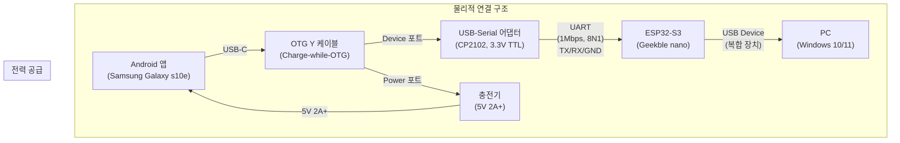
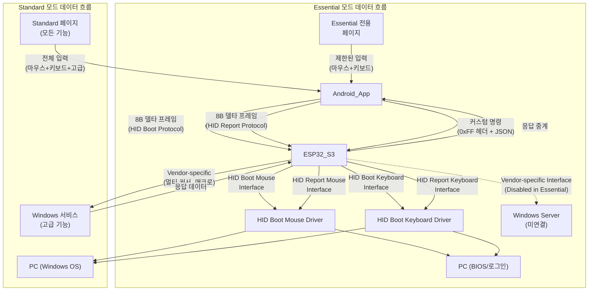

# BridgeOne 기술 명세서

## 용어집/정의

- Selected/Unselected: 선택 상태. 시각 강조/선택 표시. 입력 가능과 혼동 금지.
- Enabled/Disabled: 입력 가능 상태. 포인터/키 입력 허용 여부.
- Essential/Standard: 운용 상태. Windows 서버와 연결되지 않은 상태는 Essential(필수 기능), 연결된 상태는 Standard(모든 기능)입니다.
- TransportState: NoTransport | UsbOpening | UsbReady.
- RFC2119: MUST/SHOULD/MAY 규범 용어.
- 상태 용어 사용 원칙(금칙어 포함): "활성/비활성" 금지. Selected/Unselected, Enabled/Disabled로 표기[[memory:5809234]].

## 1. 목적/범위/용어

### 1.1 문서 역할 정의

본 문서는 **BridgeOne 프로젝트의 SSOT(Single Source of Truth) 규범 문서**입니다:
- **목적**: 프로토콜·상태·알고리즘·성능·오류 정책을 중앙에서 규정해 문서 간 드리프트를 방지
- **성격**: 기술 명세 및 플랫폼 간 계약서 ("**무엇을**" 해야 하는가)

### 1.2 범위 및 용어

- **범위**: 앱↔동글↔PC 입력 경로 전반. UI 시각 규칙은 `Docs/design-guide-app.md`를 참조하되, 상호작용 알고리즘은 본 문서가 우선
- **용어**: `Selected/Unselected`(선택), `Enabled/Disabled`(입력 가능), `Essential/Standard`(운용 상태), `TransportState` 등

## 2. 시스템 개요

### 2.1 하드웨어 연결 구조

**하드웨어 구성 요소:**
- **Android 앱**: Samsung Galaxy s10e (2280×1080, 5.8인치, Android 12)
- **OTG Y 케이블**: 동시 충전 및 USB OTG 지원
- **USB-Serial 어댑터**: CP2102 칩셋, 3.3V TTL 레벨
- **ESP32-S3**: Geekble nano 보드, USB 복합 장치 구성
- **PC**: Windows 11, USB Host 포트

### 2.2 데이터 흐름 경로

**데이터 흐름 특징:**
- **Essential 모드**: Windows 서버 미연결 상태로 HID Boot Protocol만 사용하여 BIOS/로그인 단계에서 동작
- **Standard 모드**: Windows 서버 연결 상태로 HID Report Protocol과 Vendor-specific를 통한 고급 기능 제공
- **기본 경로**: 8바이트 프레임을 통한 마우스/키보드 입력 (모든 모드에서 동작)
- **확장 경로**: 커스텀 명령을 통한 멀티 커서, 매크로 등 고급 기능 (Standard 모드에서만)

**프로토콜 구분:**
- **HID Boot Protocol**: Essential 모드에서 사용, BIOS/UEFI 호환성 보장
- **HID Report Protocol**: Standard 모드에서 사용, 확장 기능 지원
- **Vendor-specific**: Windows 서비스와의 양방향 통신, 고급 기능 처리

## 3. 상수/임계값 (Standardized Constants)

### 3.1 개요

> (작성 예정)

## 4. 플랫폼별 주요 로직

> (작성 예정)
