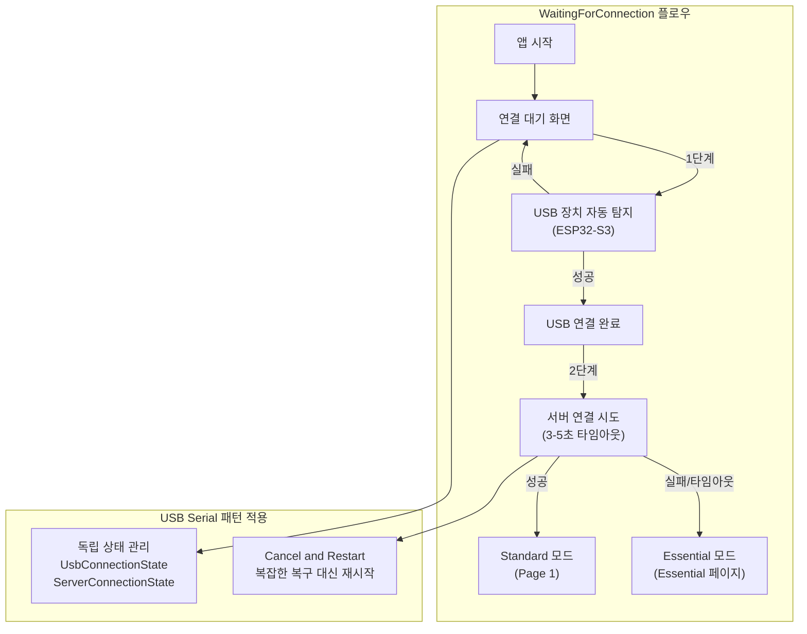

# BridgeOne 앱 디자인 가이드

> **상세 아키텍처**: 전체 시스템 아키텍처는 [`technical-specification.md` §3]를 참조하세요.
> **용어 정의**: 용어 정의는 [`technical-specification.md` §6.2 Android 플랫폼 용어집]을 참조하세요.

## 개요

- 본 문서는 BridgeOne Android 앱의 전체적인 디자인 설계 명세서입니다.
- 사용자 인터페이스(UI), 사용자 경험(UX), 상호작용 패턴, 시각적 설계 요소들을 체계적으로 정리합니다.

> **관련 문서**:
> - **기술적 구현**: `technical-guide-app.md` - 알고리즘, 프로토콜, 성능 요구사항 및 구현 세부사항
> - **컴포넌트 상세 설계**: `component-*.md` - 각 UI 컴포넌트별 기술적 동작 명세
> - **스타일프레임**: `styleframe-*.md` - 화면별 상세 UI/UX 설계 및 인터랙션

## 1. 디자인 원칙

### 1.1 핵심 원칙

- **접근성 우선**: 근육장애 사용자를 위한 단일 터치 최적화
- **직관적 조작**: 복잡한 학습 없이 즉시 사용 가능
- **시각적 명확성**: PC 모니터 집중 시에도(=앱 화면을 직접 보지 않고도) 상태 파악 가능
- **안정성 보장**: 작업 중단 없는 연결 및 입력 신뢰성

### 1.2 사용자 제약 고려사항

#### 1.2.1 터치 제약 조건

**터치 가능 영역**:
- **선호 영역**: 스마트폰 좌하단~중앙 하단 (화면의 약 30% 영역)
  - 가장 안정적이고 정확한 터치 조작 가능
  - 모든 핵심 기능은 이 영역 내에 배치되어야 함
- **회피 영역**: 우상단, 상단 전체 (손이 닿기 어려운 영역)
  - 정보 표시만 허용, 터치 조작 요소는 절대 배치 금지

**터치 패턴 특성**:
- **터치 정확도**: 단일 지점 터치 및 드래그 정확도는 높음, 정밀한 커서 제어 및 버튼 터치 가능
- **연속 터치**: 0.2초 이하의 간격으로 연속 터치 어려움, 두 번째 터치부터 미세 드래그 발생 가능
- **좌우 우선 조작**: 상하보다 좌우 공간 활용이 더 수월함, 컴포넌트 배치 시 가로 방향 우선 고려
- **터치 시작점 기준 동작**: 터치 시작 시점의 컴포넌트가 터치 종료까지 해당 컴포넌트로 인식되어야 함
  - *예외(DPad): 동일 터치를 유지한 채로 방향 전환 허용*

#### 1.2.2 시야 분배 특성

**시야 분포**:
- **주 시야**: PC 모니터 (대부분의 시야 집중, 주요 작업 공간)
- **부 시야**: 스마트폰 (곁눈질로 잠깐씩만 확인, 보조 도구 역할)

**UI 설계 영향**:
- **시각적 정보 전달**: 색상과 아이콘 중심으로 상태 구분, 텍스트보다 시각적 요소 우선
- **즉시 확인**: 잠깐 보는 것만으로도 현재 상태 파악 가능하도록 명확한 색상 구분과 직관적인 아이콘 사용

> **기술적 구현**: 접근성 원칙과 사용자 제약사항의 구체적인 알고리즘 구현은 [`technical-specification-app.md` §2.1.1]을 참조하세요.

#### 1.2.3 하드웨어 환경

**타겟 디바이스**: Samsung Galaxy s10e
- 해상도: 2280 × 1080
- 화면 크기: 5.8인치
- OS: Android 12

---

## 2. 색상 시스템

**기본 테마 설정**:
- 다크 테마(단일 테마) 전용 디자인
- 모바일 환경 최적화된 색상 구성

### 2.1 다크 테마

배경 색상:
- **#121212** (Primary Background): 앱 전체 배경, 특수 컴포넌트 기본 배경, 상태 알림 토스트 아이콘, 상태 알림 토스트 텍스트, 상태 알림 토스트 그림자 (30% 투명도)

텍스트 색상:
- **#FFFFFF** (Primary Text): 기본 텍스트, 기본 로딩 스피너, 버튼 텍스트, 메뉴 항목 텍스트
- **#C2C2C2** (Disabled Text): Disabled 상태 및 Unselected 상태 공통 표현, 페이지 인디케이터 Unselected 닷, 컴포넌트 Disabled 상태 또는 Unselected 상태 시 배경/아이콘/텍스트 톤다운 기준 (권장 투명도: 60%)

### 2.2 액센트 색상

상태 색상:
- **#2196F3** (Info/Blue-500): 주요 액션 버튼 및 Enabled/Selected 상태, 페이지 인디케이터 Selected 닷, 페이지 전환 애니메이션 (20% 투명도로 사용됨), 상태 알림 토스트 기본 배경, 상태 알림 토스트: 정보 상태 배경
- **#4CAF50** (Success/Green-500): 상태 알림 토스트: 통신 성공 상태 배경, 성공 알림 배경
- **#FF9800** (Warning/Amber-500): 상태 알림 토스트: 로딩 스피너, 진행 상태 표시, 경고 알림 배경
- **#F44336** (Error/Red-500): 오류 표시, 연결 실패 상태, 상태 알림 토스트: 통신 오류 상태 배경, 심각한 오류 표시

### 2.3 시스템 설정

**투명도 사용법**:
- 20% 투명도: 페이지 전환 애니메이션, 부드러운 전환 효과
- 30% 투명도: 그림자 효과, 상태 알림 토스트 그림자, 오버레이
- 60% 투명도: Disabled 상태, Unselected 상태, 비활성화된 컴포넌트

**접근성 고려사항**:
- 최소 4.5:1 색상 대비율 유지
- 색상에만 의존하지 않는 정보 전달 (아이콘, 텍스트 병행)
- 터치 인터페이스에 최적화된 색상 대비

> **기술적 구현**: 색상 시스템과 타이포그래피의 구체적인 구현 요구사항은 [`technical-specification-app.md` §2.2.1]을 참조하세요.

---

## 3. 타이포그래피

### 3.1 폰트 체계

**폰트**: Pretendard(`Android\app\src\main\res\font`에 있음)
**크기 체계**
- 제목 (H1): 24sp, Bold
- 부제목 (H2): 20sp, Medium
- 본문 (Body): 16sp, Regular
- 캡션 (Caption): 14sp, Regular
- 버튼 텍스트: 16sp, Medium

### 3.2 텍스트 사용 원칙

- **최소 텍스트**: 아이콘과 색상으로 상태 표현 우선
- **명확한 라벨**: 기능 버튼에는 간결한 한글 라벨
- **상태 정보**: 연결 상태, 모드 정보는 텍스트로 명시

> **기술적 구현**: 타이포그래피 사용 원칙의 구체적인 구현 요구사항은 [`technical-specification-app.md` §2.2.1]을 참조하세요.

---

## 4. 레이아웃 가이드라인

### 4.1 화면 구성

상단 페이지 인디케이터 영역 (10%)
└── 페이지 인디케이터 (현재 페이지 위치 표시)

중앙 여백 영역 (30%)
└── 빈 공간 (페이지 전환 슬라이드 제스처 영역)

하단 조작 영역 (60%)
├── 터치패드/버튼 컴포넌트 (좌측 하단 집중 배치)
├── 모드 변경 컨트롤
├── 기능 버튼들
└── 컴포넌트 간 여백 (페이지 전환 슬라이드 제스처 영역)

페이지 전환 슬라이드 제스처 영역
- 중앙 여백 영역 전체 + 하단 조작 영역의 빈 공간
- 좌우 슬라이드로 페이지 전환
- 상하 슬라이드는 무시

### 4.2 터치 영역 최적화

**최소 터치 영역**: 48dp × 48dp
**터치 반응성**: 최소 터치 시간 50ms
**터치패드 영역**:
- 1(가로):2(세로) 비율 고정
- 화면 폭의 80% 이내 배치
- 최소 160×320dp
- 부모 크기에 따른 반응형 스케일링
**버튼 간격**: 16dp
**화면 가장자리 여백**: 16dp
**제스처 세부사항**:
- 슬라이드 제스처:
  - 좌우 슬라이드: 페이지 전환
  - 최소 이동 거리: 화면 폭의 20%
  - 애니메이션: 스프링 효과 (400ms)
  - 터치 영역: 화면 전체
- 길게 누르기:
  - 인식 영역: 페이지 전환 슬라이드 제스처 터치 영역 내
  - 모든 입력 상태 초기화
  - 최소 길게 누르기 시간: 5000ms

> **기술적 구현**: 터치 영역 최적화와 제스처 처리의 구체적인 알고리즘 구현은 [`technical-specification-app.md` §2.1.2]를 참조하세요.

---

## 5. 공통 컴포넌트

### 5.1 공통 컴포넌트 설계 철학

#### 5.1.1 BridgeOne의 핵심 가치와 공통 컴포넌트

**연결성 (Connectivity)**:
- 공통 컴포넌트는 사용자와 시스템 간의 원활한 소통을 담당
- 상태 변화를 즉시 전달하여 사용자가 현재 상황을 명확히 파악할 수 있도록 지원
- PC 모니터 집중 시에도 곁눈질로 상태를 확인할 수 있는 직관적 디자인

**직관성 (Intuitiveness)**:
- 복잡한 학습 없이 즉시 이해 가능한 시각적 언어 사용
- 색상, 아이콘, 애니메이션을 통한 일관된 의미 전달
- 사용자 행동에 대한 즉각적이고 예측 가능한 피드백 제공

**일관성 (Consistency)**:
- 앱 전체에서 동일한 디자인 언어와 상호작용 패턴 적용
- 모든 페이지와 상황에서 일관된 사용자 경험 보장
- 컴포넌트 간의 조화로운 조합과 상호작용

#### 5.1.2 공통 컴포넌트의 역할과 가치

**시스템 상태 전달자**:
- 연결 상태, 작업 진행 상황, 오류 발생 등 중요한 시스템 상태를 사용자에게 전달
- PC 모니터 집중 시에도 앱 화면을 직접 보지 않고도 상태 파악 가능
- 시각적 우선순위를 통한 정보의 중요도 구분

**사용자 경험 향상**:
- 터치 조작에 대한 즉각적이고 일관된 피드백 제공
- 현재 위치와 전체 구조에 대한 명확한 시각적 안내
- 작업 중단 없는 부드러운 상태 전환과 애니메이션

**접근성 보장**:
- 근육장애 사용자를 위한 단일 터치 최적화
- 시각적, 촉각적, 청각적 피드백의 조화로운 조합
- 시스템 설정과 사용자 선호도 존중

#### 5.1.3 디자인 시스템의 일관성 원칙

**시각적 일관성**:
- 색상 시스템: 상태별 의미가 명확한 색상 체계
- 타이포그래피: Pretendard 폰트 기반의 일관된 텍스트 스타일
- 간격과 크기: 8dp 그리드 시스템 기반의 조화로운 레이아웃

**상호작용 일관성**:
- 애니메이션 타이밍: 200-350ms 범위의 일관된 전환 시간
- 햅틱 피드백: 상황별 표준화된 진동 패턴
- 터치 반응: 모든 컴포넌트에서 동일한 터치 영역과 반응 시간

**정보 계층 구조**:
- 중요도에 따른 시각적 우선순위 설정
- 상태별 적절한 표시 시간과 애니메이션 강도
- 사용자 주의를 분산시키지 않는 비침습적 디자인

### 5.2 상태 알림 토스트 (Status Notification Toast)

#### 5.2.1 설계 의도와 사용자 가치

> **기술적 구현**: 상태 알림 토스트의 구체적인 구현 요구사항은 [`technical-specification-app.md` §2.2.1.1]을 참조하세요.

**핵심 목적**:
- 중요한 상태 변화를 사용자에게 즉시 알리되, 현재 작업을 방해하지 않는 방식으로 전달
- PC 모니터 집중 시에도 곁눈질로 상태를 파악할 수 있는 시각적 정보 제공
- 일시적이고 비침습적인 알림으로 사용자 경험의 연속성 보장

**사용자 시나리오**:
- **연결 상태 변화**: USB 동글 연결/해제, 서버 연결 성공/실패
- **작업 완료 알림**: 매크로 실행 완료, 설정 변경 완료
- **오류 상황 안내**: 연결 실패, 권한 부족, 시스템 오류
- **진행 상황 표시**: 부팅 대기, 재연결 진행, 데이터 처리 중

#### 5.2.2 디자인 명세

**위치 및 크기**:
- 화면 상단 중앙 (상단에서 15% 지점, 상태표시줄 아래)
- 너비: 화면 폭의 90% (최대 400dp)
- 높이: 고정 56dp
- 여백: 화면 좌우 가장자리에서 16dp

**배경 및 스타일**:
- 배경색: #2196F3 (메인 컬러, 불투명, 100% 불투명도)
- 모서리: 완전 둥근 모서리 (28dp radius - 높이의 절반)
- 그림자: #000000 (30% 투명도, 6dp blur, 2dp offset)
- 테두리: 없음
- 형태: 알약 모양 (양쪽 끝이 완전히 둥근 직사각형)

**내부 구성**:
- 아이콘 (좌측): 24dp × 24dp, 좌측 여백 16dp
- 텍스트 (중앙): 16sp, #121212, Pretendard-Medium
- 여백: 아이콘과 텍스트 간 12dp
- 패딩: 상하 16dp, 좌우 20dp
- 정렬: 수직 중앙 정렬

#### 5.2.3 상태별 의미와 사용 원칙

##### 5.2.3.1 상태 분류 체계

상태 알림 토스트는 **5가지 주요 카테고리**로 분류되며, 각 카테고리별로 일관된 디자인 패턴을 따릅니다:

**1. 성공/완료 상태 (Success)**
- **의미**: 작업 성공, 연결 완료, 설정 적용 완료
- **색상**: #4CAF50 (녹색)
- **아이콘**: Success 아이콘, 체크 마크
- **표시 시간**: 2-3초
- **사용 원칙**: 사용자 행동이 필요한 경우가 아닌 성공 알림

**2. 진행/처리 상태 (Progress)**
- **의미**: 작업 진행 중, 대기 상태, 처리 중
- **색상**: #FF9800 (주황색)
- **아이콘**: 원형 인디케이터 (2초 주기 애니메이션)
- **표시 시간**: 무제한 (상태 해제까지)
- **사용 원칙**: 서버 연결 중에는 전용 화면에서 처리, 일반 작업 진행 시에만 사용

**3. 정보/알림 상태 (Info)**
- **의미**: 페이지 전환, 모드 변경, 일반 정보 제공
- **색상**: #2196F3 (파란색)
- **아이콘**: 상황별 적절한 아이콘
- **표시 시간**: 2초
- **사용 원칙**: 사용자 행동이 필요하지 않은 정보성 알림

**4. 오류/경고 상태 (Error)**
- **의미**: 연결 실패, 작업 오류, 시스템 오류
- **색상**: #F44336 (빨간색)
- **아이콘**: 경고 아이콘, 오류 아이콘
- **표시 시간**: 3-4초
- **사용 원칙**: 사용자 주의가 필요한 오류 상황

**5. 특수 상태 (Special)**
- **의미**: 강제 재연결, 시스템 특수 상황
- **색상**: 상황에 따라 동적 변경
- **아이콘**: 상황별 특수 아이콘
- **표시 시간**: 상황별 동적 설정
- **사용 원칙**: 일반적인 상태 분류에 속하지 않는 특수한 상황

##### 5.2.3.2 새로운 상태 추가 가이드라인

**1단계: 카테고리 분류**
- 새로운 상태가 위 5가지 카테고리 중 어디에 속하는지 판단
- 해당 카테고리의 표준 패턴을 따름

**2단계: 디자인 요소 결정**
- **색상**: 카테고리별 표준 색상 사용 (예외적 상황에서만 변경)
- **아이콘**: 상황을 가장 잘 표현하는 기존 아이콘 선택
- **표시 시간**: 카테고리별 표준 시간 범위 내에서 설정
- **텍스트**: 간결하고 명확한 메시지 작성

**3단계: 일관성 검증**
- 기존 상태들과 시각적 일관성 확인
- 사용자 경험 관점에서 혼란을 주지 않는지 검증
- 접근성 가이드라인 준수 확인

##### 5.2.3.3 주요 예시 (참고용)

**성공 상태 예시**:
- "보드에 연결되었습니다" (USB 연결 성공)
- "서버 연결 완료" (서버 연결 성공)
- "매크로 실행 완료" (매크로 실행 성공)

**진행 상태 예시**:
- "처리 중..." (데이터 처리)
- "부팅 대기 중..." (시스템 초기화)
- "재연결 진행 중입니다..." (강제 재연결)

**정보 상태 예시**:
- "키보드 페이지로 전환" (페이지 전환)
- "Essential 모드로 전환" (모드 변경)
- "설정이 적용되었습니다" (설정 적용)

**오류 상태 예시**:
- "연결에 실패했습니다" (USB 연결 실패)
- "서버 연결 오류" (서버 연결 실패)
- "매크로 실행 오류" (매크로 실행 실패)

**특수 상태 예시**:
- "서버가 재연결을 요청했습니다" (재연결 요청 수신)
- "재연결이 완료되었습니다" (재연결 완료)

#### 5.2.4 애니메이션과 전환 원칙

**등장 애니메이션**:
- 시작: 화면 상단에서 아래로 튀어나옴 (translateY: -100dp → 0dp)
- 지속시간: 350ms
- 이징: EaseOutBack (약간의 바운스 효과)
- 스케일: 0.8 → 1.0 (동시에 적용)

**사라짐 애니메이션**:
- 종료: 화면 상단으로 위로 사라짐 (translateY: 0dp → -100dp)
- 지속시간: 300ms
- 이징: EaseInBack (부드러운 수축 효과)

**상태 전환**:
- 색상 변경: 250ms 트랜지션 (EaseInOut)
- 아이콘 변경: 페이드 효과 (200ms)
- 텍스트 변경: 크로스페이드 (250ms)
- 전체적인 전환: 크로스페이드/슬라이드/스케일 조합

#### 5.2.5 음성 알림

**음성 알림 사용 원칙**:
- **중요도 기반**: 배터리 부족 등 사용자 행동이 필요한 상황에서만 음성 알림 사용
- **간결성**: 짧고 명확한 메시지로 핵심 정보만 전달
- **일관성**: 동일한 상황에서는 항상 동일한 음성 메시지 사용

### 5.3 페이지 인디케이터 (Page Indicator)

#### 5.3.1 설계 의도와 사용자 가치

> **기술적 구현**: 페이지 인디케이터의 구체적인 구현 요구사항은 [`technical-specification-app.md` §2.2.1.2 **페이지 인디케이터 구현 요구사항**]을 참조하세요.

**핵심 목적**:
- 현재 위치와 전체 페이지 구조를 직관적으로 파악할 수 있도록 지원
- 페이지 전환 시 사용자가 길을 잃지 않도록 시각적 안내 제공
- 미니멀한 디자인으로 시야를 방해하지 않으면서도 필요한 정보 전달

**사용자 시나리오**:
- **위치 파악**: 현재 어떤 페이지에 있는지 즉시 확인
- **구조 이해**: 전체적으로 몇 개의 페이지가 있는지 파악
- **네비게이션 지원**: 페이지 전환 시 시각적 피드백 제공

#### 5.3.2 디자인 명세

**위치 및 크기**:
- 화면 상단 중앙 (상단에서 15% 지점)
- 전체 너비: 자동 조절 (페이지 수에 따라)
- 높이: 8dp
- 여백: 좌우 16dp

**개별 인디케이터**:
- Unselected 닷: 지름 8dp, #C2C2C2
- Selected 닷: 지름 12dp, #2196F3
- 간격: 8dp
- 모서리: 완전한 원형

#### 5.3.3 상태별 의미와 사용 원칙

**Unselected 상태**:
- 크기: 8dp × 8dp
- 색상: #C2C2C2 (회색)
- 투명도: 60%
- 애니메이션: 없음
- **의미**: 현재 선택되지 않은 페이지, 접근 가능한 페이지

**Selected 상태**:
- 크기: 12dp × 12dp
- 색상: #2196F3 (파란색)
- 투명도: 100%
- 애니메이션: 스케일 효과 (1.5배 확대)
- **의미**: 현재 활성화된 페이지, 사용자가 현재 위치한 페이지

**전환 애니메이션**:
- 크기 변경: 200ms 스프링 애니메이션
- 색상 변경: 150ms 트랜지션
- 투명도 변경: 100ms 트랜지션
- **원칙**: 부드럽고 자연스러운 전환으로 사용자 혼란 최소화

### 5.4 햅틱 피드백 (Haptic Feedback)

#### 5.4.1 설계 의도와 사용자 가치

> **기술적 구현**: 햅틱 피드백의 구체적인 구현 요구사항은 [`technical-specification-app.md` §2.2.1.3]을 참조하세요.

**핵심 목적**:
- 터치 조작에 대한 즉각적이고 일관된 촉각적 피드백 제공
- 시각적 정보에 의존하지 않고도 조작 결과를 즉시 확인 가능
- 근육장애 사용자를 위한 접근성 향상 및 사용자 경험의 풍부함 제공

**사용자 시나리오**:
- **터치 확인**: 버튼 터치, 토글 조작 시 즉각적 피드백
- **상태 변화**: 모드 전환, 설정 변경 시 촉각적 확인
- **오류 알림**: 잘못된 입력, 연결 실패 시 경고 피드백
- **진행 상황**: 스크롤, 드래그 시 진행감 제공

#### 5.4.2 피드백 카테고리와 사용 원칙

**가벼운 피드백 (Light)**:
- **용도**: 일반 버튼 터치, 토글, 경미한 상태 변화
- **특성**: 짧은 진동(15ms, 중간 강도)
- **사용 시나리오**: 기본적인 터치 조작, 설정 토글, 경미한 상태 변화

**중간 피드백 (Medium)**:
- **용도**: 모드 전환, 설정 변경 확정, 페이지 인디케이터 점프
- **특성**: 표준 클릭 진동(30ms, 강한 강도)
- **사용 시나리오**: 중요한 설정 변경, 모드 전환, 페이지 인디케이터 활성화

**강한 피드백 (Strong)**:
- **용도**: 페이지 전환, 중요 실행, 연결 성공
- **특성**: 무거운 클릭 진동 (50ms, 최대 강도)
- **사용 시나리오**: 페이지 전환, 중요한 액션 실행, 연결 성공

**오류 피드백 (Error)**:
- **용도**: 입력 무효, 연결 실패, 경고
- **특성**: 더블 클릭 진동 패턴 (반복 진동)
- **사용 시나리오**: 잘못된 입력, 연결 실패, 시스템 오류

**진행 피드백 (Progressive/Scrolling)**:
- **용도**: 스크롤/드래그 진행감, 무한 스크롤 임계 진입
- **정책**: 연속 진동 지속은 배터리/발열 이슈로 금지. 이벤트 임계 통과 시 짧은 진동만 간헐적으로 트리거(≤10Hz)
- **특성**: 가벼운 틱 진동(10ms, 약한 강도)
- **사용 시나리오**: 스크롤 진행, 드래그 조작, 임계값 통과

#### 5.4.3 일관성 원칙과 제약사항

**일관성 원칙**:
- 동일한 상황에서는 항상 동일한 피드백 카테고리 사용
- 사용자 행동의 중요도에 비례한 피드백 강도 적용
- 시스템 표준 피드백 패턴 준수로 일관된 사용자 경험 보장

**제약사항과 예외 처리**:
- 시스템 진동 비활성, 방해 금지(DND) 시 트리거 생략
- 반복 입력 시 50ms 이내 재트리거 방지(디바운스)
- 사용자 설정 존중: 앱 내 햅틱 피드백 토글 제공

### 5.5 공통 컴포넌트 통합 가이드라인

#### 5.5.1 컴포넌트 조합 원칙

**시각적 계층 구조**:
- 상태 알림 토스트: 최상위 우선순위 (z-index 최고)
- 페이지 인디케이터: 정보 표시 레벨 (z-index 중간)
- 햅틱 피드백: 촉각적 레이어 (시각적 z-index 없음)
- 각 컴포넌트 간의 시각적 간섭 방지 및 조화로운 배치

**정보 전달 우선순위**:
- **긴급/오류**: 즉시 토스트 표시 + 강한 햅틱 피드백
- **상태 변화**: 토스트 표시 + 중간 햅틱 피드백
- **일반 조작**: 가벼운 햅틱 피드백만
- **정보 표시**: 페이지 인디케이터 업데이트

#### 5.5.2 일관성 유지 방법

**디자인 토큰 활용**:
- 색상: 상태별 표준 색상 체계 (#2196F3, #FF9800, #F44336)
- 타이포그래피: Pretendard 폰트 기반 일관된 텍스트 스타일
- 간격: 8dp 그리드 시스템 기반의 조화로운 레이아웃
- 애니메이션: 200-350ms 범위의 일관된 전환 시간

**상호작용 패턴 표준화**:
- 터치 반응: 모든 컴포넌트에서 동일한 터치 영역과 반응 시간
- 햅틱 피드백: 상황별 표준화된 진동 패턴
- 상태 전환: 일관된 애니메이션 타이밍과 이징 함수

#### 5.5.3 사용자 경험 최적화 원칙

**정보 과부하 방지**:
- 동시에 표시되는 토스트는 최대 1개로 제한
- 페이지 인디케이터는 항상 표시되지만 시야를 방해하지 않도록 배치
- 햅틱 피드백은 적절한 간격으로 제한하여 피로감 방지

**접근성 고려사항**:
- 시각적 정보와 촉각적 정보의 조화로운 조합
- 시스템 설정과 사용자 선호도 존중
- 근육장애 사용자를 위한 단일 터치 최적화

**성능 최적화**:
- 컴포넌트 재사용으로 메모리 효율성 확보
- 애니메이션의 GPU 가속 활용
- 불필요한 리렌더링 방지 및 효율적인 상태 관리

---

## 6. 특수 컴포넌트 디자인

> 각 특수 컴포넌트의 상세한 디자인 명세는 별도 문서 `docs/component-design-guide.md`를 참조하세요.

---

## 7. 접근성 가이드라인

### 7.1 터치 접근성

- 터치 영역 확보: 최소 48dp, 권장 56dp
- 터치 간격: 인접 요소 간 최소 8dp 간격
- 터치 피드백: 모든 터치에 햅틱 + 시각적 피드백

### 7.2 시각적 접근성

- 상태 구분: 색상 + 아이콘 + 텍스트 조합
- 애니메이션: 부드러운 전환 (300ms 이하)
- 크기 조절: 동적 텍스트 크기 지원

### 7.3 사용성 접근성

- 단일 터치: 모든 기능을 한 번의 터치로 수행
- 즉시 피드백: 입력 즉시 시각적/햅틱 반응
- 상태 표시: 현재 모드/연결 상태 항상 표시

> **기술적 구현**: 접근성 가이드라인의 구체적인 성능 요구사항은 [`technical-specification-app.md` §2.5.2]를 참조하세요.

---

## 8. 앱 전체 유저 플로우

### 8.1 앱 실행 및 초기화 플로우

#### 8.1.1 앱 실행 및 초기 상태 감지

1. 앱 아이콘 터치
   ↓
2. 권한 요청(최초 1회)
   - USB Host 권한(OTG 장치 접근)
   - 알림 권한(연결 상태/백그라운드 서비스 알림)
   ↓
3. Animated Splash Screen 시작 (2.5초, 6단계 애니메이션 시퀀스) + 병렬 초기 감지:
   - 상세 설계: `styleframe-loading-splash.md` 참조
   - 기술 구현: `technical-specification-app.md` 2.1 스플래시 스크린 구현 요구사항 참조
   - USB 장치 스캔 (ESP32-S3 자동 탐지)
   - Windows 서버 연결 신호 수신 대기
   ↓
4. Splash 종료 시점에 결과 기반 화면 분기

#### 8.1.2 초기 상태 감지 및 3분기 화면 전환 로직

**상태 모델**:
- TransportState: {NoTransport, UsbOpening, UsbReady}
- AppState: {WaitingForConnection, Essential, Standard}

**Splash Screen 동안 병렬 감지 결과에 따른 3분기 로직**:
- **분기 A) 장치 + 서버 모두 준비됨 → Standard 직접 진입**
  - 조건: USB Ready + Windows 서버 연결 신호 수신 성공
  - AppState: 처음부터 Standard (중간 상태 생략)
  - 표시 화면: Splash → 일반 홈 페이지 (Page 1) 직접 전환
  - 상태 알림 토스트: "모든 기능이 활성화되었습니다"(녹색, 3초)
  - 총 소요시간: ~3초 (기존 대비 50% 단축)
- **분기 B) 장치만 준비됨 → 서버 연결 시도**
  - 조건: USB Ready + Windows 서버 미응답
  - AppState: WaitingForConnection (임시) → 서버 시도 → Essential/Standard 분기
  - 표시 화면: 장치 연결 대기 화면 유지 (메시지 "서버를 찾는 중...")
  - 진행: 기존 서버 연결 시도 플로우 (§8.1.3.3)
- **분기 C) 장치 미준비 → 장치 연결 대기 화면**
  - 조건: TransportState: NoTransport 유지
  - AppState: WaitingForConnection
  - 표시 화면: 장치 연결 안내 화면 (§8.1.3 참조)
  - 상태 알림 토스트: "USB 동글을 연결해주세요"(주황색, 무제한)
  - 백그라운드: USB 장치 자동 탐지 지속

#### 8.1.3 연결 대기 화면 (WaitingForConnection)

**WaitingForConnection 상태 정의**
- 앱 실행 시 두 단계의 연결 과정을 통합 관리하는 상태
- Splash 중 초기 감지 실패 시 폴백 화면 역할을 하며, USB Serial 동글 연결과 Windows 서버 핸드셰이크를 순차적으로 처리함

**시스템 아키텍처**



**핵심 용어 정의:**
- **WaitingForConnection**: 완전한 연결 완료까지의 전체 과정 관리 상태 (장치 + 서버)
- **UsbConnectionState**: USB 연결 단계별 세부 상태 (Unknown → Probing → Connected/Failed)
- **ServerConnectionState**: 서버 연결 단계별 세부 상태 (NotStarted → Connecting → Connected/Failed)
- **ConnectionPhase**: 전체 진행 단계 (USB_PHASE → SERVER_PHASE → COMPLETE)

**주요 특징:**
- **2단계 자동 처리**: USB 장치 연결 → 서버 핸드셰이크 순차 진행
- **독립 상태 관리**: 각 연결 단계를 분리하여 복잡도 60-70% 감소
- **Cancel and Restart**: USB Serial 라이브러리의 검증된 패턴 적용
- **실시간 감지**: BroadcastReceiver 기반 USB 이벤트 처리
- **자동 분기**: 연결 결과에 따라 Essential/Standard 모드 자동 전환

> 상세한 UI/UX 스타일프레임은 `docs/Android/styleframe-connection-waiting.md`를 참조하세요.
> 연결 상태 관리 시스템의 상세한 구현은 `docs/Android/technical-guide-app.md` §6.2를 참조하세요.

##### 8.1.3.1 연결 시작 및 상태 관리

**사용자 관점의 연결 플로우**:
1. **장치 탐지 단계**
  - "USB 동글 확인 중..." 메시지 표시
  - ESP32-S3 자동 인식 및 드라이버 호환성 확인
2. **권한 처리 단계**
  - "USB 권한을 요청했습니다" 대기 메시지
  - 사용자 권한 승인 후 자동 진행
3. **연결 완료 단계**
  - "USB 연결됨" (파란색, 3초) 토스트
  - 서버 연결 대기 상태로 자동 전환

**사용자 경험 관점의 상태 전환:**
- **Unknown** → **Probing**: "USB 동글 확인 중..." 표시
- **PermissionRequested**: "USB 권한을 요청했습니다" 대기
- **Connected**: "USB 연결됨" (파란색, 3초) 토스트

> **기술적 구현 세부사항**: 연결 상태 관리의 구체적인 구현 요구사항은 [`technical-specification-app.md` §2.4.2]를 참조하세요.

##### 8.1.3.2 연결 완료 및 모드 전환

**사용자 경험 관점의 동글 확인 프로세스**:
1. **상태 확인 단계**
  - "동글 상태를 확인하는 중..." 메시지 표시
  - 로딩 인디케이터로 진행 상태 표시
2. **확인 완료 단계**
  - **성공 시**: "동글 준비 완료" (녹색, 2초) 토스트
  - **실패 시**: "동글 연결 확인 필요" (주황색, 3초) 안내
3. **모드 전환**
  - 동글 준비 완료 시 Essential 모드로 자동 전환
  - 서버 연결 신호 감지 시 Standard 모드로 추가 전환

**AppState 기반 UI/표시 규칙:**
- WaitingForConnection: 장치 연결 대기 화면, 페이지 전환/인디케이터 Disabled 상태
- Essential: Essential 전용 페이지 표시, 휠/확장 기능 Disabled 상태
- Standard: 일반 페이지들 표시, 모든 기능 Enabled 상태
  - **강제 재연결 시**: Standard 모드 유지, 서버 의존 기능만 일시 비활성화

> **기술적 구현 세부사항**: 모드 전환 로직의 구체적인 구현 요구사항은 [`technical-specification-app.md` §2.4.2]를 참조하세요.

##### 8.1.3.3 운영 중 사용자 경험

**사용자 관점의 연결 안정성:**
  - **정상 연결 상태:**
    - **연결 표시**: 상단 상태 바에 "연결됨" 표시 (녹색 점)
    - **실시간 반응**: 터치 입력이 즉시 PC에 반영
    - **안정성**: 끊김 없는 부드러운 커서 이동
  - **연결 불안정 감지 시:**
    - **경고 표시**: "서버 연결 불안정" (주황색, 2초) 토스트
    - **사용자 조치**: 서버 재시작, 네트워크 확인 등 안내 + 음성 안내
      - **음성 안내**: "서버 연결 문제. 재시작 또는 네트워크 확인 필요"
  - **연결 끊어짐 발생 시:**
    - **즉시 알림**: "연결이 끊어졌습니다" (빨간색, 3초) 토스트
    - **화면 전환**: 자동으로 연결 대기 화면으로 전환
    - **재연결 시도**: "재연결을 시도하는 중..." 진행 표시
    - **복구 완료**: "연결이 복구되었습니다" (녹색, 2초) + 이전 설정 자동 복원
  - **USB 케이블 분리/재연결:**
    - **분리 감지**: 즉시 안전한 대기 화면으로 전환
    - **재연결 감지**: "USB 동글을 감지했습니다" (파란색, 2초)
    - **빠른 복구**: 이전 상태로 자동 복원 (설정, 페이지 등)
    - **완료 안내**: "이전 상태가 복원되었습니다" (녹색, 2초)

> **기술적 구현 세부사항**: 연결 모니터링 및 복구 시스템의 구체적인 구현 요구사항은 [`technical-specification-app.md` §2.6]를 참조하세요.

**모드별 사용자 경험**

> **기술적 구현 세부사항**: 데이터 전송 정책 및 프레임 구조의 상세한 구현은 `technical-guide-app.md` §6.5 (데이터 전송 정책 구현)을 참조하세요.

**모드별 기능 차이 및 사용자 안내:**
- **Essential 모드**
  - **허용 기능**: 일반적인 키보드/마우스 입력
  - **진입 피드백**: 상단 토스트(정보, 2초) 각 1회 순차 표시 "PC: Essential 모드", "Essential 화면 표시" — 두 토스트 사이 간격 300ms
  - **사용 가능한 입력**:
    - **터치패드**: 탭 → 좌클릭 전송, 드래그 → 포인터 이동 전송
    - **Del 키**: BIOS 진입용 단발 전송
    - **F1-F12 키**: 컨테이너 버튼 탭 → F키 팝업 표시 → 선택 후 자동 닫힘
    - **메인 키**: Esc/Enter 키 단발 전송
    - **D-Pad**: 방향키 단발 전송
  - **모드 전환**:
    - **Essential → Standard**: 서버 핸드셰이크 성공 시 자동 전환
    - **Essential → WaitingForConnection**: USB 분리 시 즉시 대기 화면으로 전환
- **Standard 모드**
  - **허용 기능**: Essential 모드 허용 기능 + 모든 기능
  - **UI 표시**: 모든 컴포넌트 `Enabled` 상태
  - **모드 전환 알림**: "모든 기능이 활성화되었습니다" (녹색, 3초)
  - **Essential → Standard 전환**: 토스트 "정상 모드로 복귀했습니다"(파란색, 2초) + 햅틱 Medium
**제약 환경에서의 사용자 경험:**
- **보안 정책 환경**: Essential 모드 유지, Essential 전용 화면 자동 표시

> **상세 UI 레이아웃 및 스타일**: Essential 화면의 구체적인 UI 레이아웃과 스타일은 `docs/Android/styleframe-essential.md`를 참조하세요.

##### 8.1.3.4 문제 해결 및 기술 참조

**오류 처리 및 사용자 안내**

> **기술적 구현 세부사항**: 오류 타입 분류 및 복구 시스템의 상세한 구현은 `technical-guide-app.md` §7 (오류 처리 및 복구 시스템)을 참조하세요.

**사용자 관점의 오류 안내 메시지:**
- **USB 연결 오류 상황:**
  - **장치 미감지**: "USB 동글을 연결해주세요" + 연결 안내
  - **호환 장치 없음**: "호환되지 않는 USB 장치입니다" + 지원 장치 안내
  - **권한 거부**: "USB 권한이 필요합니다" + 설정 안내
  - **연결 실패**: "USB 연결에 실패했습니다" + 케이블 확인 안내
- **서버 연결 오류 상황:**
  - **타임아웃**: "서버 연결 시간 초과" → Essential 모드 자동 전환
  - **네트워크 오류**: "네트워크 연결을 확인해주세요" + 연결 상태 안내
  - **프로토콜 오류**: "서버 연결 실패" → 상세 오류 정보 표시
    - 오류 코드 및 메시지
    - 서버 상태 확인
    - 네트워크 연결 상태
    - 프로토콜 버전 정보
    - 구체적인 해결 방법 제시
- **자동 복구 원칙:**
  - 가능한 경우 사용자 개입 없이 자동 복구
  - 사용자 친화적이고 구체적인 안내 메시지
  - 모든 오류 상황에 대한 명확한 해결 방법 제시

**기술적 구현 참조**

> **기술적 구현 세부사항**: Android USB 시리얼 통신의 모든 기술적 구현 세부사항은 별도 기술 문서를 참조하세요:
> - **USB 통신 구현**: `technical-guide-app.md` §1 (USB 시리얼 통신 설계 요구사항)
> - **앱 초기화 및 연결 관리**: `technical-guide-app.md` §6 (앱 초기화 및 연결 관리 구현)
> - **오류 처리 및 복구**: `technical-guide-app.md` §7 (오류 처리 및 복구 시스템)

**구현 핵심 요소:**
- **자동 탐지**: ESP32-S3 USB Serial BroadcastReceiver 기반 실시간 감지
- **상태 관리**: Cancel and Restart 패턴 적용
- **고성능 통신**: 1Mbps, 8N1 통신 및 Keep-alive 메커니즘
- **오류 복구**: 지수 백오프 재연결 및 비정상 종료 복구

### 8.2 페이지 네비게이션 플로우

#### 8.2.1 페이지 전환 방식

**슬라이드 제스처**:
- 좌우 슬라이드: 페이지 전환
- 즉시 피드백: 터치와 동시에 페이지 밀림 효과 시작
- 전환 임계값: 화면 폭의 20% (이 거리 이상 밀면 페이지 전환 완료)
- 미완성 시: 20% 미만에서 손을 떼면 원래 위치로 스프링 애니메이션
- 완성 시: 20% 이상에서 손을 떼면 다음 페이지로 전환
- 애니메이션: 스프링 효과 (400ms)
- 햅틱 피드백: 강한 진동 (50ms)
- 페이지 전환 시 토스트 알림 표시

**페이지 인디케이터**:
- 화면 중앙 상단에 n개 닷 표시
- 현재 페이지: 파란색 활성 닷 (#2196F3, 크기: 12dp)
- 다른 페이지: Unselected 닷(#C2C2C2, 크기: 8dp, 투명도: 60%)
- 페이지 전환 시 애니메이션

**터치 영역**:
- 화면 전체 영역
- 좌우 슬라이드만 지원 (상하는 무시)

**주의**:
- Essential 모드에서는 Essential 전용 페이지만 표시되며 페이지 네비게이션은 Disabled 상태입니다(§8.6).
- Standard 전환 후 일반 네비게이션이 Enabled 상태로 활성화됩니다.

#### 8.2.2 페이지별 상태 유지

**페이지 전환 시**:
- 각 페이지 내 각 컴포넌트의 모드/상태 유지
  ex) 터치패드 모드, DPI 설정, 버튼 Enabled/Disabled 상태

### 8.3 컴포넌트 Disabled 상태 사용자 경험

> **기술 구현 상세**: 이 섹션의 기술적 구현 명세는 `technical-guide-app.md §3`을 참조하시기 바랍니다.

> **기술적 구현**: 컴포넌트 Disabled 상태의 구체적인 구현 요구사항은 [`technical-specification-app.md` §2.3]을 참조하세요.

#### 8.3.1 사용자 경험 원칙

**명확한 상태 전달**:
- 사용자가 현재 상태를 즉시 이해할 수 있도록 시각적 피드백 제공
- 작업 진행 상황과 예상 완료 시간을 명확히 안내
- Disabled 상태와 Enabled 상태 간의 명확한 구분
- Disabled 상태와 Unselected 상태의 차이점 명확화
**일관된 상호작용 패턴**:
- 모든 컴포넌트에서 동일한 Disabled 상태 표현 및 동작 제공
- 예측 가능한 복구 메커니즘으로 사용자 혼란 최소화
- 일관된 피드백 타이밍과 애니메이션 패턴 유지
**Disabled 상태 전환 로직**:
- 자동 전환: 작업 시작 시 즉시 Disabled, 작업 완료/취소 시 자동 Enabled 복원, 시스템 상태(연결, 권한 등)에 따른 자동 전환

#### 8.3.2 시각적 디자인 가이드라인

**Disabled 상태 시각 효과**:
- **컴포넌트별 스타일 적용**: 각 컴포넌트가 사전 정의된 Disabled 상태 스타일을 자체적으로 적용
- **색상 변화**: 컴포넌트별로 정의된 Disabled 상태 색상 (예: 버튼 배경 `#C2C2C2`, 텍스트 톤다운 등)
- **투명도 조절**: 컴포넌트별 Alpha 값 적용 (일반적으로 0.6)
- **전환 애니메이션**: 200ms 페이드 인/아웃으로 자연스러운 변화
- **텍스트 처리**: 가독성 유지하면서 Disabled 상태 표현
- **터치 영역 처리**: 시각적으로 Disabled 표시하되 접근성 고려하여 터치 영역 유지
**레이어 구조 원칙**
- 오버레이 레이어는 투명하게 유지하여 입력 차단 기능만 담당
- 각 컴포넌트가 개별적으로 Disabled 상태 시각적 표현 적용
- 정보성 요소(페이지 인디케이터, 토스트)는 정상 표시 유지
- 시각적 계층 구조 유지로 사용자 혼란 방지

#### 8.3.3 사용자 플로우 시나리오

**1. 개별 컴포넌트 Disabled 상태 시나리오**
```
사용자 액션 → 컴포넌트 Disabled → 작업 진행 표시 → 작업 완료 → Enabled 복원
```
- **진입**: 특정 버튼 또는 기능 실행 시 해당 컴포넌트만 Disabled 상태로 전환
- **진행**: 작업 상태를 명확히 표시하여 사용자 대기 유도
- **완료**: 부드러운 애니메이션과 함께 Enabled 상태로 복원

**2. 활성 매크로 실행 시나리오**
```
활성 매크로 실행 → 페이지 전체 Disabled → 진행 상태 표시 → 강제 해제 또는 자동 완료
```
- **진입**: 활성 매크로(실제 키보드/마우스 조작 수반) 실행 시 페이지 전체 입력 차단
- **이유**: 매크로 실행 중 다른 조작 시 오작동 가능성이 높아 충돌 방지 필요
- **진행**: 상단 토스트로 진행 상황 안내, 취소 방법 명시
- **해제**: 동일 버튼 재탭으로 강제 해제 또는 작업 완료 시 자동 Enabled 복원

**3. 비활성 매크로 실행 시나리오**
```
비활성 매크로 실행 → 개별 컴포넌트 Disabled (선택적) → 즉시 실행 → 완료 알림
```
- **진입**: 비활성 매크로(SendMessage/PostMessage 방식) 실행 시 해당 매크로 버튼만 Disabled (선택적)
- **이유**: 특정 프로세스에 메시지 전송 방식으로 다른 조작과 충돌 가능성이 낮음
- **진행**: 즉시 실행되므로 대기 시간 최소화, 사용자는 다른 작업 계속 가능
- **완료**: 간단한 토스트 메시지로 실행 완료 알림, 전체 페이지 차단 없음

#### 8.3.4 사용자 피드백 설계

**햅틱 피드백 패턴**
- **Disabled 상태 시작**: Medium 햅틱 - 상태 변화 알림
- **강제 해제**: Light 햅틱 - 취소 동작 확인
- **작업 완료**: Success 햅틱 - 성공적 완료 알림
**토스트 메시지 가이드**
- **작업 진행 중**: "작업을 처리하고 있습니다..." (진행 상태)
- **강제 해제**: "작업이 취소되었습니다" (2-3초 표시)
- **작업 완료**: "작업을 완료했습니다" (2초 표시)

#### 8.3.5 특별한 상황별 UX 처리

**커서 모드 전환 시**
- 터치패드 영역과 제어 버튼만 선택적 Disabled 상태로 전환
- 상단 로더로 진행 상태 시각적 표시
- 최대 500ms 지속으로 사용자 대기 시간 최소화
**연결 문제 발생 시**
- 즉시 모든 Disabled 상태 해제하여 Enabled 상태로 복원
- 연결 복구 후 재실행 옵션 제공
- 사용자에게 상황을 투명하게 안내

### 8.4 앱 종료 및 백그라운드 처리

#### 8.4.1 앱 종료 플로우

1. 뒤로가기 버튼 첫 번째 터치
   ↓
2. 상태 알림 토스트 표시
   - 메시지: "앱을 종료하시겠습니까?"
   - 표시 시간: 1초
   - 색상: 정보 상태 (파란색)
   ↓
3. 1초 내 두 번째 뒤로가기 버튼 터치
   ↓
4. 앱 종료 실행
   - 서버 연결 해제
   - 중립 프레임(모든 버튼 해제, dx/dy=0) 2~3회 전송 후 포트 닫기
   - 앱 완전 종료

3초 초과 시:
   - 토스트 메시지 사라짐
   - 앱 종료 플로우 초기화
   - 현재 화면 유지

#### 8.4.2 백그라운드 처리

**앱 최소화 시**:
- 연결 유지 (백그라운드 서비스)
- 알림 표시 (연결 상태)
- 모든 페이지별 상태를 SharedPreferences에 즉시 저장
- 진행 중인 사용자 입력 상태 저장 (드래그 여부, 수정키 상태)
**앱 복원 시**:
- 즉시 연결 상태 확인
- UI 상태 복원
- 사용자 입력 준비

### 8.5 오류 처리 플로우

#### 8.5.1 USB 연결 오류 처리

- **AppState 자동 전환**:
  - Standard/Essential → WaitingForConnection: 연결 끊김 시 즉시 대기 화면 전환
  - 자동 재탐지: 대기 화면에서 USB 스캔 재개
  - 사용자 경험: 오류 알림 대신 자연스러운 대기 화면 표시
- **재연결 정책**:
  - 백오프 재시도: 1 → 2 → 4 → 8초 간격으로 재연결 시도
  - 설정 복원: 연결 성공 시 이전 설정 자동 복구
- **권한 처리**:
  - 필요 권한: USB 장치 접근 권한, 알림 권한
  - 설정 안내: 권한 부여 후 자동 재시도 수행

#### 8.5.2 서버 연결 끊어짐 오류

**서버 연결 끊어짐 감지 및 사용자 알림**:
- **연결 끊어짐 감지**: 실시간 연결 상태 모니터링
- **즉시 알림**: "서버 연결이 끊어졌습니다" (빨간색, 3초) 토스트 표시
- **상태 표시**: 상단 상태 바에서 연결 상태를 실시간으로 업데이트
- **사용자 경험**: 작업 중단 없이 부드러운 상태 전환으로 혼란 최소화

**AppState 전환 및 기능 제한**:
- **Standard → Essential 전환**: 서버 연결 끊어짐 감지 시 즉시 Essential 모드로 전환
- **Essential 전용 페이지 표시**: Essential 전용 페이지로 화면 전환
  - 상세 UI/UX 설계: `docs/Android/styleframe-essential.md` 참조
  - 필수 입력 기능: 터치패드(좌클릭, 커서 이동), Boot Keyboard Cluster(Del, Esc, Enter, F1-F12, 방향키)
  - 제한된 기능: 휠/스크롤, 매크로, 고급 설정, 확장 기능 등 서버 의존 기능 비활성화
- **기능 제한 안내**: "Essential 모드로 전환되었습니다" (주황색, 2초) 토스트

**재연결 시도 정책**:
- **자동 재연결**: 백그라운드에서 재연결 시도
- **재연결 진행 표시**: "서버 재연결을 시도하는 중..." (주황색, 무제한) 토스트
- **재연결 성공**: "서버 연결이 복구되었습니다" (녹색, 3초) → Standard 모드 자동 복원
- **재연결 실패**: "서버 연결에 실패했습니다" (빨간색, 4초) → Essential 모드 유지

**사용자 경험 최적화**:
- **작업 연속성**: 기본 입력 기능은 계속 사용 가능하여 작업 중단 최소화
- **명확한 상태 안내**: 현재 모드와 사용 가능한 기능을 명확히 표시
- **투명한 복구 과정**: 재연결 시도 과정을 사용자에게 투명하게 안내
- **자동 복구**: 재연결 성공 시 이전 설정과 상태 자동 복원

> **기술적 구현 세부사항**: 서버 연결 오류 처리의 구체적인 구현 요구사항은 [`technical-specification-app.md` §2.6]를 참조하세요.

#### 8.5.3 앱 비정상 종료 및 복구 시스템

##### 8.5.3.1 비정상 종료 경우의 수

**예측 가능한 상황:**
- **배터리 부족 상황:**
  - **발생 조건**: 배터리 레벨 15% 이하 감지
  - **사용자 알림**:
    - 20% 이하: "배터리 20%" (주황색 토스트) + 음성 알림
    - 10% 이하: "배터리 10%" (빨간색 토스트) + 음성 알림
    - 5% 이하: "배터리 5%" (빨간색 토스트) + 음성 알림
  - **음성 알림 세부사항** (1회 재생):
    - 20% 이하: "배터리 20%입니다"
    - 10% 이하: "배터리 10%입니다"
    - 5% 이하: "배터리 5%입니다"
    - 재생 조건: 토스트 표시와 동시에 음성 알림 재생
- **메모리 부족 (OOM):**
  - **발생 조건**: 사용 가능 메모리 50MB 이하
  - **사용자 알림**: "메모리 부족" (주황색 토스트)

**예측 불가능한 상황:**
- **예상치 못한 오류:**
  - **네트워크 오류**: "네트워크 오류: 재시도 중입니다" (주황색 토스트)
  - **파일 시스템 오류**: "설정 오류: 기본값으로 복구합니다" (주황색 토스트)
  - **권한 오류**: "권한 오류: 설정에서 권한을 확인하세요" (빨간색 토스트)
  - **크래시 발생 시**: "앱이 예기치 않게 종료되었습니다" (빨간색 토스트)

##### 8.5.3.2 크래시 복구 플로우

**앱 크래시 직후 재시작 시**:
- 8.1 앱 실행 및 초기화 플로우와 동일하게 진행
- 사용자에게 크래시 알림

> **기술적 구현 세부사항**: 비정상 종료 복구 시스템의 구체적인 구현 요구사항은 [`technical-specification-app.md` §2.6]를 참조하세요.

### 8.6 강제 재연결 시나리오

#### 8.6.1 개요

**강제 재연결의 특징:**
- **서버 주도**: Windows 서버가 재연결을 요청하는 특별한 상황
- **화면 전환 없음**: 일반적인 연결 끊어짐과 달리 연결 대기 화면으로 전환되지 않음
- **Standard 모드 유지**: AppState 변경 없이 현재 화면을 유지하면서 서버 의존 기능만 일시 비활성화
- **사용자 경험 최적화**: 작업 중단 없이 부드러운 재연결 처리

#### 8.6.2 시나리오 상세 설명

**재연결 시작 (Standard 모드 유지):**
- **결과**: "서버가 재연결을 요청했습니다" 토스트 → 현재 화면 유지, 서버 의존 기능만 일시 비활성화
- **특징**: 화면 전환 없음, 기본 기능은 계속 사용 가능

**재연결 완료 (Standard 모드 유지):**
- **결과**: "재연결이 완료되었습니다" 토스트, 모든 기능 자동 활성화

#### 8.6.3 사용자 경험 관점

**사용자 관점의 장점:**
- **작업 연속성**: 현재 작업을 중단하지 않고 계속 진행 가능
- **화면 안정성**: 갑작스러운 화면 전환으로 인한 혼란 방지
- **직관적 피드백**: 토스트 메시지로 재연결 상태를 명확히 안내
- **자동 복구**: 사용자 개입 없이 자동으로 모든 기능 복원

**상태 표시:**
- **재연결 요청 수신**: 파란색 토스트 "서버가 재연결을 요청했습니다" (3초)
- **재연결 진행 중**: 주황색 토스트 "재연결 진행 중입니다..." (무제한, 상태 해제까지)
- **재연결 완료**: 녹색 토스트 "재연결이 완료되었습니다" (2초)

> **기술적 구현 세부사항**: 강제 재연결 시나리오의 구체적인 구현 요구사항은 [`technical-specification-app.md` §2.4.2]를 참조하세요.

### 8.7 상태 모델 정의

- **화면별 상태 처리:**
  - WaitingForConnection: 연결 대기 화면, 네비게이션 Disabled 상태
  - Essential: Essential 전용 페이지, 제한된 기능 (일부 기능 Disabled 상태)
  - Standard: 전체 페이지 표시, 모든 기능 Enabled 상태
    - **강제 재연결 시**: Standard 모드 유지, 서버 의존 기능만 일시 비활성화

> **기술적 구현**: 앱 전체 유저 플로우의 구체적인 구현 요구사항은 [`technical-specification-app.md` §2.4]를 참조하세요.

---

## 9. 페이지별 스타일프레임 링크

본 문서는 앱 전반의 설계/정책을 다룹니다. 각 페이지에 공통 컴포넌트(토스트, 페이지 인디케이터 등)와 특수 컴포넌트(DPad, 모드 버튼 등)가 실제로 배치된 시각 구조는 아래 스타일프레임 문서를 참조하세요.

> **기술적 구현**: 성능 및 품질 요구사항의 구체적인 구현은 [`technical-specification-app.md` §2.5]를 참조하세요.

- 장치 연결 대기 화면: USB Serial 동글이 연결되지 않은 상태에서 사용자에게 연결 안내를 제공하고 자동 장치 탐지를 수행하는 전용 화면
  - `styleframe-connection-waiting.md`
- Essential 페이지: BIOS/UEFI, BitLocker PIN, 로그인 화면, UAC Secure Desktop 등 Windows 서버 미연결 상태에서 표시되는 최소 입력 전용 페이지
  - `styleframe-essential.md`
- 기본 홈/터치패드 페이지: 좌측 Touchpad, 우측 특수 키/키 조합/매크로 패널로 구성된 메인 조작 페이지
  - `styleframe-page1.md`
키보드/작업 페이지: 키보드 조작 중심 페이지로, 네비게이션/에디팅/펑션/모디파이어/단축키/미디어/락키 등 제공
  - `styleframe-page2.md`
- Minecraft 특화 페이지: Minecraft 플레이에 최적화된 D패드와 게임 버튼을 제공하는 페이지
  - `styleframe-page3.md`
