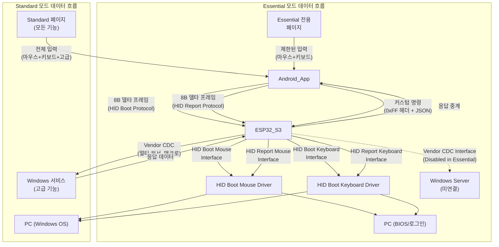

---
title: "BridgeOne 기술 명세서"
description: "프로토콜·상태모델·알고리즘·성능·오류와 플랫폼 간 계약을 단일 출처로 규정하는 SSOT(Single Source of Truth) 문서"
tags: ["spec", "contract", "protocol", "state-machine", "algorithms"]
version: "v0.1"
owner: "Chatterbones"
updated: "2025-10-20"
note: "본 문서에 존재하는 모든 상수값 및 설정값은 초기 값으로, 확정된 고정값이 아님"
---

# BridgeOne 기술 명세서

## 용어집/정의

- Selected/Unselected: 선택 상태. 시각 강조/선택 표시. 입력 가능과 혼동 금지.
- Enabled/Disabled: 입력 가능 상태. 포인터/키 입력 허용 여부.
- Essential/Standard: 운용 상태. Windows 서버와 연결되지 않은 상태는 Essential(필수 기능), 연결된 상태는 Standard(모든 기능)입니다.
- TransportState: NoTransport | UsbOpening | UsbReady.
- RFC2119: MUST/SHOULD/MAY 규범 용어.
- 상태 용어 사용 원칙(금칙어 포함): "활성/비활성" 금지. Selected/Unselected, Enabled/Disabled로 표기[[memory:5809234]].

## 1. 목적/범위/용어

### 1.1 문서 역할 정의

본 문서는 **BridgeOne 프로젝트의 SSOT(Single Source of Truth) 규범 문서**입니다:
- **목적**: 프로토콜·상태·알고리즘·성능·오류 정책을 중앙에서 규정해 문서 간 드리프트를 방지
- **성격**: 기술 명세 및 플랫폼 간 계약서 ("**무엇을**" 해야 하는가)

### 1.2 범위 및 용어

- **범위**: 앱↔동글↔PC 입력 경로 전반. UI 시각 규칙은 `docs/design-guide-app.md`를 참조하되, 상호작용 알고리즘은 본 문서가 우선
- **용어**: `Selected/Unselected`(선택), `Enabled/Disabled`(입력 가능), `Essential/Standard`(운용 상태), `TransportState` 등

## 2. 시스템 아키텍처

### 2.1 하드웨어 연결 구조


**하드웨어 구성 요소:**
- **Android 앱**: Samsung Galaxy s10e (2280×1080, 5.8인치, Android 12)
- **ESP32-S3**: ESP32-S3 N16R8 보드 (16MB Flash, 8MB Octal SPI PSRAM)
  - 지원 보드: YD-ESP32-S3 N16R8
  - UART 포트 (Android 연결, GPIO17/18)
  - USB-OTG 포트 (PC 연결, 복합 장치 구성)
- **PC**: Windows 11, USB Host 포트
- **충전기**: 5V 2A 이상 (Android 충전용)

### 2.2 데이터 흐름 아키텍처



**데이터 흐름 특징:**
- **Essential 모드**: Windows 서버 미연결 상태로 HID Boot Protocol만 사용하여 BIOS/로그인 단계에서 동작
- **Standard 모드**: Windows 서버 연결 상태로 HID Report Protocol과 Vendor CDC를 통한 고급 기능 제공
- **기본 경로**: 8바이트 프레임을 통한 마우스/키보드 입력 (모든 모드에서 동작)
- **확장 경로**: 커스텀 명령을 통한 멀티 커서, 매크로 등 고급 기능 (Standard 모드에서만)

**프로토콜 구분:**
- **HID Boot Protocol**: Essential 모드에서 사용, BIOS/UEFI 호환성 보장
- **HID Report Protocol**: Standard 모드에서 사용, 확장 기능 지원
- **Vendor CDC**: Windows 서비스와의 양방향 통신, 고급 기능 처리

### 2.3 하드웨어 구성 요소 분석

#### 2.3.1 ESP32-S3 N16R8 보드

**개요:**
- **역할**: USB 복합 장치로 HID 프로토콜 처리 및 Vendor CDC 통신 담당
- **펌웨어 프레임워크**: ESP-IDF v5.5+
- **지원 보드**:
  - ESP32-S3-DevkitC-1-N16R8 (Espressif 공식 개발 보드)
  - YD-ESP32-S3 N16R8 / YD-ESP32-23 (VCC-GND Studio 호환 보드)
- **공통 특징**:
  - 듀얼 코어 32비트 Xtensa LX7 마이크로컨트롤러 (최대 240MHz)
  - 16MB Flash (N16), 8MB Octal SPI PSRAM (R8)
  - Native USB OTG 포트 (GPIO19/20)
  - WiFi (2.4GHz) 및 Bluetooth 5.0 LE 내장
  - 45개의 프로그래머블 GPIO

**보드별 차이점**:

| 항목 | ESP32-S3-DevkitC-1 | YD-ESP32-S3 N16R8 |
|------|-------------------|------------------|
| USB-UART 칩 | CP2102N | CH343P |
| Android 통신 UART | UART0 (GPIO43/44) | UART1 (GPIO17/18) |
| 드라이버 | CP210x | CH343 |
| 비고 | 공식 보드 | 저가 클론, 전압 확인 필요 |

**성능 최적화 포인트:**
- **USB 스택**: ESP-IDF TinyUSB 컴포넌트로 저수준 직접 제어
- **실시간 처리**: FreeRTOS 듀얼 코어 활용으로 HID/CDC 분산 처리
- **메모리 관리**: 512KB RAM으로 효율적인 정적 버퍼 할당
- **전력 최적화**: ESP-IDF 전력 관리 API로 동적 주파수 조절

**USB Composite 디바이스 구성** (불변):
```
Interface 0: HID Boot Keyboard (0x03/0x01/0x01) - BIOS/UEFI 호환
Interface 1: HID Boot Mouse    (0x03/0x01/0x02) - BIOS/UEFI 호환
Interface 2: CDC-ACM Comm      (0x02/0x02/0x00) - Windows 서버 통신
Interface 3: CDC-ACM Data      (0x0A/0x00/0x00) - Windows 서버 통신
```

**호환성 보장:**
- Android 앱 및 Windows 서버 코드 변경 없음
- 동일 USB 디스크립터 및 리포트 구조 유지
- 인터페이스 순서 고정으로 열거 일관성 보장

#### 2.3.2 하드웨어 간 통신 최적화 전략

**UART 통신 (Android ↔ ESP32-S3):**
- **속도**: 1Mbps, 8N1 (8비트 데이터, 패리티 없음, 1비트 정지)
- **프레임 구조**: 8바이트 델타 프레임으로 효율적인 데이터 전송
- **플로우 제어**: 소프트웨어 플로우 제어로 안정적 통신 보장
- **보드별 구성**:
  - ESP32-S3-DevkitC-1: UART0 (GPIO43/44, CP2102N 연결)
  - YD-ESP32-S3 N16R8: UART1 (GPIO17/18, Android 통신 전용)
- **장점**: 신호 무결성 향상, 안정적 통신

**USB 통신 (ESP32-S3 ↔ PC):**
- **인터페이스**: 복합 USB 장치 (HID + Vendor CDC)
- **HID 부트 프로토콜**: BIOS/UEFI 호환성 보장
- **HID 리포트 프로토콜**: 확장 기능 지원
- **Vendor CDC 인터페이스**: 고급 기능 및 양방향 통신 처리

**전력 관리:**
- **ESP32-S3**: Light-sleep 모드 지원으로 배터리 효율 극대화
- **동적 전력 조절**: 사용량에 따른 코어 주파수 조절
- **내장 USB 브릿지**: 외부 어댑터 대비 전력 소비 감소

### 2.4 통신 프로토콜 최적화 전략

#### 2.4.1 프로토콜 최적화

**Essential 모드 최적화:**
- **HID Boot Protocol 전용**: 불필요한 오버헤드 제거로 최소 지연 시간 달성
- **8바이트 델타 프레임**: 마우스/키보드 입력만 처리하여 대역폭 효율 극대화
- **폴링 레이트 조절**: 125Hz 폴링으로 전력 소비 최소화

**Standard 모드 최적화:**
- **HID Report Protocol 활용**: 확장 기능 지원과 함께 효율적인 데이터 전송
- **Vendor CDC 인터페이스**: JSON 기반 커맨드로 구조화된 고급 기능 처리
- **양방향 통신**: 비동기 응답 처리로 실시간 상호작용 보장

#### 2.4.2 데이터 전송 효율화

**프레임 구조 최적화:**
```typescript
// 8바이트 델타 프레임 구조
interface HIDFrame {
  buttons: uint8;    // 1바이트: 마우스 버튼 상태
  deltaX: int8;      // 1바이트: X축 이동 델타
  deltaY: int8;      // 1바이트: Y축 이동 델타
  wheel: int8;       // 1바이트: 휠 이동 델타
  modifiers: uint8;  // 1바이트: 키보드 모디파이어
  reserved: uint8;   // 1바이트: 예약
  key1: uint8;       // 1바이트: 키 코드 1
  key2: uint8;       // 1바이트: 키 코드 2
}
```

**압축 및 인코딩 전략:**
- **델타 압축**: 이전 프레임 대비 변화량만 전송하여 대역폭 절약
- **RLE (Run-Length Encoding)**: 연속된 동일 입력에 대한 효율적 처리
- **비트 패킹**: 플래그와 데이터를 효율적으로 패킹하여 공간 최적화

#### 2.4.3 실시간 처리 최적화

**FreeRTOS 태스크 설계:**
- **고우선도 HID 태스크**: 마우스/키보드 입력을 실시간으로 처리
- **중우선도 Vendor 태스크**: 고급 기능 명령을 비동기로 처리
- **저우선도 관리 태스크**: 연결 상태 모니터링 및 전력 관리

**버퍼 관리 전략:**
- **링 버퍼**: UART 수신 데이터를 효율적으로 저장
- **더블 버퍼링**: HID 프레임 처리 중 데이터 손실 방지
- **동적 할당**: 사용량에 따른 버퍼 크기 조절

#### 2.4.4 전력 및 성능 최적화

**동적 전력 관리:**
- **활성 모드**: 최대 성능 모드 (Standard 모드)
- **절전 모드**: 입력 없을 때 저전력 모드 전환
- **심플 모드**: Essential 모드에서 불필요한 기능 비활성화

**성능 모니터링:**
- **지연 시간 측정**: 각 통신 단계별 처리 시간 모니터링
- **처리량 측정**: 초당 처리 가능한 프레임 수 추적
- **에러율 모니터링**: 통신 오류 발생률 및 복구 시간 측정

#### 2.4.5 오류 처리 및 복구 전략

**연결 상태 모니터링:**
- **하트비트 패킷**: 5초 간격으로 연결 상태 확인
- **재연결 로직**: 연결 끊어짐 시 자동 복구 메커니즘
- **폴백 모드**: 오류 발생 시 Essential 모드로 자동 전환

**데이터 무결성 보장:**
- **체크섬**: 각 프레임에 CRC16 체크섬 추가
- **재전송 메커니즘**: 오류 프레임 자동 재전송
- **순서 보장**: 시퀀스 번호로 패킷 순서 관리

#### 2.4.6 인터페이스별 통신 최적화 전략

**개요:**
각 USB 인터페이스(HID Boot Mouse, HID Boot Keyboard, Vendor CDC)는 서로 다른 목적과 특성을 가지므로, 개별적인 최적화 전략이 필요합니다. 이 절에서는 각 인터페이스의 프로토콜 스펙, 데이터 구조, 성능 최적화, 오류 처리 전략을 상세히 다룹니다.

**인터페이스별 역할 구분:**
- **HID Boot Mouse**: Essential 모드에서 BIOS/UEFI 호환 마우스 입력 처리
- **HID Boot Keyboard**: Essential 모드에서 BIOS/UEFI 호환 키보드 입력 처리
- **Vendor CDC**: Standard 모드에서 고급 기능 및 양방향 통신 처리

**통합 최적화 원칙:**
1. **프로토콜 일관성**: 모든 인터페이스가 동일한 8바이트 프레임 구조 기반
2. **실시간 우선순위**: HID 인터페이스를 Vendor CDC보다 높은 우선순위로 처리
3. **상태 기반 전환**: Essential/Standard 모드에 따른 인터페이스 활성화/비활성화
4. **자원 공유**: 공통 버퍼와 메모리 풀을 효율적으로 활용

#### 2.4.6.1 HID Boot Mouse Interface 최적화

**프로토콜 스펙:**
```typescript
// HID Boot Mouse 프레임 구조 (8바이트)
interface HidBootMouseFrame {
  buttons: uint8;    // 버튼 상태 (좌/우/중앙 클릭)
  deltaX: int8;      // X축 상대 이동 (-127 ~ +127)
  deltaY: int8;      // Y축 상대 이동 (-127 ~ +127)
  wheel: int8;       // 휠 이동 (스크롤)
  reserved: uint8[4]; // 예약 영역 (0으로 채움)
}
```

**ESP-IDF TinyUSB 기반 구현 방식:**
```c
// ESP32-S3 ESP-IDF 프레임워크 기반 HID Mouse 구현
#include "tusb.h"

// BridgeOne 8바이트 프레임을 HID Mouse 리포트로 변환
void processMouseFrame(const bridge_frame_t* frame) {
    // HID Boot Mouse 리포트 구조 (4바이트, 불변)
    struct {
        uint8_t buttons;
        int8_t deltaX;
        int8_t deltaY;
        int8_t wheel;
    } __attribute__((packed)) mouse_report;
    
    // 리포트 생성
    mouse_report.buttons = frame->buttons;
    mouse_report.deltaX = frame->deltaX;
    mouse_report.deltaY = frame->deltaY;
    mouse_report.wheel = frame->wheel;
    
    // TinyUSB API로 전송 (Interface 1: HID Mouse)
    tud_hid_n_report(1, 0, &mouse_report, sizeof(mouse_report));
}
```

**HID Mouse 최적화 타이밍 상수:**
```c
#define MOUSE_MOVE_STEP           8    // 마우스 이동 단위
#define MOUSE_SCROLL_STEP         1    // 스크롤 단위
#define MOUSE_DEBOUNCE_MS        40    // 마우스 버튼 디바운싱
#define MOUSE_REPEAT_INITIAL_MS 300    // 초기 반복 지연
#define MOUSE_REPEAT_INTERVAL_MS 30    // 반복 간격
```

**최적화 전략:**

**성능 최적화:**
- **폴링 레이트**: 125Hz로 설정하여 전력 소모 최소화
- **델타 압축**: 이전 프레임 대비 변화량만 전송
- **지연 보상**: 프레임 처리 시 시스템 지연 시간 예측 및 보정
- **버퍼 관리**: 16프레임의 링 버퍼로 입력 버스트 처리

**정확성 최적화:**
- **보정 알고리즘**: DPI 설정에 따른 마우스 감도 자동 조정
- **안정화 필터**: 미세 떨림을 제거하는 노이즈 필터 적용
- **가속 곡선**: 사용자의 이동 패턴에 따른 속도 가속 처리
- **정지 감지**: 2프레임 연속 무이동 시 전송 중단

**오류 처리:**
- **프레임 검증**: 각 프레임의 유효성 검사 (체크섬 + 범위 검사)
- **재전송 로직**: 오류 프레임 발생 시 즉시 재전송
- **폴백 모드**: 오류 지속 시 절대 좌표 모드로 전환

#### 2.4.6.2 HID Boot Keyboard Interface 최적화

**프로토콜 스펙:**
```typescript
// HID Boot Keyboard 프레임 구조 (8바이트)
interface HidBootKeyboardFrame {
  modifiers: uint8;   // 모디파이어 키 (Ctrl, Alt, Shift, GUI)
  reserved: uint8;    // 예약 (0)
  keyCodes: uint8[6]; // 동시 입력 가능한 키 코드 (최대 6키)
}
```

**ESP-IDF TinyUSB 기반 구현 방식:**
```c
// ESP32-S3 ESP-IDF 프레임워크 기반 HID Keyboard 구현
#include "tusb.h"

// BridgeOne 8바이트 프레임을 HID Keyboard 리포트로 변환
void processKeyboardFrame(const bridge_frame_t* frame) {
    static uint32_t lastKeyTime = 0;
    uint32_t currentTime = esp_timer_get_time() / 1000; // us → ms
    
    // 키보드 디바운싱 처리
    if (currentTime - lastKeyTime < KEYBOARD_DEBOUNCE_MS) {
        return;
    }
    
    // HID Boot Keyboard 리포트 구조 (8바이트, 불변)
    struct {
        uint8_t modifiers;
        uint8_t reserved;
        uint8_t keyCodes[6];
    } __attribute__((packed)) kb_report;
    
    // 리포트 생성
    kb_report.modifiers = frame->modifiers;
    kb_report.reserved = 0;
    kb_report.keyCodes[0] = frame->keyCode1;
    kb_report.keyCodes[1] = frame->keyCode2;
    kb_report.keyCodes[2] = 0;
    kb_report.keyCodes[3] = 0;
    kb_report.keyCodes[4] = 0;
    kb_report.keyCodes[5] = 0;
    
    // TinyUSB API로 전송 (Interface 0: HID Keyboard)
    tud_hid_n_report(0, 0, &kb_report, sizeof(kb_report));
    
    lastKeyTime = currentTime;
}
```

**HID Keyboard 최적화 타이밍 상수:**
```c
#define KEYBOARD_DEBOUNCE_MS        40    // 키보드 디바운싱
#define KEYBOARD_REPEAT_INITIAL_MS 300    // 초기 반복 지연
#define KEYBOARD_REPEAT_INTERVAL_MS 30    // 반복 간격
#define KEYBOARD_MAX_SIMULTANEOUS    6    // 최대 동시 입력 키 수 (HID Boot 표준)
```

**최적화 전략:**

**성능 최적화:**
- **키 매트릭스**: 8x8 키 상태 매트릭스로 동시 입력 처리
- **디바운싱**: 5ms 하드웨어 디바운싱 + 10ms 소프트웨어 디바운싱
- **타이핑 속도**: 초당 최대 1000키 처리 (롤오버 지원)
- **메모리 관리**: 키 상태를 비트맵으로 압축 저장

**기능 최적화:**
- **모디파이어 처리**: 동시 모디파이어 키 조합 지원 (Ctrl+Alt+Del 등)
- **키 맵핑**: Android 키코드와 HID 키코드 간 매핑 테이블
- **멀티탭 처리**: 더블탭, 트리플탭 등 제스처 인식
- **매크로 지원**: 자주 사용되는 키 조합을 단축키로 등록

**오류 처리:**
- **키 고착 방지**: 물리적 키보드의 키 고착 상태 감지 및 복구
- **입력 검증**: 유효하지 않은 키 조합 필터링
- **타이밍 제어**: 키 릴리즈 타이밍 정밀 제어로 고스트 키 방지

#### 2.4.6.3 Vendor CDC Interface 최적화

**프로토콜 스펙:**
```typescript
// Vendor CDC 명령 프레임 구조
interface VendorCdcFrame {
  header: uint8;      // 0xFF (벤더 명령 식별자)
  command: uint8;     // 명령 타입 (0x01-0xFF)
  length: uint16;     // 페이로드 길이 (Little-Endian, 최대 448 bytes)
  payload: uint8[];   // JSON 형식의 명령 데이터 (UTF-8 인코딩)
  checksum: uint16;   // CRC16 체크섬 (Little-Endian)
}
```

**프레임 크기 제한:**
- **최대 페이로드 크기**: 448 bytes
  - 계산 근거: 512 bytes (ESP32-S3 버퍼) - 1 (header) - 1 (command) - 2 (length) - 2 (checksum) - 58 (예비 영역) = 448 bytes
  - JSON 메시지는 UTF-8 인코딩 후 448 bytes를 초과할 수 없음
- **최소 프레임 크기**: 6 bytes (헤더 + command + length + checksum, payload 없음)
- **전체 프레임 최대 크기**: 454 bytes (1 + 1 + 2 + 448 + 2)

**JSON 페이로드 검증 요구사항:**
- Android 앱: JSON 직렬화 후 바이트 크기 검증 (448 bytes 이하 확인)
- ESP32-S3: `length` 필드 값이 448 이하인지 검증
- Windows 서버: 수신된 프레임의 `length` 필드 값이 실제 페이로드 크기와 일치하는지 검증

**0xFF 헤더 충돌 방지:**
- **length 필드 기반 프레임 추출**: 헤더 0xFF 감지 후 `length` 필드를 읽어 정확한 프레임 종료 위치 계산
- **프레임 구분 알고리즘**:
  1. UART/CDC 스트림에서 0xFF 바이트 검색
  2. 다음 1바이트를 `command` 필드로 읽기 (0x01-0xFE 범위 검증)
  3. 다음 2바이트를 `length` 필드로 읽기 (Little-Endian, 0-448 범위 검증)
  4. `length` 바이트만큼 `payload` 읽기
  5. 마지막 2바이트를 `checksum`으로 읽기
  6. CRC16 검증 수행
- **장점**: JSON 페이로드 내 0xFF 바이트가 있어도 프레임 구분 오류 없음
- **주의**: 잘못된 0xFF 바이트를 헤더로 오인할 경우 `command`나 `length` 검증 실패로 감지됨

**CRC16 불일치 재전송 프로토콜:**
- **오류 감지 및 응답**:
  1. 수신측(ESP32-S3 또는 Windows 서버)에서 CRC16 불일치 감지
  2. 즉시 `CRC_ERROR` 응답 JSON 전송:
     ```json
     {
       "command": "ERROR_RESPONSE",
       "error_code": "CRC_MISMATCH",
       "error_message": "CRC16 checksum verification failed",
       "timestamp": "ISO-8601"
     }
     ```
  3. 송신측(Android 앱 또는 ESP32-S3)이 `CRC_ERROR` 수신
  
- **재전송 메커니즘**:
  - 최대 재전송 횟수: 3회
  - 재전송 간격: 100ms (지수 백오프: 100ms, 200ms, 400ms)
  - 3회 재전송 실패 시: 상위 레이어에 `COMMUNICATION_ERROR` 전달
  
- **Android 앱 구현 요구사항**:
  - `CRC_ERROR` 수신 시 자동 재전송 로직 구현
  - 재전송 횟수 카운터 관리
  - 최종 실패 시 사용자에게 오류 피드백 제공
  
- **ESP32-S3 구현 요구사항**:
  - CRC16 불일치 시 로그 기록 + `CRC_ERROR` 응답 전송 (양방향)
  - UART → CDC 방향: Android로 `CRC_ERROR` 응답
  - CDC → UART 방향: Windows 서버로 `CRC_ERROR` 응답
  
- **Windows 서버 구현 요구사항**:
  - CRC16 불일치 시 ESP32-S3로 `CRC_ERROR` 응답 전송
  - 재전송 요청 수신 시 원본 데이터 재전송 (최대 3회)

**JSON 파싱 실패 복구 프로토콜:**
- **오류 감지 및 응답**:
  1. 수신측에서 JSON 파싱 실패 감지 (구문 오류, 필수 필드 누락 등)
  2. 즉시 `PARSE_ERROR` 응답 JSON 전송:
     ```json
     {
       "command": "ERROR_RESPONSE",
       "error_code": "JSON_PARSE_ERROR",
       "error_message": "Failed to parse JSON payload: <detail>",
       "timestamp": "ISO-8601"
     }
     ```
  
- **처리 요구사항**:
  - Android 앱: `PARSE_ERROR` 수신 시 재전송 없이 즉시 사용자에게 오류 알림
  - ESP32-S3: 파싱 실패 시 로그 기록 + `PARSE_ERROR` 응답 전송 (양방향)
  - Windows 서버: 파싱 실패 시 ESP32-S3로 `PARSE_ERROR` 응답 전송
  - 파싱 오류는 재전송으로 해결되지 않으므로 재전송 메커니즘 비활성화

**최적화 전략:**

**통신 최적화:**
- **JSON 압축**: 자주 사용되는 명령에 대한 단축 코드 할당
- **스트리밍 처리**: 큰 데이터는 청크 단위로 분할 전송
- **우선순위 큐**: 긴급 명령(시스템 상태 변경)은 우선 처리
- **연결 풀링**: 다중 연결 시 효율적인 연결 자원 관리

**고급 기능 지원:**
- **상태 동기화**: Android 앱과 Windows 서비스 간 실시간 상태 공유
- **이벤트 중계**: 마우스/키보드 이벤트의 Windows 서비스 전달
- **원격 제어**: Windows 서비스에서 Android 앱 기능 제어
- **데이터 캐싱**: 자주 요청되는 정보의 로컬 캐시 관리

**보안 최적화:**
- **인증 프로토콜**: 연결 시 챌린지-응답 인증 방식
- **암호화 통신**: 민감한 명령에 대한 AES256 암호화
- **접근 제어**: 명령별 권한 검사 및 로깅
- **무결성 검증**: 모든 프레임에 대한 디지털 서명 검증

#### 2.4.6.4 통합 최적화 전략

**리소스 관리:**
- **메모리 풀**: 각 인터페이스별 전용 메모리 영역 할당
- **태스크 우선순위**: HID 태스크 > Vendor 태스크 > 관리 태스크
- **전력 최적화**: 인터페이스별 동적 전력 모드 전환
- **자원 경합 방지**: 뮤텍스와 세마포어를 통한 동시성 제어

**성능 모니터링:**
- **실시간 메트릭스**: 각 인터페이스의 처리량, 지연시간, 오류율 추적
- **적응형 조절**: 부하 상황에 따른 폴링 레이트 자동 조정
- **상태 전이**: Essential ↔ Standard 모드 전환 시 무손실 처리
- **진단 로깅**: 상세한 통신 로그로 문제 진단 지원

**확장성 설계:**
- **플러그인 아키텍처**: 새로운 입력 장치 타입의 동적 추가 지원
- **프로토콜 버전 관리**: 하위 호환성을 유지한 프로토콜 업그레이드
- **구성 가능성**: 사용자 설정에 따른 인터페이스 동작 커스터마이징
- **테스트 프레임워크**: 각 인터페이스의 독립적 테스트 및 검증

### 2.5 ESP-IDF USB Device 아키텍처 상세

**ESP-IDF TinyUSB 컴포넌트 구조**:
```
ESP-IDF v5.5+
├── components/tinyusb/        # TinyUSB 스택 (ESP-IDF 내장)
│   ├── src/device/            # USB 디바이스 스택
│   ├── src/class/hid/         # HID 클래스 드라이버
│   └── src/class/cdc/         # CDC 클래스 드라이버
└── main/
    └── usb_descriptors.c      # 프로젝트별 디스크립터 (§0 불변 규칙)
```

**TinyUSB Composite 디바이스 초기화 시퀀스**:
```c
void app_main(void) {
    // 1. TinyUSB 초기화
    tud_init(BOARD_TUD_RHPORT);
    
    // 2. USB 태스크 시작 (tud_task 호출)
    xTaskCreate(usb_task, "USB", 4096, NULL, 5, NULL);
    
    // 3. HID/CDC 핸들러 태스크 시작
    xTaskCreate(hid_task, "HID", 4096, NULL, 9, NULL);
    xTaskCreate(cdc_task, "CDC", 4096, NULL, 8, NULL);
    
    // 4. UART 태스크 시작
    xTaskCreate(uart_task, "UART", 4096, NULL, 10, NULL);
}
```

**USB 디스크립터 구성 계약** (§0 불변 규칙):
- ESP-IDF 프로젝트의 `main/usb_descriptors.c`에서 정의
- TinyUSB 매크로(`TUD_HID_DESCRIPTOR`, `TUD_CDC_DESCRIPTOR`) 활용
- 인터페이스 번호 및 순서 고정으로 호스트 호환성 보장
- 컴파일 타임 디스크립터 검증 (크기, 순서, 클래스 코드)

**ESP-IDF 빌드 시스템 통합**:
```cmake
# main/CMakeLists.txt
idf_component_register(
    SRCS "main.c" "usb_descriptors.c" ...
    REQUIRES driver esp_timer freertos usb
)
```

**sdkconfig 필수 옵션** (§0 프로토콜 준수):
```ini
CONFIG_TINYUSB=y
CONFIG_TINYUSB_HID_COUNT=2        # Keyboard + Mouse
CONFIG_TINYUSB_CDC_COUNT=1        # Vendor CDC
CONFIG_TINYUSB_HID_ENABLED=y
CONFIG_TINYUSB_CDC_ENABLED=y
```

## 3. 상수/임계값 (Standardized Constants)

### 3.1 HID 처리 관련 상수 (ESP-IDF/TinyUSB 기반)

| 상수명 | 값 | 단위 | 설명 | 출처 |
|--------|-----|------|------|------|
| `HID_DEBOUNCE_MS` | 40 | ms | HID 입력 디바운싱 지연 | BridgeOne 프로토콜 표준 |
| `HID_INITIAL_REPEAT_MS` | 300 | ms | 홀드 입력 초기 반복 지연 | BridgeOne 프로토콜 표준 |
| `HID_REPEAT_INTERVAL_MS` | 30 | ms | 홀드 입력 반복 간격 | BridgeOne 프로토콜 표준 |
| `HID_PROCESSING_DELAY_MS` | 2 | ms | TinyUSB 태스크 호출 주기 | TinyUSB 권장 사항 |

**마우스 관련 상수:**

| 상수명 | 값 | 단위 | 설명 | 출처 |
|--------|-----|------|------|------|
| `MOUSE_MOVE_STEP` | 8 | pixel | 마우스 이동 기본 단위 | BridgeOne 프로토콜 표준 |
| `MOUSE_SCROLL_STEP` | 1 | tick | 마우스 휠 스크롤 단위 | BridgeOne 프로토콜 표준 |
| `MOUSE_DELTA_MAX` | 127 | - | 마우스 델타 최대값 (int8 범위) | HID Boot Protocol §0.2 |
| `MOUSE_DELTA_MIN` | -127 | - | 마우스 델타 최소값 (int8 범위) | HID Boot Protocol §0.2 |

**키보드 관련 상수:**

| 상수명 | 값 | 단위 | 설명 | 출처 |
|--------|-----|------|------|------|
| `KEYBOARD_MAX_KEYS` | 6 | 개 | 동시 입력 가능한 최대 키 수 | HID Boot Protocol 표준 |
| `KEYBOARD_MODIFIERS_MASK` | 0xFF | - | 모디파이어 키 비트 마스크 | HID Boot Protocol |

**UART 통신 관련 상수:**

| 상수명 | 값 | 단위 | 설명 | 적용 대상 |
|--------|-----|------|------|----------|
| `UART_BAUD_RATE` | 1000000 | bps | UART 통신 속도 | Android ↔ ESP32-S3 |
| `BRIDGE_FRAME_SIZE` | 8 | byte | BridgeOne 프레임 크기 | 프로토콜 표준 |
| `UART_BUFFER_SIZE` | 128 | byte | UART 링 버퍼 크기 (16프레임) | ESP32-S3 구현 |

**USB HID 관련 상수:**

| 상수명 | 값 | 단위 | 설명 | 적용 대상 |
|--------|-----|------|------|----------|
| `HID_POLLING_RATE` | 1 | ms | HID 인터페이스 폴링 간격 | USB HID Descriptor §0.1 |
| `HID_BOOT_MOUSE_REPORT_SIZE` | 4 | byte | HID Boot Mouse 리포트 크기 | HID Boot Protocol §0.2 |
| `HID_BOOT_KEYBOARD_REPORT_SIZE` | 8 | byte | HID Boot Keyboard 리포트 크기 | HID Boot Protocol §0.2 |
| `USB_STABILIZATION_DELAY_MS` | 50 | ms | TinyUSB 초기화 후 안정화 지연 | TinyUSB 권장 사항 |

### 3.2 성능 임계값

**처리량 목표:**

| 지표 | 목표값 | 단위 | 측정 기준 | 검증 방법 |
|------|-------|------|----------|----------|
| HID 프레임 처리량 | ≥ 1000 | frame/sec | ESP32-S3 기준 | 소프트웨어 카운터 |
| UART 데이터 처리량 | ≥ 8000 | byte/sec | 1000 frame × 8 byte | 로직 애널라이저 |
| 엔드투엔드 지연시간 | ≤ 50 | ms | Android → PC 전체 | 하드웨어 측정 |
| ESP32-S3 기여 지연시간 | ≤ 5 | ms | ESP32-S3 내부 처리 | 소프트웨어 타이머 |

**리소스 사용량 제한:**

| 리소스 | 제한값 | 단위 | 기준 | 모니터링 방법 |
|--------|-------|------|------|--------------|
| CPU 사용률 | ≤ 30 | % | 240MHz 기준 | FreeRTOS 통계 |
| 메모리 사용률 | ≤ 70 | % | 512KB RAM 기준 | 힙 모니터링 |
| 전력 소모 (활성) | ≤ 150 | mA | 3.3V 기준 | 전력 측정기 |
| 전력 소모 (절전) | ≤ 10 | mA | Light-sleep 모드 | 전력 측정기 |

## 4. 플랫폼별 주요 로직

BridgeOne 시스템의 각 플랫폼별 핵심 로직과 구현 세부사항은 다음과 같은 전용 기술 명세서에서 상세히 정의되어 있습니다:

### 4.1 Android 앱 주요 로직

**참조 문서**: [`docs/android/technical-specification-app.md`]

**핵심 구현 영역**:
- **USB 통신 아키텍처**: CP2102 칩셋 기반 1Mbps UART 통신, BridgeOne 프로토콜 구현, HID/Vendor CDC 인터페이스 최적화
- **터치패드 알고리즘**: 자유 이동, 직각 이동, 데드존 보상, 스크롤 가이드라인, 멀티 커서 알고리즘
- **컴포넌트 설계**: 상태 알림 토스트, 페이지 인디케이터, 햅틱 피드백, KeyboardKeyButton, ShortcutButton, MacroButton, ContainerButton, DPad
- **UI 상태 제어**: 컴포넌트 비활성화 시스템, 강제 해제 메커니즘, Essential/Standard 모드 관리
- **성능 최적화**: 메모리 관리, UI 렌더링 최적화, 통신 성능 최적화, 배터리 최적화
- **상수 및 임계값**: 레이아웃/UI 상수, 색상 상수, 입력 인식 임계값, 터치패드 동작 상수, 애니메이션 타이밍 상수

### 4.2 ESP32-S3 펌웨어 주요 로직 (ESP-IDF)

**참조 문서**: [`docs/board/esp32s3-code-implementation-guide.md`]
- **§3.7 참고 구현**: esp32-cdc-keyboard 프로젝트 분석 및 BridgeOne 확장 가이드
- **실제 코드 예시**: USB Composite 디스크립터, CDC→HID 변환, TinyUSB 콜백 패턴

**핵심 구현 영역**:
- **UART 통신 모듈** (ESP-IDF): ESP-IDF UART 드라이버 기반 1Mbps 통신, 8바이트 BridgeOne 프레임 구조, 실시간 프레임 파싱 및 검증
- **USB HID 모듈** (TinyUSB): TinyUSB API 직접 제어로 HID Boot Mouse/Keyboard 인터페이스 구현, `tud_hid_n_report()` 기반 리포트 전송
- **Vendor CDC 모듈** (TinyUSB): TinyUSB CDC 콜백 기반 JSON 명령 처리, ESP-IDF `esp_crc` API로 CRC16 검증, 양방향 메시지 중계
- **FreeRTOS 태스크 구조**: 듀얼 코어 활용 (Core 0: UART/HID, Core 1: CDC/USB/Monitor), 우선순위 기반 실시간 처리
- **상태 관리 시스템**: 시스템 상태 정의, 연결 상태 추적, 성능 지표 수집, 오류 통계 관리
- **메시지 중계 시스템**: Android-Windows 양방향 통신 중계, 메시지 ID 관리, 요청-응답 매칭
- **성능 최적화**: ESP-IDF 정적 메모리 할당, ESP-IDF 전력 관리 API, 컴파일러 최적화 (-Os)

### 4.3 Windows 서버 주요 로직

**참조 문서**: [`docs/windows/technical-specification-server.md`]

**핵심 구현 영역**:
- **연결 관리 기술**: 서버 주도적 연결 신호, 3단계 연결 확립, 핸드셰이크 프로토콜, Keep-alive 정책
- **키보드 입력 처리**: 다층 입력 처리 시스템, 상태 기반 관리, Windows API 통합, 성능 최적화
- **멀티 커서 기술**: 듀얼 커서 패러다임, 텔레포트 메커니즘, 가상 커서 렌더링, 동적 커서 상태 반영
- **성능 모니터링**: 실시간 성능 지표 수집, 성능 데이터 처리, 임계값 기반 알림
- **설정 관리**: 계층적 설정 구조, 동적 설정 변경, 설정 동기화
- **스플래시 시스템**: 6단계 애니메이션 시퀀스, WPF/XAML 기반 설계, 성능 및 품질 목표
- **WPF UI 기술**: Fluent Design System 구현, MVVM 패턴, 접근성 지원, 애니메이션 시스템

### 4.4 플랫폼 간 연동 로직

**통합 아키텍처 원칙**:
- **프로토콜 일관성**: 모든 플랫폼에서 동일한 BridgeOne 프로토콜 구조 사용
- **상태 동기화**: Essential/Standard 모드 전환 시 모든 플랫폼 간 일관된 상태 유지
- **오류 처리**: Cancel and Restart 패턴 기반 안정적인 복구 메커니즘
- **성능 목표**: 전체 시스템 50ms 이하 엔드투엔드 지연시간 달성

**플랫폼별 책임 분담**:
- **Android 앱**: 사용자 입력 처리, 터치패드 알고리즘, UI 상태 관리
- **ESP32-S3**: 프로토콜 변환, USB 브릿지 역할, 메시지 중계
- **Windows 서버**: 고급 기능 처리, 멀티 커서 관리, 시스템 통합

#### 4.4.1 매크로 실행

##### 4.4.1.1 매크로 실행 플로우 전체 시퀀스

```
1. Android 앱: MacroButton 탭 (UUID: 550e8400-...)
   ↓ UART 전송: {"command": "MACRO_START_REQUEST", "macro_id": "550e8400-..."}
   
2. ESP32-S3: UART 수신 → Vendor CDC 프레임 재구성 (CRC16 추가)
   ↓ USB CDC 전송
   
3. Windows 서버: Vendor CDC 수신 → JSON 파싱
   ↓ message_id 생성: "7a3b2f8c-..."
   ↓ pendingRequests 큐 등록 (30초 타이머 시작)
   ↓ isOrbitConnected 확인
   ↓ Named Pipe 전송: {"message_id": "7a3b2f8c-...", "command": "MACRO_EXECUTE", "payload": {"macro_id": "550e8400-..."}}
   
4. Orbit 프로그램: Named Pipe 수신 → JSON 파싱
   ↓ macro_id로 매크로 레지스트리 검색
   ↓ 매크로 실행 (키보드/마우스 조작 등)
   ↓ 실행 결과 생성: {"success": true/false, "error_message": "..."}
   ↓ Named Pipe 전송: {"message_id": "7a3b2f8c-...", "command": "MACRO_RESULT", "payload": {...}}
   
5. Windows 서버: Named Pipe 수신 → JSON 파싱
   ↓ message_id로 pendingRequests 큐 검색 → 원본 macro_id 매칭
   ↓ 타이머 취소 및 큐에서 제거
   ↓ Vendor CDC 프레임 재구성: {"command": "MACRO_RESULT", "macro_id": "550e8400-...", "payload": {...}}
   ↓ USB CDC 전송
   
6. ESP32-S3: Vendor CDC 수신 → JSON 파싱
   ↓ UART 전송
   
7. Android 앱: UART 수신 → JSON 파싱
   ↓ macro_id로 MacroButton 매칭
   ↓ UI 업데이트: 성공 시 녹색 토스트, 실패 시 빨간색 토스트 + error_message 표시
```

**플랫폼별 책임**:
- **Android 앱**: MacroButton 탭 감지, 요청 전송, UI 상태 업데이트
- **ESP32-S3**: UART-CDC 프레임 변환, 양방향 중계
- **Windows 서버**: message_id 관리, Orbit 연결 확인, 요청-응답 매칭
- **Orbit 프로그램**: 매크로 레지스트리 관리, 실제 매크로 실행

##### 4.4.1.2 매크로 실행 오류 처리

| 오류 유형 | 감지 위치 | 응답 시간 | 오류 메시지 | 복구 전략 |
|----------|----------|----------|-----------|----------|
| **Orbit 미연결** | Windows 서버 | 즉시 | `ORBIT_NOT_CONNECTED` | Android 앱에 즉시 알림, Orbit 시작 권장 |
| **매크로 타임아웃** | Windows 서버 | 30초 | `MACRO_TIMEOUT` | Android 앱에 타임아웃 알림, 매크로 재실행 옵션 제공 |
| **존재하지 않는 매크로** | Orbit | 1초 이내 | `MACRO_NOT_FOUND` | Android 앱에 오류 알림, 매크로 ID 확인 권장 |
| **매크로 실행 실패** | Orbit | 가변 | `EXECUTION_ERROR: {상세 메시지}` | Android 앱에 상세 오류 표시, 수동 해결 필요 |
| **JSON 파싱 오류** | ESP32-S3/Windows | 즉시 | `INVALID_FORMAT` | 로그 기록, Android 앱에 일반 오류 알림 |
| **Named Pipe 끊김** | Windows 서버 | 3초 | `PIPE_DISCONNECTED` | 자동 재연결 시도 (최대 3회), 실패 시 Orbit 재시작 권장 |

각 플랫폼의 상세한 구현 명세와 기술적 요구사항은 해당 참조 문서에서 확인할 수 있습니다.

## 5. 외부 프레임워크/라이브러리 분석

### 5.1 android-hid-client 프로젝트 분석

**참조 저장소**: [Arian04/android-hid-client](https://github.com/Arian04/android-hid-client)

#### 5.1.1 개요 및 활용 가능성

`android-hid-client`는 Android 기기를 USB HID 키보드와 마우스로 변환하는 오픈소스 프로젝트입니다. 본 프로젝트는 루트 권한이 필요한 제약사항이 있지만, HID 프로토콜 처리와 입력 장치 에뮬레이션 측면에서 BridgeOne에 유용한 인사이트를 제공합니다.

**BridgeOne 적용 가능성**:
- Android 측면에서 터치 입력을 HID 프레임으로 변환하는 로직 참고
- ESP32의 USB 복합 장치 구현 시 Arduino USB 라이브러리 활용
- HID Boot Protocol과 HID Report Protocol 구분 방식 차용

#### 5.1.2 핵심 기술 요소 분석

**USB HID 프로토콜 구현**:
- **캐릭터 디바이스 활용**: `/dev/hidg0`, `/dev/hidg1`을 통한 HID 기능 추가
- **프로토콜 구분**: BIOS/UEFI 호환을 위한 Boot Protocol과 확장 기능을 위한 Report Protocol
- **프레임 구조**: 8바이트 델타 프레임을 통한 효율적인 입력 데이터 전송

**Android 측면 적용**:
```kotlin
// android-hid-client에서 참고할 수 있는 HID 처리 접근법
class HidInputProcessor {
    private val hidDevice: UsbDevice
    private val inputManager: InputManager

    fun processTouchInput(event: MotionEvent): HidFrame {
        // 터치 이벤트를 HID 마우스 프레임으로 변환
        return HidFrame(
            buttons = getButtonState(event),
            deltaX = calculateDeltaX(event),
            deltaY = calculateDeltaY(event),
            wheel = 0,
            modifiers = 0,
            key1 = 0,
            key2 = 0
        )
    }
}
```

**ESP32 측면 적용**:
- **Arduino USB 라이브러리**: 경량화된 USB 복합 장치 구현
- **FreeRTOS 기반 실시간 처리**: HID 프레임 처리 최적화
- **Vendor CDC 인터페이스**: 확장 기능 지원

#### 5.1.3 BridgeOne 적용 전략

**Android 앱에서 활용**:
1. **터치패드 입력 처리**: android-hid-client의 입력 변환 로직을 참고하여 터치 이벤트를 HID 프레임으로 변환
2. **USB OTG 통신**: Android의 USB Host API를 활용한 ESP32와의 HID 데이터 전송
3. **입력 모드 전환**: Essential/Standard 모드에 따른 프로토콜 선택

**ESP32 펌웨어에서 활용**:
1. **USB 복합 장치 구성**: Arduino USB 라이브러리 기반으로 HID + Vendor CDC 인터페이스 구현
2. **프로토콜 처리 최적화**: Boot Protocol과 Report Protocol을 상황에 맞게 전환
3. **실시간 성능 최적화**: FreeRTOS 태스크 설계를 통한 처리 지연 최소화

#### 5.1.4 한계점 및 대안

**현재 한계사항**:
- 루트 권한 필요: BridgeOne은 루트 권한 없이 동작하도록 설계되어야 함
- SELinux 정책: 보안 정책 우회 문제로 직접 적용 어려움
- 특정 루팅 방식 의존: Magisk/KernelSU에만 한정

**BridgeOne 적용 시 대안**:
1. **Android USB Host API 활용**: 루트 권한 없이 USB 통신 구현
2. **ADB USB 권한**: 개발자 모드에서 USB 디버깅 권한 활용
3. **Custom HID 드라이버**: Windows 측에서 커스텀 드라이버로 HID 기능 우회
4. **WebUSB API**: 브라우저 기반 USB 통신으로 루트 권한 우회

#### 5.1.5 추천 라이브러리 및 프레임워크

**Android 측**:
- **USB Serial Library**: `com.github.felHR85/UsbSerial` - USB 시리얼 통신
- **Android HID API**: `android.hardware.usb` - USB Host 기능 활용
- **Input Processing**: `android.view.InputEvent` - 터치/키보드 입력 처리

**ESP32 측**:
- **Arduino USB 라이브러리**: 경량화된 USB 프로토콜 스택
- **FreeRTOS**: 실시간 태스크 스케줄링
- **Arduino Framework**: ESP32 개발 편의성

**통합 솔루션**:
- **Protocol Buffers**: 효율적인 데이터 직렬화
- **libusb**: 크로스 플랫폼 USB 라이브러리
- **pyusb**: Python 기반 USB 통신 테스트

#### 5.1.6 성능 및 보안 고려사항

**성능 최적화**:
- 8바이트 델타 프레임 구조로 대역폭 효율 극대화
- 비동기 처리로 입력 지연 시간 최소화
- 버퍼 관리 전략으로 메모리 사용량 최적화

**보안 강화**:
- 입력 데이터 검증 및 필터링
- 권한 기반 접근 제어
- 안전한 프로토콜 설계로 중간자 공격 방지

**BridgeOne 특화 최적화**:
- 배터리 효율을 위한 동적 전력 관리
- 연결 상태 모니터링 및 자동 복구
- Essential/Standard 모드 전환 시 무손실 데이터 처리

### 5.2 usb-serial-for-android 프로젝트 분석

**참조 저장소**: [mik3y/usb-serial-for-android](https://github.com/mik3y/usb-serial-for-android)

#### 5.2.1 개요 및 활용 가능성

`usb-serial-for-android`는 Android 기기에서 USB 시리얼 통신을 위한 오픈소스 드라이버 라이브러리입니다. Android 3.1부터 지원되는 USB Host Mode를 활용하여 루트 권한 없이 다양한 USB-to-Serial 하드웨어와 통신할 수 있습니다.

**BridgeOne 적용 가능성**:
- Android와 ESP32 간 USB 시리얼 통신 구현
- CDC ACM 클래스 기반 ESP32 펌웨어와의 호환성
- 다양한 USB-to-Serial 칩셋 지원으로 확장성 확보
- 안정적인 데이터 전송을 위한 입출력 관리 기능 활용

#### 5.2.2 핵심 기술 요소 분석

**USB 시리얼 통신 아키텍처**:
- **Android USB Host API 활용**: `android.hardware.usb` 패키지 기반 구현
- **다중 드라이버 지원**: FTDI, Prolific, Silicon Labs, QinHeng 등 주요 칩셋 지원
- **CDC ACM 프로토콜**: USB Communication Device Class Abstract Control Model
- **비동기 입출력**: `SerialInputOutputManager`를 통한 이벤트 기반 데이터 처리

**주요 인터페이스 구조**:
```java
// usb-serial-for-android의 핵심 인터페이스 구조
public interface UsbSerialDriver {
    UsbDevice getDevice();
    List<UsbSerialPort> getPorts();
}

public interface UsbSerialPort {
    void open(UsbDeviceConnection connection);
    void setParameters(int baudRate, int dataBits, int stopBits, int parity);
    int write(byte[] buffer, int timeout);
    int read(byte[] buffer, int timeout);
    void close();
}
```

**ESP32 측면 적용**:
- **Arduino CDC ACM 클래스**: ESP32에서 구현 가능한 USB 시리얼 인터페이스
- **Vendor CDC 활용**: 확장 기능을 위한 벤더 정의 시리얼 통신
- **실시간 데이터 전송**: HID와 병행하여 보조 통신 채널로 활용

#### 5.2.3 BridgeOne 적용 전략

**Android 앱에서 활용**:
1. **USB 시리얼 통신 관리**: ESP32와의 양방향 데이터 전송
2. **연결 안정성 확보**: 자동 재연결 및 에러 복구 메커니즘
3. **다중 포트 지원**: ESP32의 복합 USB 장치 인터페이스 활용
4. **데이터 스트리밍**: 실시간 입력 데이터 전송을 위한 버퍼 관리

**ESP32 펌웨어에서 활용**:
1. **CDC ACM 구현**: Arduino USB 라이브러리 기반 USB 시리얼 포트 구성
2. **Vendor CDC 인터페이스**: HID 외 보조 통신 채널 제공
3. **데이터 프로토콜**: 구조화된 명령/응답 프레임워크 구현

**통합 통신 프로토콜**:
```kotlin
// BridgeOne에서 활용할 수 있는 USB 시리얼 통신 접근법
class Esp32SerialManager {
    private val usbSerialPort: UsbSerialPort
    private val inputOutputManager: SerialInputOutputManager

    fun initializeCommunication() {
        // ESP32 연결 및 포트 설정
        usbSerialPort.setParameters(
            baudRate = 115200,
            dataBits = UsbSerialPort.DATABITS_8,
            stopBits = UsbSerialPort.STOPBITS_1,
            parity = UsbSerialPort.PARITY_NONE
        )

        // 이벤트 기반 데이터 수신
        inputOutputManager = SerialInputOutputManager(usbSerialPort, dataListener)
        inputOutputManager.start()
    }

    private val dataListener = SerialInputOutputManager.Listener {
        override fun onNewData(data: ByteArray) {
            processEsp32Data(data)
        }

        override fun onRunError(e: Exception) {
            handleConnectionError(e)
        }
    }
}
```

#### 5.2.4 한계점 및 대안

**BridgeOne 적용 시 대안**:
1. **커스텀 VID/PID 지원**: ESP32의 벤더 ID/제품 ID 등록으로 안정성 향상
2. **연결 모니터링**: USB 연결 상태 실시간 감지 및 사용자 알림
3. **전력 최적화**: 연결 유휴 시 저전력 모드 전환

#### 5.2.5 추천 라이브러리 및 프레임워크

**Android 측**:
- **USB Serial Library**: `com.github.mik3y:usb-serial-for-android:3.9.0`
- **Android USB API**: `android.hardware.usb` - USB Host 기능 활용
- **Permissions**: `android.permission.USB_PERMISSION` - USB 권한 획득
- **Device Filter**: VID/PID 기반 자동 장치 인식

**ESP32 측**:
- **Arduino USB 라이브러리**: CDC ACM 클래스 구현
- **Arduino Framework**: ESP32 개발 편의성
- **FreeRTOS**: 실시간 데이터 처리

**통합 솔루션**:
- **Protocol Buffers**: 효율적인 데이터 직렬화
- **RxJava**: 비동기 통신 처리
- **OkHttp**: 백그라운드 서비스 내 HTTP 통신

#### 5.2.6 성능 및 보안 고려사항

**성능 최적화**:
- **버퍼 관리**: 입력/출력 버퍼 크기 최적화로 메모리 효율 극대화
- **비동기 처리**: `SerialInputOutputManager`를 통한 블록킹 없는 데이터 처리
- **플로우 제어**: 하드웨어/소프트웨어 플로우 제어로 데이터 손실 방지
- **연결 안정성**: 자동 재연결 메커니즘으로 통신 지속성 보장

**보안 강화**:
- **권한 검증**: USB 권한 획득 과정에서 사용자 의도 확인
- **데이터 검증**: 수신 데이터 무결성 검사 및 유효성 검증
- **연결 보안**: 인증된 ESP32 장치만 연결 허용
- **프라이버시**: 통신 데이터의 민감 정보 보호

**BridgeOne 특화 최적화**:
- **배터리 효율**: USB 연결 상태에 따른 전력 관리 전략
- **연결 복구**: 네트워크 변경 시 자동 재연결 로직
- **사용자 경험**: 연결 상태를 직관적으로 표시하는 UI 피드백
- **다중 프로토콜 지원**: HID + 시리얼 복합 통신으로 기능 확장

## 6. 플랫폼별 용어집

### 6.1 플랫폼 공통 용어집

#### 6.1.1 상태 및 모드 관련 용어

| 용어 | 설명 | 상태값 | 사용 맥락 |
|------|------|--------|----------|
| **Essential/Standard** | 시스템 운용 상태 | Essential (서버 미연결), Standard (서버 연결) | 모든 플랫폼에서 기능 제한 정도 표시 |
| **Selected/Unselected** | 시각적 선택 상태 | UI 컴포넌트의 선택/강조 여부 표시 | 모든 플랫폼의 UI 컴포넌트에서 사용 |
| **Enabled/Disabled** | 입력 가능 상태 | 상호작용 가능 여부 | 모든 플랫폼의 버튼, 설정 등에서 사용 |

#### 6.1.2 통신 프로토콜 관련 용어

| 용어 | 설명 | 프로토콜 | 사용 모드 |
|------|------|----------|----------|
| **Keep-alive** | 연결 상태 확인 패킷 | 500ms 주기 전송 | 모든 플랫폼에서 연결 모니터링 |
| **Cancel and Restart** | 오류 복구 패턴 | 전체 상태 재시작 | 모든 플랫폼에서 연결 오류 시 사용 |
| **Vendor CDC Interface** | 벤더 정의 통신 인터페이스 | JSON 기반 커스텀 명령 | 고급 기능 (매크로, 멀티 커서)에서 사용 |

#### 6.1.3 매크로 관련 용어

| 용어 | 설명 | 실행 방식 | 상태 관리 | 비활성화 전략 |
|------|------|----------|----------|--------------|
| **활성 매크로** | 키보드/마우스 조작 동반 매크로 | SendInput API | UI 차단 모드 | 전체 인터페이스 입력 차단 |
| **비활성 매크로** | 메시지 전송 기반 매크로 | SendMessage/PostMessage | UI 관리 모드 | 개별 컴포넌트 선택적 비활성화 (작업 완료 시 자동 복원) |
| **매크로 실행 타임아웃** | 매크로 실행 제한 시간 | 30,000ms | 타임아웃 타이머 | 작업 중단 + UI 자동 복원 + 오류 알림 |
| **매크로 강제 해제** | 실행 중 매크로 중단 | 재탭으로 취소 요청 | MACRO_CANCEL_REQUEST | UI_FORCE_ENABLE_ALL_TOUCHABLES_REQUEST 전송 |
| **Orbit 프로그램** | 외부 매크로 실행 엔진 | Windows Named Pipe | 독립 프로세스 | BridgeOne 서버와 IPC 통신 |
| **매크로 ID** | UUID v4 기반 매크로 고유 식별자 | 예: `550e8400-e29b-41d4-a716-446655440000` | Android → ESP32-S3 → Windows → Orbit 전달 | 요청-응답 매칭에 사용 |

#### 6.1.4 용어 사용 원칙

**플랫폼 공통 용어 사용 규칙**:
- **시각적 선택 상태**: `Selected/Unselected` (UI 강조, 네비게이션 선택 등)
- **입력 가능 상태**: `Enabled/Disabled` (상호작용 허용 여부, 버튼/설정 등)
- **운용 상태**: `Essential/Standard` (기능 제한 정도, 서버 연결 여부)
- **연결 상태 확인**: `Keep-alive` (주기적 연결 상태 확인)
- **오류 복구**: `Cancel and Restart` (전체 상태 재시작)

**플랫폼 간 용어 일관성 원칙**:
1. **표준화된 용어 우선 사용**: 플랫폼 공통 용어집에 정의된 용어 우선 사용
2. **상태 구분 명확성**: 상태의 성격에 맞는 적절한 용어 선택
3. **플랫폼 일관성**: Android와 Windows 간 용어 일관성 유지
4. **사용자 이해도**: 직관적이고 명확한 용어 선택

**참조 문서**:
- Android 앱 기술 명세: `technical-specification-app.md`
- Windows 서버 기술 명세: `technical-specification-server.md`

### 6.2 Android 플랫폼 용어집

#### 6.2.1 상태 및 모드 관련 용어

| 용어 | 설명 | 상태값 | 사용 맥락 |
|------|------|--------|----------|
| **TransportState** | USB 연결 상태를 나타내는 상태값 | `NoTransport`, `UsbOpening`, `UsbReady` | USB 장치 연결 및 통신 상태 관리 |
| **AppState** | Android 앱 전체 상태 | `WaitingForConnection`, `Essential`, `Standard` | 앱 화면 표시 및 기능 제한 결정 |

#### 6.2.2 통신 프로토콜 관련 용어

| 용어 | 설명 | 프로토콜 | 사용 모드 |
|------|------|----------|----------|
| **BridgeOne 프로토콜** | 8바이트 통합 프레임 구조 | UART 기반 양방향 통신 | 모든 통신에서 사용 |
| **HID Boot Protocol** | BIOS/UEFI 호환 프로토콜 | 마우스/키보드 입력 | Essential 모드 전용 |
| **HID Report Protocol** | 확장 기능 지원 프로토콜 | 마우스/키보드 + 고급 기능 | Standard 모드에서 사용 |
| **8바이트 델타 프레임** | 통합 입력 데이터 구조 | `seq + buttons + deltaX/Y + wheel + modifiers + key1/2` | 모든 HID 통신에서 사용 |

#### 6.2.3 하드웨어 및 구성 요소 관련 용어

| 용어 | 설명 | 사양 | 역할 |
|------|------|------|------|
| **ESP32-S3-DevkitC-1-N16R8** | 메인 마이크로컨트롤러 보드 | Espressif 공식 개발 보드, 듀얼 코어 240MHz | USB 복합 장치 및 HID 처리, UART 브릿지 |
| **내장 USB-to-UART 포트** | Android ↔ ESP32-S3 통신 인터페이스 | ESP32-S3 내장, 1Mbps, 8N1 | Android 스마트폰 연결, 8바이트 프레임 전송 |
| **USB OTG 포트** | ESP32-S3 ↔ PC 통신 인터페이스 | 복합 USB 장치 (HID + CDC) | PC와의 HID/Vendor CDC 연결 |
| **USB OTG Y 케이블** | 동시 충전 및 데이터 전송 케이블 | Charge-while-OTG 지원 | Android 충전 + USB 연결 |
| **Samsung Galaxy s10e** | 타겟 Android 디바이스 | 2280×1080, 5.8인치, Android 12 | 앱 실행 및 사용자 인터페이스 |

#### 6.2.4 UI 컴포넌트 관련 용어

| 용어 | 설명 | 구현 방식 | 주요 기능 |
|------|------|----------|----------|
| **TouchpadWrapper** | 최상위 터치패드 컨테이너 | 1:2 비율, 반응형 크기 | 모든 터치 입력 처리 |
| **TouchpadAreaWrapper** | 터치 인터페이스 영역 | 둥근 모서리, 영역별 색상 | 제스처 인식 및 좌표 변환 |
| **ControlButtonContainer** | 제어 버튼 컨테이너 | 상단 오버레이, 15% 높이 | 모드 전환 버튼들 |
| **KeyboardKeyButton** | 키보드 키 버튼 | KeyDown/KeyUp 전송 | 단일 키 입력 (BIOS 호환) |
| **ShortcutButton** | 단축키 버튼 | 키 조합 시퀀스 전송 | Ctrl+C, Alt+Tab 등 복합키 |
| **MacroButton** | 매크로 버튼 | PC Windows 서비스 실행 | 매크로 실행 및 상태 관리 |
| **ContainerButton** | 컨테이너 버튼 | 팝업 오버레이 | F1-F12 등 그룹 버튼 |
| **DPad** | 방향키 패드 | 8분할 섹터, VectorDrawable | 게임 및 방향키 입력 |
| **ScrollGuideline** | 스크롤 방향 가이드 | 선 패턴, 색상별 표시 | 스크롤 방향 및 속도 표시 |

#### 6.2.5 입력 처리 관련 용어

| 용어 | 설명 | 임계값/파라미터 | 적용 대상 | 관련 컴포넌트 |
|------|------|----------------|----------|--------------|
| **Dead Zone** | 입력 무시 영역 (미세 떨림 방지) | 15dp | 모든 터치 입력 | TouchpadWrapper, DPad |
| **DPI** | 마우스 감도 레벨 | 낮음(0.5x)/보통(1.0x)/높음(1.5x) | 커서 이동 속도 | DPIControlButton |
| **Sticky Hold** | 지속 입력 모드 | 500ms 롱프레스 | 방향키 연속 입력 | DPad, KeyboardKeyButton |
| **멀티 커서 모드** | 다중 커서 지원 모드 | TouchpadAreaWrapper 50% 분할 | 두 영역 독립 제어 | Touchpad1Area/Touchpad2Area |
| **싱글 커서 모드** | 단일 커서 표준 모드 | 전체 영역 사용 | 표준 마우스 조작 | TouchpadAreaWrapper |
| **커서 이동 모드** | 마우스 포인터 이동 모드 | 자유/직각 이동 | 드래그 제스처 처리 | MoveModeButton |
| **스크롤 모드** | 휠 스크롤 처리 모드 | 일반/무한 스크롤 | 세로 드래그 → 스크롤 | ScrollModeButton |
| **일반 스크롤** | 정량적 스크롤 방식 | 50dp 단위, 선형 증가 | 표준 스크롤바 조작 | ScrollGuideline (초록색) |
| **무한 스크롤** | 관성 스크롤 방식 | 지수 감속 (0.95^배율) | 자연스러운 스크롤 | ScrollGuideline (빨간색) |
| **디바운스** | 중복 입력 방지 | 50-150ms | 모든 버튼/제스처 | 모든 Interactive 컴포넌트 |

#### 6.2.6 용어 사용 원칙

**Android 플랫폼 용어 사용 규칙**:
- **연결 상태**: `TransportState` (USB 연결 단계, NoTransport → UsbOpening → UsbReady)
- **앱 상태**: `AppState` (앱 화면 표시 및 기능 제한 결정)

**Android 플랫폼 금칙어 및 대체 표현**:
- ❌ "연결됨/연결안됨" → ✅ `TransportState` (USB 연결 상태)
- ❌ "앱 상태" → ✅ `AppState` (앱 화면 및 기능 상태)

**용어 정의 우선순위**:
1. **플랫폼 공통 용어**: 6.1 플랫폼 공통 용어집의 용어 우선 사용
2. **Android 플랫폼 용어**: Android 특화 용어는 6.2 Android 용어집에서 정의
3. **상태 구분 명확성**: 상태의 성격에 맞는 적절한 용어 선택
4. **사용자 이해도**: 직관적이고 명확한 용어 선택

**참조 문서**:
- Android 앱 기술 명세: `technical-specification-app.md`
- 컴포넌트 디자인 가이드: `component-design-guide-app.md`
- 터치패드 컴포넌트 명세: `component-touchpad.md`
- 디자인 가이드: `design-guide-app.md`

#### 6.2.7 추가 카테고리별 용어

**색상 시스템 용어**:
- **Primary 색상**: `#2196F3` (주요 액션, Selected 상태)
- **Success 색상**: `#4CAF50` (성공 상태, 완료 알림)
- **Error 색상**: `#F44336` (오류 상태, 실패 알림)
- **Warning 색상**: `#FF9800` (경고 상태, 진행 중 알림)

**애니메이션 및 타이밍 용어**:
- **Toast 등장/사라짐**: 350ms/300ms (등장/사라짐 지속시간)
- **버튼 스케일**: 200ms (터치 피드백 애니메이션)
- **모드 전환**: 250ms (상태 변경 트랜지션)

### 6.4 Windows 플랫폼 용어집

#### 6.4.1 상태 및 모드 관련 용어

| 용어 | 설명 | 상태값 | 사용 맥락 |
|------|------|--------|----------|
| **ServiceState** | Windows 서비스 상태 | `Stopped`, `Starting`, `Running`, `Stopping`, `Error` | 서비스 라이프사이클 관리 |
| **ConnectionState** | 연결 상태 | `Disconnected`, `Connecting`, `Connected`, `Reconnecting`, `Error` | Android 앱과의 연결 상태 |
| **AppMode** | 애플리케이션 모드 | `Essential`, `Standard` | 기능 활성화 범위 결정 |

#### 6.4.2 통신 프로토콜 관련 용어

| 용어 | 설명 | 프로토콜 | 사용 모드 |
|------|------|----------|----------|
| **핸드셰이크** | 연결 확립 및 상태 동기화 과정 | TLS 1.3 기반 보안 연결 | Android 앱과 Windows 서버 간 연결 |
| **HID Boot Mouse** | BIOS/UEFI 호환 마우스 프로토콜 | 표준 HID 마우스 입력 | Essential/Standard 모드 |
| **HID Boot Keyboard** | BIOS/UEFI 호환 키보드 프로토콜 | 표준 HID 키보드 입력 | Essential/Standard 모드 |

#### 6.4.3 하드웨어 및 구성 요소 관련 용어

| 용어 | 설명 | 사양 | 역할 |
|------|------|------|------|
| **Windows Service 아키텍처** | 백그라운드 서비스 실행 방식 | .NET 6+ 기반 | Windows 통합 및 백그라운드 실행 |
| **USB HID/CDC 통신** | USB 복합 장치 통신 | ESP32-S3 동글 | Android 앱과의 데이터 교환 |
| **시스템 레벨 입력 시뮬레이션** | Windows API 기반 입력 처리 | SendInput API | 키보드/마우스 입력 생성 |
| **성능 모니터링 시스템** | 실시간 시스템 지표 추적 | CPU/메모리/네트워크 사용량 | 성능 최적화 및 문제 진단 |

#### 6.4.4 UI 컴포넌트 관련 용어

| 용어 | 설명 | 구현 방식 | 주요 기능 |
|------|------|----------|----------|
| **Mica** | Windows 11 반투명 배경 효과 | Acrylic 표면 | 모던한 배경 시각 효과 |
| **Acrylic** | 블러 효과가 있는 반투명 재질 | 배경 블러 | 깊이감 있는 UI 표현 |
| **테마 감지** | 시스템 테마 자동 감지 | Dark/Light 모드 | 자동 테마 적용 |
| **심볼 아이콘** | Fluent System Icons 기반 | 벡터 아이콘 | 일관된 시각적 언어 |
| **네비게이션 뷰** | 앱 내 네비게이션 컨테이너 | 탭 기반 레이아웃 | 페이지 전환 및 탐색 |
| **플루언트 윈도우** | Fluent Design 스타일 윈도우 | Mica 배경 효과 | Windows 11 네이티브 느낌 |

#### 6.4.5 시스템 통합 관련 용어

| 용어 | 설명 | 구현 방식 | 목적 |
|------|------|----------|------|
| **시스템 트레이 관리** | 백그라운드 상태 표시 | 트레이 아이콘 및 컨텍스트 메뉴 | 빠른 접근 및 상태 모니터링 |
| **자동 시작** | Windows 부팅 시 자동 실행 | 서비스 등록 | 사용자 편의성 향상 |
| **보안 정책 적용** | EDR/방화벽 환경 적응 | 권한 관리 | 기업 환경 호환성 |
| **실시간 모니터링** | 성능 지표 실시간 추적 | 백그라운드 스레드 | 시스템 상태 파악 |

#### 6.4.6 설정 및 구성 관련 용어

| 용어 | 설명 | 설정 범위 | 적용 대상 |
|------|------|----------|----------|
| **연결 모니터링** | 연결 상태 폴링 주기 | 1-30초 | 연결 품질 추적 |
| **자동 복구** | 연결 실패 시 자동 재연결 | 활성화/비활성화 | 안정성 향상 |
| **성능 최적화 모드** | 시스템 리소스 최적화 | 저지연/배치 처리 | 성능 조정 |
| **로그 레벨** | 로깅 상세도 | 오류/경고/정보/디버그 | 문제 진단 |

#### 6.4.7 고급 기능 관련 용어

| 용어 | 설명 | 활성화 조건 | 기능 범위 |
|------|------|----------|----------|
| **멀티 커서 기능** | 다중 커서 시뮬레이션 | Standard 모드 | 생산성 향상 |
| **매크로 편집기** | 사용자 정의 작업 시퀀스 | Standard 모드 | 자동화 작업 |
| **커서 팩 관리** | 커스텀 커서 테마 | Standard 모드 | 개인화 |
| **가상 커서 표시** | 커서 상태 시각적 표현 | Standard 모드 | 멀티태스킹 지원 |

#### 6.4.8 용어 사용 원칙

**Windows 플랫폼 용어 사용 규칙**:
- **서비스 상태**: `ServiceState` (서비스 라이프사이클, Stopped → Running)
- **연결 상태**: `ConnectionState` (Android 앱과의 연결 상태)
- **앱 모드**: `AppMode` (기능 활성화 범위 결정)

**통신 용어 사용 규칙**:
- **연결 과정**: `핸드셰이크` (연결 확립 및 상태 동기화)

**Windows 플랫폼 금칙어 및 대체 표현**:
- ❌ "서비스 상태" → ✅ `ServiceState` (서비스 라이프사이클)
- ❌ "연결 상태" → ✅ `ConnectionState` (Android 앱 연결 상태)
- ❌ "앱 모드" → ✅ `AppMode` (기능 활성화 범위)

**용어 정의 우선순위**:
1. **플랫폼 공통 용어**: 6.1 플랫폼 공통 용어집의 용어 우선 사용
2. **Windows 플랫폼 용어**: Windows 특화 용어는 6.4 Windows 용어집에서 정의
3. **플랫폼 일관성**: Windows와 Android 간 용어 일관성 유지
4. **기술적 정확성**: 각 플랫폼의 기술적 맥락에 맞는 용어 사용

**참조 문서**:
- Windows 서버 기술 명세: `technical-specification-server.md`
- 디자인 가이드: `design-guide-server.md`
- 스타일프레임: `styleframe-server.md`
